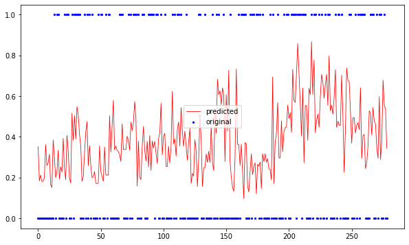
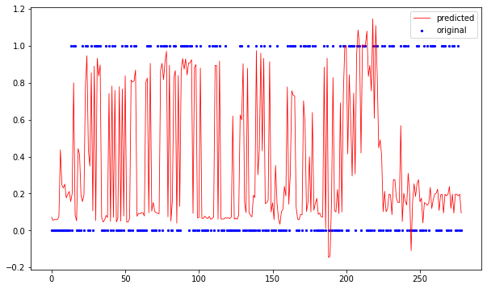

# 0. 개요

### 0-1. 종목의 화제성과 등락률
많은 연구들은 언급이 많이되는 주식 종목은 그렇지 않은 종목에 비해 주가가 상승할 확률이 높다고 한다. 일례로, 
Hristidis(2012)는 빅데이터(Big-data)와 주식시장의 상관관계를 파악하려 했다. 약 3억 4천만개의 트위터를분석한 결과 특정 기업에 대해 언급이 많을수록 주가상승확률이 높아짐을 실증분석 하였다. 4개월 동안의 모델 시뮬레이션 결과 빅데이터(Big-data)에 많이 언급된 회사일수록 다우지수와 비교하여 약 2%정도 덜 하락함을 보였다. 또한 기업의 신제품 출시 등의 정보가해당 기업의 주식 거래량에 영향을 미침을 보였다.(이득환 외, 2013)
이 프로젝트에서는 최근 3개월 기준 가장 많이 언급된 종목 10개를 중심으로 기존의 펀드상품과는 차별되는 새로운 투자상품을 개발하려 한다.

### 0-2. 한국 주식 투자자의 패턴
주식을 잘 알지 못하는 일반인이더라도, 우리나라의 주식 투자자들은 대부분 장기 투자보다는 단기 매매를 통한 수익 창출을 목적으로 한다는 것을 잘 알고있다. 이 처럼 우리나라의 주식 투자 패턴은 단기 매매, 속된 말로 '단타'에 굳혀져 있는듯 하다. 이 때문에 대부분의 주식 투자자들은 단기간에 수익을 얻는 거래에 익숙해져 있고, 또 그러한 상품을 원한다.

### 0-3. 4차 산업 혁명에서 펀드 매니저의 한계
펀드를 '펀드매니저가 운영하는 계모임'이라 일컫는 말이 괜히 나온 것은 아닐 것이다. 이 말의 속 뜻은 투자자들은 잘 알지 못하고, 또 이해하기 어려운 근거 또는 펀드 매니저의 직감에 의존한 종목 선정 및 거래 양상을 비꼬는 말일 것이다. 이 프로젝트에서는 4차 산업 혁명의 분야 중 하나인 인공지능 및 빅데이터를 주식 투자 상품과 접목시키려 한다. 빅데이터를 이용하여 인간의 직감을 배제하고 인간이 미처 발견하지 못한 패턴을 발견하며 분석된 데이터를 시각화하여 이용자들에게 종목 추천의 근거를 쉽게 설명할 수 있다.


# 1. 데이터 수집

### 1-1. 뉴스 데이터 (텍스트)
'주식'으로 검색했을 때의 데이터, 
19177개의 기사


```python
from google.colab import drive
drive.mount('/content/drive')
```

    Drive already mounted at /content/drive; to attempt to forcibly remount, call drive.mount("/content/drive", force_remount=True).
    


```python
import csv
import os

import pandas as pd
import xlrd

data = {}

# 빅카인즈 데이터
path = os.path.join('/content/drive/My Drive', 'news')

csvFiles = []
for f in os.listdir(path):
    csvFiles.append(pd.read_excel(os.path.join(path, f)))
data['뉴스'] = pd.concat(csvFiles)
data['뉴스']
```


<div>
<style scoped>
    .dataframe tbody tr th:only-of-type {
        vertical-align: middle;
    }

    .dataframe tbody tr th {
        vertical-align: top;
    }

    .dataframe thead th {
        text-align: right;
    }
</style>
<table border="1" class="dataframe">
  <thead>
    <tr style="text-align: right;">
      <th></th>
      <th>뉴스 식별자</th>
      <th>일자</th>
      <th>언론사</th>
      <th>기고자</th>
      <th>제목</th>
      <th>통합 분류1</th>
      <th>통합 분류2</th>
      <th>통합 분류3</th>
      <th>사건/사고 분류1</th>
      <th>사건/사고 분류2</th>
      <th>사건/사고 분류3</th>
      <th>인물</th>
      <th>위치</th>
      <th>기관</th>
      <th>키워드</th>
      <th>특성추출(가중치순 상위 50개)</th>
      <th>본문</th>
      <th>URL</th>
      <th>분석제외 여부</th>
    </tr>
  </thead>
  <tbody>
    <tr>
      <th>0</th>
      <td>1.101101e+06</td>
      <td>20200530</td>
      <td>한국일보</td>
      <td>김정현</td>
      <td>사흘 만에 재소환된 이재용, 17시간 조사 받고 새벽 귀가</td>
      <td>사회&gt;사건_사고</td>
      <td>경제&gt;산업_기업</td>
      <td>사회&gt;미디어</td>
      <td>NaN</td>
      <td>NaN</td>
      <td>NaN</td>
      <td>이,초부,이재용</td>
      <td>NaN</td>
      <td>미전실,검찰,청구,미래전략실</td>
      <td>사흘,재소환,이재용,시간,조사,귀가,삼성물산,제일모직,합병,경영,승계,의혹,사흘,검...</td>
      <td>부회장,제일모직,삼성물산,이재용,재소환,콜옵션,전략실,계열사들,계열사,삼성바이오,임...</td>
      <td>삼성물산과 제일모직 합병과 경영권 승계를 둘러싼 의혹으로 사흘 만에 검찰에 재소환된...</td>
      <td>NaN</td>
      <td>NaN</td>
    </tr>
    <tr>
      <th>1</th>
      <td>1.100701e+06</td>
      <td>20200530</td>
      <td>세계일보</td>
      <td>남정훈</td>
      <td>P2P로 용돈 벌고 리셀로 목돈 불리고 MZ세대가 사는 법 [S 스토리]</td>
      <td>경제&gt;증권_증시</td>
      <td>경제&gt;금융_재테크</td>
      <td>IT_과학&gt;IT_과학일반</td>
      <td>NaN</td>
      <td>NaN</td>
      <td>NaN</td>
      <td>한모,강모,지드래곤,전모,이모,김모,오프라</td>
      <td>우호,미국,서울,용산구,강남구,관악구,청나라,계산,조선,월평</td>
      <td>업비트,금융투자협회,MZ세대,코웬앤드컴퍼니,한국은행,코빗,국회,한국,스니커즈,투자은...</td>
      <td>P2P,용돈,리셀,목돈,MZ세대,스토리,관악구,1.,서울,회사원,카카오페이,10만,...</td>
      <td>스니커즈,p2p,20대,mz세대,미국,회사원,구매자,리셀,가상자산,서울,한정판,20...</td>
      <td>#1. 서울 관악구에 사는 회사원 김모(29)씨는 카카오페이로 10만원이 모일 때마...</td>
      <td>http://www.segye.com/content/html/2020/05/29/2...</td>
      <td>NaN</td>
    </tr>
    <tr>
      <th>2</th>
      <td>2.100851e+06</td>
      <td>20200530</td>
      <td>아주경제</td>
      <td>이보미</td>
      <td>전날 외국인 코스닥 순매수 상위 종목에 셀트리온헬스케어 제약</td>
      <td>경제&gt;증권_증시</td>
      <td>경제&gt;금융_재테크</td>
      <td>경제&gt;유통</td>
      <td>NaN</td>
      <td>NaN</td>
      <td>NaN</td>
      <td>NaN</td>
      <td>NaN</td>
      <td>코아시아,30일 한국거래소,메드팩토,EDGC,에코프로비엠</td>
      <td>외국인,코스닥,매수,상위,종목,셀트리온헬스케어,제약,외국인,투자자,29일,코스닥,시...</td>
      <td>셀트리온헬스케어,코스닥,외국인,44억,투자자,에코프로비엠,셀트리온제약,메드팩토,동진...</td>
      <td>\n \n외국인 투자자는 전날(29일) 코스닥 시장에서 셀트리온헬스케어, 셀트리...</td>
      <td>http://www.ajunews.com/view/20200530161201950</td>
      <td>NaN</td>
    </tr>
    <tr>
      <th>3</th>
      <td>7.101201e+06</td>
      <td>20200530</td>
      <td>디지털타임스</td>
      <td>박영서</td>
      <td>온종일 출렁거린 뉴욕증시...제한적 중국 제재에 혼조세 마감</td>
      <td>국제&gt;미국_북미</td>
      <td>경제&gt;증권_증시</td>
      <td>NaN</td>
      <td>NaN</td>
      <td>NaN</td>
      <td>NaN</td>
      <td>트럼프,도널드 트럼프</td>
      <td>미국,중국,홍콩,뉴욕,미</td>
      <td>뉴욕증권거래소,BTIG</td>
      <td>온종일,뉴욕증시,제한적,중국,제재,혼조세,마감,뉴욕,증시,도널드,트럼프,미국,대통령...</td>
      <td>중국,줄리언,미중,뉴욕,혼조세,도널드,스탠더드앤드푸어스,뉴욕증권거래소,다우존스,전략...</td>
      <td>뉴욕 증시가 도널드 트럼프 미국 대통령의 재한적 중국 제재 방안에 안도하며 혼조세로...</td>
      <td>http://www.dt.co.kr/contents.html?article_no=2...</td>
      <td>NaN</td>
    </tr>
    <tr>
      <th>4</th>
      <td>1.100901e+06</td>
      <td>20200530</td>
      <td>중앙일보</td>
      <td>한애란(aeyani@joongang.co.kr)</td>
      <td>"XX전자 터진다", 다음날 진짜 상한가 이 스팸문자에 혹하면</td>
      <td>IT_과학&gt;모바일</td>
      <td>IT_과학&gt;보안</td>
      <td>NaN</td>
      <td>NaN</td>
      <td>NaN</td>
      <td>NaN</td>
      <td>NaN</td>
      <td>NaN</td>
      <td>NaN</td>
      <td>XX전자,상한가,다음날,진짜,상한,스팸문자,머니,주식스팸문자,실체,전자,평일,7시,...</td>
      <td>다음날,주식스팸문자,스팸문자,리딩방,작전세력,김진아,금융팀,650만,원짜리,예지력,...</td>
      <td>"○○전자, 터집니다. 우리 먼저 갈게요!" \n 평일 저녁 7시만 되면 오는 무료...</td>
      <td>https://news.joins.com/article/olink/23384170</td>
      <td>NaN</td>
    </tr>
    <tr>
      <th>...</th>
      <td>...</td>
      <td>...</td>
      <td>...</td>
      <td>...</td>
      <td>...</td>
      <td>...</td>
      <td>...</td>
      <td>...</td>
      <td>...</td>
      <td>...</td>
      <td>...</td>
      <td>...</td>
      <td>...</td>
      <td>...</td>
      <td>...</td>
      <td>...</td>
      <td>...</td>
      <td>...</td>
      <td>...</td>
    </tr>
    <tr>
      <th>17987</th>
      <td>2.100201e+06</td>
      <td>20200301</td>
      <td>머니투데이</td>
      <td>김도윤|기자</td>
      <td>플레이디 엔피디 코로나19 영향 피할까</td>
      <td>IT_과학&gt;콘텐츠</td>
      <td>경제&gt;증권_증시</td>
      <td>경제&gt;자동차</td>
      <td>NaN</td>
      <td>NaN</td>
      <td>NaN</td>
      <td>소</td>
      <td>일본</td>
      <td>한국거래소,코넥스,메타넷엠플랫폼,Circ,플레이디,IPO,공모주,희망,엔피디</td>
      <td>플레이디,엔피디,코로나19,영향,3월,플레이디,엔피디,청약,메타넷엠플랫폼,노브메타파...</td>
      <td>엔피디,플레이디,주관사,수요예측,메타넷엠플랫폼,코스닥,대행사,희망공모가,노브메타파마...</td>
      <td>[머니투데이 김도윤 기자] [[공모주 브리핑]3월 첫째주 플레이디 엔피디 청약 메타...</td>
      <td>http://news.moneytoday.co.kr/view/mtview.php?n...</td>
      <td>NaN</td>
    </tr>
    <tr>
      <th>17988</th>
      <td>7.100501e+06</td>
      <td>20200301</td>
      <td>전자신문</td>
      <td>배옥진</td>
      <td>예탁결제원, 3월 아모그린텍 등 31개사 주식 의무보호예수 해제</td>
      <td>경제&gt;증권_증시</td>
      <td>경제&gt;금융_재테크</td>
      <td>경제&gt;유통</td>
      <td>NaN</td>
      <td>NaN</td>
      <td>NaN</td>
      <td>NaN</td>
      <td>1275만주,5665만주,최대주주,6940만주</td>
      <td>린드먼아시아인베스트먼트,웰바이오텍,아모그린텍,한국예탁결제원,시너지이노베이션,유가증권...</td>
      <td>예탁결제원,아모그린텍,31개,해제,주식,의무,보호,예수,아모그린텍,웰바이오텍,31개...</td>
      <td>아모그린텍,의무보호예수,코스닥시장,유가증권시장,웰바이오텍,예수,투자자,최대주주,코스...</td>
      <td>아모그린텍, 웰바이오텍 등 31개사 주식에 대한 의무보호예수가 해제된다.\n\n한국...</td>
      <td>http://www.etnews.com/20200228000200</td>
      <td>NaN</td>
    </tr>
    <tr>
      <th>17989</th>
      <td>2.100201e+06</td>
      <td>20200301</td>
      <td>머니투데이</td>
      <td>반준환|김소연|정인지|김사무엘|기자|기자|기자|기자</td>
      <td>지난주 3.4조원 판 외국인, 언제 돌아오나</td>
      <td>경제&gt;외환</td>
      <td>경제&gt;증권_증시</td>
      <td>경제&gt;국제경제</td>
      <td>NaN</td>
      <td>NaN</td>
      <td>NaN</td>
      <td>김경훈,홍남기,김사무,제롬 파월,하건형</td>
      <td>중구,미국,명동,서울,중국,경기,한국</td>
      <td>app,미국,Fed,유럽,연준,국회,리서치본부장,정부,서울대학교병원,기획재정부,머니...</td>
      <td>지난주,3.4,외국인,머니투데이,반준환,김소연,정인지,김사무엘,정점통과,vs,코로,...</td>
      <td>외국인,코로나19,미국,연준,한국,가능성,서울,확진자,이창목,김경훈,연구원,골드만삭...</td>
      <td>[머니투데이 반준환 기자, 김소연 기자, 정인지 기자, 김사무엘 기자] ["정점통과...</td>
      <td>http://news.moneytoday.co.kr/view/mtview.php?n...</td>
      <td>NaN</td>
    </tr>
    <tr>
      <th>17990</th>
      <td>2.100201e+06</td>
      <td>20200301</td>
      <td>머니투데이</td>
      <td>반준환|정인지|한정수|기자|기자|기자</td>
      <td>증시반등 조건은 마련, 문제는 속도</td>
      <td>경제&gt;증권_증시</td>
      <td>경제&gt;외환</td>
      <td>경제&gt;자동차</td>
      <td>NaN</td>
      <td>NaN</td>
      <td>NaN</td>
      <td>강현기</td>
      <td>선진,미국</td>
      <td>리서치센터장,DB금융투자,중국,리서치본부장,경기,증권사</td>
      <td>증시,반등,조건,마련,속도,머니투데이,반준환,정인지,한정수,미국,증시,수준,지난달,...</td>
      <td>코스피,2000선,이창목,강현기,김지산,코로나19,반준환,한정수,머니투데이,정인지,...</td>
      <td>[머니투데이 반준환 기자, 정인지 기자, 한정수 기자] 미국 증시가 지난달 28일 ...</td>
      <td>http://news.moneytoday.co.kr/view/mtview.php?n...</td>
      <td>NaN</td>
    </tr>
    <tr>
      <th>17991</th>
      <td>2.100201e+06</td>
      <td>20200301</td>
      <td>머니투데이</td>
      <td>반준환|김사무엘|한정수|김소연|기자|기자|기자|기자</td>
      <td>"바닥신호 명확" 증권가, 반등에 힘 싣는다</td>
      <td>경제&gt;증권_증시</td>
      <td>경제&gt;국제경제</td>
      <td>경제&gt;외환</td>
      <td>NaN</td>
      <td>NaN</td>
      <td>NaN</td>
      <td>서정훈,김사무,제롬 파월</td>
      <td>미국,중구,한국,서울</td>
      <td>파월,Fed,중앙은행,중국,증권사,연준,리서치,FOMC</td>
      <td>바닥신호,증권가,반등,머니투데이,반준환,김사무엘,한정수,김소연,한국,증시,역사,저점...</td>
      <td>미국,코스피,하회,2000선,pbr,파월,한국,연구원,제롬,상반기,가능성,연준,코로...</td>
      <td>[머니투데이 반준환 기자, 김사무엘 기자, 한정수 기자, 김소연 기자] ["한국증시...</td>
      <td>http://news.moneytoday.co.kr/view/mtview.php?n...</td>
      <td>NaN</td>
    </tr>
  </tbody>
</table>
<p>17992 rows × 19 columns</p>
</div>


### 1-2. 주식 데이터(종목명, 종목코드)


```python
!pip install finance-datareader
import FinanceDataReader as fdr
data['종목'] = fdr.StockListing('KRX')[['Name', 'Symbol']]
data['종목']
```

    Requirement already satisfied: finance-datareader in /usr/local/lib/python3.6/dist-packages (0.9.6)
    Requirement already satisfied: requests-file in /usr/local/lib/python3.6/dist-packages (from finance-datareader) (1.5.1)
    Requirement already satisfied: pandas>=0.19.2 in /usr/local/lib/python3.6/dist-packages (from finance-datareader) (1.0.5)
    Requirement already satisfied: requests>=2.3.0 in /usr/local/lib/python3.6/dist-packages (from finance-datareader) (2.23.0)
    Requirement already satisfied: lxml in /usr/local/lib/python3.6/dist-packages (from finance-datareader) (4.2.6)
    Requirement already satisfied: six in /usr/local/lib/python3.6/dist-packages (from requests-file->finance-datareader) (1.15.0)
    Requirement already satisfied: numpy>=1.13.3 in /usr/local/lib/python3.6/dist-packages (from pandas>=0.19.2->finance-datareader) (1.18.5)
    Requirement already satisfied: pytz>=2017.2 in /usr/local/lib/python3.6/dist-packages (from pandas>=0.19.2->finance-datareader) (2018.9)
    Requirement already satisfied: python-dateutil>=2.6.1 in /usr/local/lib/python3.6/dist-packages (from pandas>=0.19.2->finance-datareader) (2.8.1)
    Requirement already satisfied: urllib3!=1.25.0,!=1.25.1,<1.26,>=1.21.1 in /usr/local/lib/python3.6/dist-packages (from requests>=2.3.0->finance-datareader) (1.24.3)
    Requirement already satisfied: chardet<4,>=3.0.2 in /usr/local/lib/python3.6/dist-packages (from requests>=2.3.0->finance-datareader) (3.0.4)
    Requirement already satisfied: certifi>=2017.4.17 in /usr/local/lib/python3.6/dist-packages (from requests>=2.3.0->finance-datareader) (2020.6.20)
    Requirement already satisfied: idna<3,>=2.5 in /usr/local/lib/python3.6/dist-packages (from requests>=2.3.0->finance-datareader) (2.10)
    


<div>
<style scoped>
    .dataframe tbody tr th:only-of-type {
        vertical-align: middle;
    }

    .dataframe tbody tr th {
        vertical-align: top;
    }

    .dataframe thead th {
        text-align: right;
    }
</style>
<table border="1" class="dataframe">
  <thead>
    <tr style="text-align: right;">
      <th></th>
      <th>Name</th>
      <th>Symbol</th>
    </tr>
  </thead>
  <tbody>
    <tr>
      <th>0</th>
      <td>3S</td>
      <td>060310</td>
    </tr>
    <tr>
      <th>1</th>
      <td>AJ네트웍스</td>
      <td>095570</td>
    </tr>
    <tr>
      <th>2</th>
      <td>AK홀딩스</td>
      <td>006840</td>
    </tr>
    <tr>
      <th>3</th>
      <td>APS홀딩스</td>
      <td>054620</td>
    </tr>
    <tr>
      <th>4</th>
      <td>AP시스템</td>
      <td>265520</td>
    </tr>
    <tr>
      <th>...</th>
      <td>...</td>
      <td>...</td>
    </tr>
    <tr>
      <th>2565</th>
      <td>흥국화재2우B</td>
      <td>000547</td>
    </tr>
    <tr>
      <th>2566</th>
      <td>흥국화재우</td>
      <td>000545</td>
    </tr>
    <tr>
      <th>2567</th>
      <td>흥아해운</td>
      <td>003280</td>
    </tr>
    <tr>
      <th>2568</th>
      <td>희림</td>
      <td>037440</td>
    </tr>
    <tr>
      <th>2569</th>
      <td>힘스</td>
      <td>238490</td>
    </tr>
  </tbody>
</table>
<p>2570 rows × 2 columns</p>
</div>


```python
# 뉴스에서 언급이 많이되는 종목 찾기
keyword = list(data['뉴스']['키워드'])
keywords = []
for i in range(len(keyword)):
    tmp = keyword[i].split(',')
    for j in range(len(tmp)):
        keywords.append(tmp[j])
        
keywords = pd.Series(keywords)
tmp = keywords.value_counts()
data['빈도수'] = pd.DataFrame(tmp).reset_index()
data['빈도수'].columns = ['단어', '빈도수']
data['빈도수'] = data['빈도수'].reset_index(drop=True)

# 상위 10개 종목
N = 100
data['화제_종목'] = []
for i in range(data['빈도수'].shape[0]):
    if data['빈도수']['단어'][i] in list(data['종목']['Name']):
        data['화제_종목'].append(data['빈도수'].iloc[i])
data['화제_종목'] = pd.DataFrame(data['화제_종목']).reset_index(drop=True)
data['화제_종목'].columns = ['Name', '빈도수']
data['화제_종목'] = pd.DataFrame.merge(data['화제_종목'], data['종목'][['Symbol', 'Name']])
# 대상(동명이어), 신라젠(거래중지) drop
data['화제_종목'] = data['화제_종목'].drop([1, 4]).reset_index(drop=True)[:N]
data['화제_종목']
```


<div>
<style scoped>
    .dataframe tbody tr th:only-of-type {
        vertical-align: middle;
    }

    .dataframe tbody tr th {
        vertical-align: top;
    }

    .dataframe thead th {
        text-align: right;
    }
</style>
<table border="1" class="dataframe">
  <thead>
    <tr style="text-align: right;">
      <th></th>
      <th>Name</th>
      <th>빈도수</th>
      <th>Symbol</th>
    </tr>
  </thead>
  <tbody>
    <tr>
      <th>0</th>
      <td>삼성전자</td>
      <td>5031</td>
      <td>005930</td>
    </tr>
    <tr>
      <th>1</th>
      <td>한진칼</td>
      <td>3786</td>
      <td>180640</td>
    </tr>
    <tr>
      <th>2</th>
      <td>대한항공</td>
      <td>2984</td>
      <td>003490</td>
    </tr>
    <tr>
      <th>3</th>
      <td>현대차</td>
      <td>1595</td>
      <td>005380</td>
    </tr>
    <tr>
      <th>4</th>
      <td>두산중공업</td>
      <td>1368</td>
      <td>034020</td>
    </tr>
    <tr>
      <th>...</th>
      <td>...</td>
      <td>...</td>
      <td>...</td>
    </tr>
    <tr>
      <th>95</th>
      <td>OCI</td>
      <td>104</td>
      <td>010060</td>
    </tr>
    <tr>
      <th>96</th>
      <td>진에어</td>
      <td>103</td>
      <td>272450</td>
    </tr>
    <tr>
      <th>97</th>
      <td>인터파크</td>
      <td>102</td>
      <td>035080</td>
    </tr>
    <tr>
      <th>98</th>
      <td>우리금융지주</td>
      <td>99</td>
      <td>316140</td>
    </tr>
    <tr>
      <th>99</th>
      <td>아모레퍼시픽</td>
      <td>98</td>
      <td>090430</td>
    </tr>
  </tbody>
</table>
<p>100 rows × 3 columns</p>
</div>


### 1-3. 추가 변수 데이터(환율, 코스피)


```python
data['환율'] = fdr.DataReader('USD/KRW', '2000')[['Close']]
data['환율']['Date'] = data['환율'].index
data['환율'] = data['환율'].rename(columns={'Close': 'USD'})
data['환율'] = data['환율'].reset_index(drop=True)
data['코스피'] = fdr.DataReader('KS11', '2000')[['Close']]
data['코스피']['Date'] = data['코스피'].index
data['코스피'] = data['코스피'].rename(columns={'Close': 'KOSPI'})
data['코스피'] = data['코스피'].reset_index(drop=True)
data['추가변수'] = pd.DataFrame.merge(data['환율'], data['코스피'])
data['추가변수']
```


<div>
<style scoped>
    .dataframe tbody tr th:only-of-type {
        vertical-align: middle;
    }

    .dataframe tbody tr th {
        vertical-align: top;
    }

    .dataframe thead th {
        text-align: right;
    }
</style>
<table border="1" class="dataframe">
  <thead>
    <tr style="text-align: right;">
      <th></th>
      <th>USD</th>
      <th>Date</th>
      <th>KOSPI</th>
    </tr>
  </thead>
  <tbody>
    <tr>
      <th>0</th>
      <td>1122.50</td>
      <td>2000-01-04</td>
      <td>1059.04</td>
    </tr>
    <tr>
      <th>1</th>
      <td>1134.50</td>
      <td>2000-01-05</td>
      <td>986.31</td>
    </tr>
    <tr>
      <th>2</th>
      <td>1146.25</td>
      <td>2000-01-06</td>
      <td>960.79</td>
    </tr>
    <tr>
      <th>3</th>
      <td>1137.50</td>
      <td>2000-01-07</td>
      <td>948.65</td>
    </tr>
    <tr>
      <th>4</th>
      <td>1133.25</td>
      <td>2000-01-10</td>
      <td>987.24</td>
    </tr>
    <tr>
      <th>...</th>
      <td>...</td>
      <td>...</td>
      <td>...</td>
    </tr>
    <tr>
      <th>5107</th>
      <td>1187.27</td>
      <td>2020-09-07</td>
      <td>2384.22</td>
    </tr>
    <tr>
      <th>5108</th>
      <td>1190.10</td>
      <td>2020-09-08</td>
      <td>2401.91</td>
    </tr>
    <tr>
      <th>5109</th>
      <td>1184.79</td>
      <td>2020-09-09</td>
      <td>2375.81</td>
    </tr>
    <tr>
      <th>5110</th>
      <td>1188.11</td>
      <td>2020-09-10</td>
      <td>2396.48</td>
    </tr>
    <tr>
      <th>5111</th>
      <td>1187.89</td>
      <td>2020-09-11</td>
      <td>2396.69</td>
    </tr>
  </tbody>
</table>
<p>5112 rows × 3 columns</p>
</div>


# 2. 데이터 분석

### 2-1. 화제 종목 주식동향(3개월)


```python
data['관심_종목_이름'] = []
for i in range(data['화제_종목'].shape[0]):
    data[data['화제_종목']['Name'][i]] = fdr.DataReader(data['화제_종목']['Symbol'][i], '2020-03-01', '2020-05-30')
    data['관심_종목_이름'].append(data['화제_종목']['Name'][i])
    
from matplotlib import pyplot as plt
import matplotlib.font_manager as fm
import numpy as np

plt.rcParams['figure.figsize'] = [10, 6]

#한글 깨짐 방지
font_path = os.path.join('/content/drive/My Drive', 'utils/NanumFontSetup_TTF_ALL/NanumGothic.ttf')
fontprop = fm.FontProperties(fname=font_path, size=15)

data['관심_종목_변화율'] = []
for s in data['관심_종목_이름']:
    index = np.arange(data[s].shape[0])
    plt.plot(index, data[s]['Close'])
    plt.title(s, fontproperties=fontprop)
    plt.show()
    plt.close()
    try:
        data['관심_종목_변화율'].append([s, (data[s]['Close'][-1] - data[s]['Close'][0]) / data[s]['Close'][0], np.mean(data[s]['Change'])])
    except Exception:
        pass


kospi = fdr.DataReader('KS11', '2020-03-01', '2020-05-30')
index = np.arange(kospi.shape[0])
plt.plot(index, kospi['Close'])
plt.title('KOSPI', fontproperties=fontprop)
plt.show()
plt.close()
data['관심_종목_변화율'].append(['KOSPI', (kospi['Close'][-1] - kospi['Close'][0]) / kospi['Close'][0], np.mean(kospi['Change'])])
```


    Output hidden; open in https://colab.research.google.com to view.


### 2-2. 5월 대비 현재 주식 등락률


```python
data['관심_종목_변화율'] = pd.DataFrame(data['관심_종목_변화율'])
data['관심_종목_변화율'].columns = ['Name', '등락률', '하루평균_등락률']
data['관심_종목_변화율']
```


<div>
<style scoped>
    .dataframe tbody tr th:only-of-type {
        vertical-align: middle;
    }

    .dataframe tbody tr th {
        vertical-align: top;
    }

    .dataframe thead th {
        text-align: right;
    }
</style>
<table border="1" class="dataframe">
  <thead>
    <tr style="text-align: right;">
      <th></th>
      <th>Name</th>
      <th>등락률</th>
      <th>하루평균_등락률</th>
    </tr>
  </thead>
  <tbody>
    <tr>
      <th>0</th>
      <td>삼성전자</td>
      <td>-0.078182</td>
      <td>-0.000723</td>
    </tr>
    <tr>
      <th>1</th>
      <td>한진칼</td>
      <td>0.282318</td>
      <td>0.010333</td>
    </tr>
    <tr>
      <th>2</th>
      <td>대한항공</td>
      <td>-0.071750</td>
      <td>0.000249</td>
    </tr>
    <tr>
      <th>3</th>
      <td>현대차</td>
      <td>-0.136564</td>
      <td>-0.001858</td>
    </tr>
    <tr>
      <th>4</th>
      <td>두산중공업</td>
      <td>-0.136226</td>
      <td>-0.001022</td>
    </tr>
    <tr>
      <th>...</th>
      <td>...</td>
      <td>...</td>
      <td>...</td>
    </tr>
    <tr>
      <th>95</th>
      <td>진에어</td>
      <td>-0.122951</td>
      <td>0.000798</td>
    </tr>
    <tr>
      <th>96</th>
      <td>인터파크</td>
      <td>0.039437</td>
      <td>0.002313</td>
    </tr>
    <tr>
      <th>97</th>
      <td>우리금융지주</td>
      <td>-0.037935</td>
      <td>-0.000125</td>
    </tr>
    <tr>
      <th>98</th>
      <td>아모레퍼시픽</td>
      <td>-0.021021</td>
      <td>0.000547</td>
    </tr>
    <tr>
      <th>99</th>
      <td>KOSPI</td>
      <td>0.013528</td>
      <td>0.000738</td>
    </tr>
  </tbody>
</table>
<p>100 rows × 3 columns</p>
</div>


### 2-3. 데이터 해석 및 비즈니스 모델 선정


```python
names = ['삼성전자', '현대차', '두산중공업', 'SK', '카카오', '키움증권', '현대모비스', '셀트리온', '유안타증권', 'KB금융']

# for i in names:
#     print(i)
#     data['{}_뉴스'.format(i)] = pd.read_excel(os.path.join('/content/drive/My Drive', 'news3', '{}.xlsx'.format(i)))[['일자', '제목', '키워드']].dropna().drop_duplicates(['제목']).reset_index(drop=True)[['일자', '키워드']]
#     df = data['{}_뉴스'.format(i)][(data['{}_뉴스'.format(i)]['일자'] > 20200301) & (data['{}_뉴스'.format(i)]['일자'] < 20200601)].reset_index(drop=True)
#     keywords = []
#     for j in range(df.shape[0]):
#         tmp = df['키워드'][j].split(',')
#         for k in range(len(tmp)):
#             keywords.append(tmp[k])
#     keywords = pd.Series(keywords)
#     tmp = keywords.value_counts()
#     data['{}_빈도수'.format(i)] = pd.DataFrame(tmp).reset_index()
#     data['{}_빈도수'.format(i)].columns = ['단어', '빈도수']
#     data['{}_빈도수'.format(i)] = data['{}_빈도수'.format(i)].reset_index(drop=True)


    
```

# 3. 데이터 전처리, 가공 및 감성분석

### 3-1. 감성사전 구축 방법

#### a. 뉴스 기사의 일자 기준으로 익일 주식의 종가가 전날 대비 1% 초과 상승 했다면 긍정의 뉴스로 판단, 그렇지 않다면 부정의 뉴스로 판단한다. (['Label'])
#### b. 긍정의 뉴스 본문의 키워드와 부정의 뉴스 본문의 키워드의 개수를 세어 점수화한다.(['긍정도'])
#### c. 해당 종목의 전체 뉴스의 긍정 뉴스와 부정 뉴스의 비율을 구한다.(posNegRate)
#### d. 긍정키워드의 Label과 부정키워드의 Label을 더한다. (만약 2또는 -2라면 긍정 또는 부정 키워드에만 있는 단어이기 때문에 강한 긍정 또는 강한 부정의 단어임)
#### e. Label이 0이라면 긍정뉴스와 부정뉴스에 모두 등장하는 단어. 긍정키워드의 긍정도에서 부정키워드의 긍정도를 나눈다.(값이 클수록 긍정에 가깝다)
#### f. Label이 0인 키워드 중 긍정도가 높은 순서로 정렬 한 뒤 긍정 키워드는 상위에서 부정키워드는 하위에서 posNegRat의 비율과 같게 추출한다.
#### g. 긍정의 경우 1 부정의 경우 -1로 라벨링 해준다.
#### h. Label이 2 또는 -2인 그룹과 함께 concat한다.

### 3-2. 기업별 감성사전 구축


```python
from sklearn.preprocessing import MinMaxScaler
scaler = MinMaxScaler()
for i in names:
    print(i)
    data['{}_뉴스'.format(i)] = pd.read_excel(os.path.join('/content/drive/My Drive', 'news3', '{}.xlsx'.format(i)))[['일자', '제목', '키워드']].dropna().drop_duplicates(['제목'])[['일자', '키워드']]
    data['{}_뉴스'.format(i)] = data['{}_뉴스'.format(i)].sort_values(['일자']).reset_index(drop=True)
    data['{}_뉴스2'.format(i)] = data['{}_뉴스'.format(i)][data['{}_뉴스'.format(i)]['일자'] < 20200601].reset_index(drop=True)

    tmp2 = []
    tmp3 = []
    for j in range(data['{}_뉴스'.format(i)].shape[0]):
        tmp = str(int(data['{}_뉴스'.format(i)]['일자'][j]))
        tmp2.append('{}-{}-{}'.format(tmp[:4], tmp[4:6], tmp[6:]))
    for j in range(data['{}_뉴스2'.format(i)].shape[0]):
        tmp = str(int(data['{}_뉴스2'.format(i)]['일자'][j]))
        tmp3.append('{}-{}-{}'.format(tmp[:4], tmp[4:6], tmp[6:]))

    data['{}_뉴스'.format(i)]['일자'] = tmp2
    data['{}_뉴스2'.format(i)]['일자'] = tmp3
    data[i] = fdr.DataReader(list(data['화제_종목'][data['화제_종목']['Name'] == i]['Symbol'])[0], '2015-01-01').drop(['Change'], axis=1)
    data[i]['Date'] = data[i].index
    data[i] = data[i].reset_index(drop=True)
    data[i] = pd.DataFrame.merge(data[i], data['추가변수'])
    datesArr = data[i]['Date']
    data[i] = data[i].drop(['Date'], axis=1)
    cols = data[i].columns
    data[i] = pd.DataFrame(scaler.fit_transform(data[i]))
    data[i].columns = cols
    tmp = []
    for j in range(data[i].shape[0]-1):
        tmp.append(1 if (data[i]['Close'][j+1] - data[i]['Close'][j]) / data[i]['Close'][j] > 0.01 else -1)
    tmp = [0] + tmp
    data[i]['Label'] = tmp
    data[i]['일자'] = datesArr.astype('str')

    data['{}_뉴스'.format(i)] = pd.DataFrame.merge(data['{}_뉴스'.format(i)], data[i][['일자', 'Label']])
    data['{}_뉴스2'.format(i)] = pd.DataFrame.merge(data['{}_뉴스2'.format(i)], data[i][['일자', 'Label']])

    if os.path.isfile(os.path.join('/content/drive/My Drive', 'news3', '{}_감성사전.csv'.format(i))):
        data['{}_감성사전'.format(i)] = pd.read_csv(os.path.join('/content/drive/My Drive', 'news3', '{}_감성사전.csv'.format(i)), encoding='utf-8')
    else:
        if os.path.isfile(os.path.join('/content/drive/My Drive', 'news3', '{}_긍정_키워드.csv'.format(i))):
            data['{}_긍정_키워드'.format(i)] = pd.read_csv(os.path.join('/content/drive/My Drive', 'news3', '{}_긍정_키워드.csv'.format(i)), encoding='utf-8')
            data['{}_긍정_키워드'.format(i)].columns = ['단어', '긍정도', 'Label']
            data['{}_부정_키워드'.format(i)] = pd.read_csv(os.path.join('/content/drive/My Drive', 'news3', '{}_부정_키워드.csv'.format(i)), encoding='utf-8')
            data['{}_부정_키워드'.format(i)].columns = ['단어', '긍정도', 'Label']
        else:
            posKeywords = []
            negKeywords = []
            for j in range(data['{}_뉴스2'.format(i)].shape[0]):
                tmp = data['{}_뉴스2'.format(i)]['키워드'].iloc[j].split(',')
                for m in range(len(tmp)):
                    if data['{}_뉴스2'.format(i)]['Label'][j] == 1:
                        posKeywords.append(tmp[m])
                    else:
                        negKeywords.append(tmp[m])
                    
            posKeywords = pd.Series(posKeywords)
            negKeywords = pd.Series(negKeywords)
            tmp2 = posKeywords.value_counts()
            data['{}_긍정_키워드'.format(i)] = pd.DataFrame(tmp2).reset_index()
            data['{}_긍정_키워드'.format(i)].columns = ['단어', '긍정도']
            data['{}_긍정_키워드'.format(i)] = data['{}_긍정_키워드'.format(i)].reset_index(drop=True)[:10000]
            data['{}_긍정_키워드'.format(i)].columns = ['단어', '긍정도']
            data['{}_긍정_키워드'.format(i)]['Label'] = [2] * data['{}_긍정_키워드'.format(i)].shape[0]
            data['{}_긍정_키워드'.format(i)].to_csv(os.path.join('/content/drive/My Drive', 'news3', '{}_긍정_키워드.csv'.format(i)), encoding='utf-8', index=False)
            tmp2 = negKeywords.value_counts()
            data['{}_부정_키워드'.format(i)] = pd.DataFrame(tmp2).reset_index()
            data['{}_부정_키워드'.format(i)].columns = ['단어', '긍정도']
            data['{}_부정_키워드'.format(i)] = data['{}_부정_키워드'.format(i)].reset_index(drop=True)[:10000]
            data['{}_부정_키워드'.format(i)].columns = ['단어', '긍정도']
            data['{}_부정_키워드'.format(i)]['Label'] = [-2] * data['{}_부정_키워드'.format(i)].shape[0]
            data['{}_부정_키워드'.format(i)].to_csv(os.path.join('/content/drive/My Drive', 'news3', '{}_부정_키워드.csv'.format(i)), encoding='utf-8', index=False)

        data['{}_감성사전'.format(i)] = pd.DataFrame()
        data['{}_감성사전'.format(i)] = (data['{}_긍정_키워드'.format(i)].set_index(['단어'])['긍정도'] / data['{}_부정_키워드'.format(i)].set_index(['단어'])['긍정도']).reset_index()
        tmp = pd.merge(data['{}_긍정_키워드'.format(i)][['단어', 'Label']], data['{}_부정_키워드'.format(i)][['단어', 'Label']], how='outer', on=['단어']).set_index(['단어']).sum(axis=1).reset_index()
        tmp.columns = ['단어', 'Label']
        data['{}_감성사전'.format(i)] = pd.DataFrame.merge(data['{}_감성사전'.format(i)], tmp)
        pos = data['{}_감성사전'.format(i)][data['{}_감성사전'.format(i)]['Label'] == 2][['단어', 'Label']].reset_index(drop=True)
        neg = data['{}_감성사전'.format(i)][data['{}_감성사전'.format(i)]['Label'] == -2][['단어', 'Label']].reset_index(drop=True)
        zero = data['{}_감성사전'.format(i)][data['{}_감성사전'.format(i)]['Label'] == 0].sort_values(['긍정도']).reset_index(drop=True)

        tmp = pd.DataFrame(data['{}_뉴스2'.format(i)]['Label'].value_counts()).reset_index()
        posNegRate = int(tmp[tmp['index']==1]['Label']) / int(tmp[tmp['index']==-1]['Label'])
        allRate = 0.1
        tmp1 = zero[:int(zero.shape[0]*(allRate/(1 + posNegRate)))].reset_index(drop=True)[['단어', 'Label']]
        tmp1['Label'] = [-1] * tmp1.shape[0]
        tmp2 = zero[zero.shape[0] - int(zero.shape[0]*((allRate/(1 + posNegRate))*posNegRate)):].reset_index(drop=True)[['단어', 'Label']]
        tmp2['Label'] = [1] * tmp2.shape[0]

        data['{}_감성사전'.format(i)] = pd.concat([pos, tmp2, neg, tmp1]).reset_index(drop=True)
        data['{}_감성사전'.format(i)].to_csv(os.path.join('/content/drive/My Drive', 'news3', '{}_감성사전.csv'.format(i)), encoding='utf-8', index=False)
```

    삼성전자
    

    /usr/local/lib/python3.6/dist-packages/ipykernel_launcher.py:31: RuntimeWarning: invalid value encountered in double_scalars
    /usr/local/lib/python3.6/dist-packages/ipykernel_launcher.py:31: RuntimeWarning: divide by zero encountered in double_scalars
    

    현대차
    

    /usr/local/lib/python3.6/dist-packages/ipykernel_launcher.py:31: RuntimeWarning: divide by zero encountered in double_scalars
    

    두산중공업
    

    /usr/local/lib/python3.6/dist-packages/ipykernel_launcher.py:31: RuntimeWarning: divide by zero encountered in double_scalars
    

    SK
    

    /usr/local/lib/python3.6/dist-packages/ipykernel_launcher.py:31: RuntimeWarning: divide by zero encountered in double_scalars
    

    카카오
    

    /usr/local/lib/python3.6/dist-packages/ipykernel_launcher.py:31: RuntimeWarning: divide by zero encountered in double_scalars
    

    미래에셋대우
    

    /usr/local/lib/python3.6/dist-packages/ipykernel_launcher.py:31: RuntimeWarning: divide by zero encountered in double_scalars
    

    키움증권
    

    /usr/local/lib/python3.6/dist-packages/ipykernel_launcher.py:31: RuntimeWarning: divide by zero encountered in double_scalars
    

    현대모비스
    

    /usr/local/lib/python3.6/dist-packages/ipykernel_launcher.py:31: RuntimeWarning: divide by zero encountered in double_scalars
    

    셀트리온
    

    /usr/local/lib/python3.6/dist-packages/ipykernel_launcher.py:31: RuntimeWarning: divide by zero encountered in double_scalars
    

    유안타증권
    

    /usr/local/lib/python3.6/dist-packages/ipykernel_launcher.py:31: RuntimeWarning: divide by zero encountered in double_scalars
    

    KB금융
    

    /usr/local/lib/python3.6/dist-packages/ipykernel_launcher.py:31: RuntimeWarning: divide by zero encountered in double_scalars
    

### 3_3. 감성분석 방법
#### a. 뉴스데이터 중 한 기사에서 등장하는 단어를 감성사전과 merge_sum 하여 총 긍정도를 구한다.
#### b. 실제 Label(익일 주가가 1%초과 상승했는지 여부)과 비교한다.


```python
correctArr = []
for s in names:
    print(s)
    tmpDf = []
    scoresArr = []
    if os.path.isfile(os.path.join('/content/drive/My Drive', 'news3', '{}_긍정도.csv'.format(s))):
        data['{}_긍정도'.format(s)] = pd.read_csv(os.path.join('/content/drive/My Drive', 'news3', '{}_긍정도.csv'.format(s)), encoding='utf-8')
    else:
        tmp = []
        data['{}_NEW_감성사전'.format(s)] = data['{}_감성사전'.format(s)]
        testDate = data['{}_뉴스'.format(s)][data['{}_뉴스'.format(s)]['일자'] > '2020-05-30'].index[0]
        for i in range(data['{}_뉴스'.format(s)].shape[0]):
            if i > testDate and data['{}_뉴스'.format(s)]['일자'][i] != data['{}_뉴스'.format(s)]['일자'][i-1]:
                df = pd.DataFrame()
                df['단어'] = tmp
                df['Label'] = [data['{}_뉴스'.format(s)]['Label'][i]] * df.shape[0]
                tmpDf.append(df)

                newDf = pd.concat(tmpDf)
                newDf = pd.DataFrame(newDf['Label'].groupby(df['단어']).sum()).reset_index()
                newDf['ABS'] = np.abs(newDf['Label'])
                newDf['Label'] = np.sign(newDf['Label'])
                newDf = newDf.sort_values(['ABS']).reset_index(drop=True)[:1000].drop(['ABS'], axis=1)
                                
                newDf = pd.DataFrame.merge(newDf, data['{}_감성사전'.format(s)], how='outer').dropna(0)
                data['{}_NEW_감성사전'.format(s)] = pd.concat([data['{}_감성사전'.format(s)], newDf]).drop_duplicates(keep='last').reset_index(drop=True)
            tmp = data['{}_뉴스'.format(s)]['키워드'][i].split(',')
            df = pd.DataFrame()
            df['단어'] = tmp
            df = pd.DataFrame.merge(data['{}_NEW_감성사전'.format(s)], df, on=['단어'])
            scoresArr.append(df['Label'].sum())

        data['{}_뉴스'.format(s)]['긍정도'] = scoresArr
        scoresArr = []
        labelsArr = []
        tmp = data['{}_뉴스'.format(s)][['일자', '긍정도']]
        tmp = pd.DataFrame(tmp['긍정도'].groupby(tmp['일자']).sum()).reset_index()
        tmp2 = data['{}_뉴스'.format(s)][['일자', 'Label']]
        tmp2 = pd.DataFrame(tmp2['Label'].groupby(tmp2['일자']).sum()).reset_index()
        tmp['긍정도'] = np.sign(tmp['긍정도'])
        tmp2['Label'] = np.sign(tmp2['Label'])

        data['{}_긍정도'.format(s)] = pd.DataFrame.merge(tmp, tmp2)
        tmp = []
        for j in range(data['{}_긍정도'.format(s)].shape[0]):
            tmp.append(1 if np.sign(data['{}_긍정도'.format(s)]['Label'][j]) == np.sign(data['{}_긍정도'.format(s)]['긍정도'][j]) else 0)
        data['{}_긍정도'.format(s)]['Correct'] = tmp
        data['{}_긍정도'.format(s)].to_csv(os.path.join('/content/drive/My Drive', 'news3', '{}_긍정도.csv'.format(s)), encoding='utf-8', index=False)
    correct = data['{}_긍정도'.format(s)]['Correct'].sum() / data['{}_긍정도'.format(s)]['Correct'].shape[0] * 100
    print('{}_정확도: {}%'.format(s, correct))
    correctArr.append(correct)
print('평균 정확도: {}'.format(np.mean(correctArr)))
```

    삼성전자
    삼성전자_정확도: 70.5072463768116%
    현대차
    현대차_정확도: 80.7444523979957%
    두산중공업
    두산중공업_정확도: 85.04335260115607%
    SK
    SK_정확도: 77.57142857142857%
    카카오
    카카오_정확도: 85.0%
    키움증권
    키움증권_정확도: 90.5%
    현대모비스
    현대모비스_정확도: 83.63116511794139%
    셀트리온
    셀트리온_정확도: 87.57142857142857%
    유안타증권
    유안타증권_정확도: 90.1580459770115%
    KB금융
    KB금융_정확도: 87.22182340272792%
    평균 정확도: 83.79489430165013
    

# 4. 데이터 추출

### 4-1. 주식가격, 거래량, 환율, 코스피, 감성분석 결과(긍정도)


```python
for s in names:
    data[s] = pd.DataFrame.merge(data[s], data['{}_긍정도'.format(s)][['일자', '긍정도']])[1:].reset_index(drop=True)
    # sigmoid 사용위해 -1을 0으로 바꿔줌
    for i in range(data[s].shape[0]):
        if data[s]['Label'][i] == -1:
            data[s]['Label'][i] = 0
    
```

    /usr/local/lib/python3.6/dist-packages/ipykernel_launcher.py:6: SettingWithCopyWarning: 
    A value is trying to be set on a copy of a slice from a DataFrame
    
    See the caveats in the documentation: https://pandas.pydata.org/pandas-docs/stable/user_guide/indexing.html#returning-a-view-versus-a-copy
      
    

![Untitled Diagram (2).png](data:image/png;base64,iVBORw0KGgoAAAANSUhEUgAAAtEAAAEtCAYAAADOcTz4AAAHZHRFWHRteGZpbGUAJTNDbXhmaWxlJTIwaG9zdCUzRCUyMmFwcC5kaWFncmFtcy5uZXQlMjIlMjBtb2RpZmllZCUzRCUyMjIwMjAtMDktMTJUMDglM0EyMSUzQTMzLjk1MVolMjIlMjBhZ2VudCUzRCUyMjUuMCUyMChXaW5kb3dzJTIwTlQlMjAxMC4wJTNCJTIwV2luNjQlM0IlMjB4NjQpJTIwQXBwbGVXZWJLaXQlMkY1MzcuMzYlMjAoS0hUTUwlMkMlMjBsaWtlJTIwR2Vja28pJTIwQ2hyb21lJTJGODUuMC40MTgzLjEwMiUyMFNhZmFyaSUyRjUzNy4zNiUyMiUyMGV0YWclM0QlMjJodFdfNWlrNDZQcnRoZkZLLTBmVSUyMiUyMHZlcnNpb24lM0QlMjIxMy42LjMlMjIlMjB0eXBlJTNEJTIyZ29vZ2xlJTIyJTNFJTNDZGlhZ3JhbSUyMGlkJTNEJTIyYkoxZWNlRVk5aFZLcHk0MU91S2ElMjIlMjBuYW1lJTNEJTIyUGFnZS0xJTIyJTNFNVZsYmI5czJGUDQxQk5LSERDSWxTOVNqYmxrTDdGSXN3SlklMkJEWnpGMmdwazBhUHAyTjZ2SDYlMkJXWlRtRzA5U1YwZ0tCdyUyRlB4VUR3Nmw0OFhBVDliYkglMkZtWkRuJTJGbFpXMEJzZ3J0OERQQVVJUVJWaiUyQlU4ak9JSlBBQWpOZWxWYXBCZTZyJTJGNmdGUFl1dXE1S3VPb3FDc1ZwVXl5NDRaVTFEcDZLREVjN1pwcXYybWRYZFdaZGtSbnZBJTJGWlRVZmZTdnFoUnpnMklVdGZoN1dzM21ibVlZeHFablFaeXlmWlBWbkpSc2N3RDVCZkF6enBnd3JjVTJvN1Z5bnZPTEdYZjNUTyUyRmVNRTRiY2NtQTMxQzJXUCUyRjk0ZkgzNHVudTRTTVBQcnolMkY4JTJGSFdOMDk1SXZYYXZyQTFWdXljQjJncEhXSkZ4c1djelZoRDZxSkZVODdXVFVuVk5KNlVXcDFmR0Z0S0VFcndrUXF4czlFbGE4RWtOQmVMMnZhYU9kVkV6NzZiaFZac3phZjB6QXU1SENGOFJzVVpQYlNQZ0V4ZHloWlU4SjBjeDJsTlJQWFV0WVBZSEpydDlWbzN5NGIxOUF1OER2dGVMMUtBWTVBR29NZ0FUa0FTM0toV09nRnhCb29FcEJGSTVWeWVyd1ZQb3htSVV4QUg3M29SNjhaak02OEV2VjhTN2JhTnJOSlR2biUyQmlYTkR0ZWUlMkYzdldVSDdJdlYxbmhneFUxYk1OQlZ3ZnlnV0VMdld2NzF2cmUwUmhlbWRmekt0TlpERTg3SjdrQmh5YXBHckE2ZSUyRkZFQmJmd0QzSTAlMkZETHlqRUpvbnRnSGRtJTJGYmxNVVklMkZiSXpoYTRQOHF0cENKN2dyQjNFc21VaFJVcUs1U1FaSHRSSEFFOFZzaVNTMDJJSnBhRFZWSXh1Y3U0S3hjVmYwdmFWMWVHbGFENW5WNGNrVk9ZMTFBbWVxWVpibU9BY3AxcmtkQW94djdDSXN1OVd5alVDU09hVkFWWVZjeUZNOCUyRlBvOHRoU0h3U2h5bkc0cjhYRFElMkZxUWU5Vk0wc1dLJTJCdFklMkZXd3M0S1g3RXc0a3NMd3g5aVVmZjlvMFU5JTJCZ2FMT3NTanlJd2hnaHdORVdRWW5nM3lTJTJGV3ZreFJ4THlmdXFvWTBVM3FiRTBIJTJCb0tTa0hLQ3dsdTVOJTJGMUd0bVdyZGFBTE8xRjlMeVZMTUZVbXJyWWpabG1EVmlIMUo1c1B6OURGUjcxbDVNS1pHazFIVW8lMkZRZjN6MW9lcDQ0OFpOalp5VzBYSzJsSzVBMTlDOHM1T2RpZk9ValdOUk5IUlNjTCUyQlJqZGtmZjRzZ0dUOTAybWJyOXpMUjFiVnFGJTJGNjZaNjdoZDZjUklwQUwwbHR1MjA5WDZ5MDRnaWElMkZ1VWhRWHBJb1gxSVVLVkhjcWlnZ0tFR09uSnAlMkJqeDZhJTJCNG80ZXdUaGt0U1ROUmFhalU2YmZ5QTQ5aTdRVHkxbThXejE5cnV6QVpzdFpTTVo2NTJhVGpqY1RkbzNvbXlVVmpWTWRQTEtERnB3TVRtNG5qckp2ZTdNQm8xR1QxSnZncUJQbmI4c3UlMkJ0d25xVVh1R1pBam1EUzNyS1B2YkxWbW9HOXFlOXVSaSUyQnQ4WElmRkVaVHBPRzVFeHJBSHVmUXc4WFhLdTFlUTRWRUJRM3dVYzJPWUhkV0clMkZhVThjVHpQT0ltaWZ5enBmOFRSTlc0JTJCMkdpNmtKVXU5eHJtOUpHR3R2RGxiNXklMkZZY1lJeDNhJTJGNUY3aE9EUzUzdVVkM3M4RkNobmFmNzExRVYlMkZQZ1ZKc3Z6aWJVbWklMkYyJTJGdkYlMkZ3JTNEJTNEJTNDJTJGZGlhZ3JhbSUzRSUzQyUyRm14ZmlsZSUzRbGW/a8AACAASURBVHhe7Z0N6F9V/cfP8iGmKP2d9DQyEXQro4U9MNhWauBkmZqGC3QQjRxuazad+NTc1FRETVw6UhHMJ5yglcVyWiqoYEtGizKnISYZaGqhoeXT78/n1vnt7P7u8zn33vPw+kJU+91z7ue83p9z7/v7+Z577jSl1ITiEzWBiQkk7irwtGnTujalXSAEmB/dhWJ+dGcXSkvmR3elmB/d2YXSUhzCBJMkFLnaxymTGH3bc9Mt4NedXQgt0ddOJfjZ8fO9NfraKQQ/O36+txZ9MdG+q2QZH5PYDiD87Pj53hp97RSCnx0/31ujr51C8LPj53trTLTvCjmIj0lsBxF+dvx8b42+dgrBz46f763R104h+Nnx8701Jtp3hRzExyS2gwg/O36+t0ZfO4XgZ8fP99boa6cQ/Oz4+d4aE+27Qg7iYxLbQYSfHT/fW6OvnULws+Pne2v0tVMIfnb8fG+NifZdIQfxMYntIMLPjp/vrdHXTiH42fHzvTX62ikEPzt+vrfGRPuukIP4mMR2EOFnx8/31uhrpxD87Pj53hp97RSCnx0/31tjon1XyEF8TGI7iPCz4+d7a/S1Uwh+dvx8b42+dgrBz46f760x0b4r5CA+JrEdRPjZ8fO9NfraKQQ/O36+t0ZfO4XgZ8fP99aYaN8VchAfk9gOIvzs+PneGn3tFIKfHT/fW6OvnULws+Pne2tMtO8KOYiPSWwHEX52/Hxvjb52CsHPjp/vrdHXTiH42fHzvTUm2neFHMTHJLaDCD87fr63Rl87heBnx8/31uhrpxD87Pj53hoT7btCDuJjEttBhJ8dP99bo6+dQvCz4+d7a/S1Uwh+dvx8b42J9l0hB/Exie0gws+On++t0ddOIfjZ8fO9NfraKQQ/O36+t8ZE+66Qg/iYxHYQ4WfHz/fW6GunEPzs+PneGn3tFIKfHT/fW2OifVfIQXxMYjuI8LPj53tr9LVTCH52/Hxvjb52CsHPjp/vrTHRvivkID4msR1E+Nnx8701+topBD87fr63Rl87heBnx8/31pho3xVyEB+T2A4i/Oz4+d4afe0Ugp8dP99bo6+dQn3yu/rqq9WiRYvUrFmzWgd58cUXqyOPPFLNmzevtu3tt9+uTjnllF2Ou+2229TJJ5+sHnvsMfXggw+qtWvXTulnx44davPmzWr16tWTf3vzzTfVunXr1NKlS0vjlnY33XSTuvDCC9X06dMn277yyitq48aNas2aNbv8uxwg/V555ZVq+fLlasaMGZNtJPYDDzyw0ThrQRQcgInuQi2wNn1O4sBQdAoXfp2wBdMIfe2kgp8dP99bo6+dQn3y62qixXCKsV2wYEFmhNt+TGOKiZ6mpimlJiYmJtpy5PhACPQ5iQNBYBUm/Kzwed8Yfe0kgp8dP99bo6+dQn3y62qipQr9wgsvqOeeey6rIDepRmsK+WpwlYkWs/3II48oiXPbtm1q/vz5WTdz5sxRmzZtqqxEL168WG3fvn0K/GXLlmX9mRVqOUiq19LmuuuuU/vvv3/2v3X7Rx99tNUY2yhOJboNrUCP7XMSB4qkVdjwa4UruIPR104y+Nnx8701+top1Cc/McMXXHBBYYB6uYX5R12BnjlzZmaexRBLJXrJkiWNKtJy/MqVK9X69esnDbCYaG2OTbMqx55//vnZcR/84Acn++9jOYce1z//+U/1gQ98YBeTzXIOu/yltVKqz0mcAmD4xa0y+trpCz87fr63Rl87hXzgp03m448/XlgB1muei4y3Hr2Y5RUrVkxpX1SJNo3yAQcckC0dEaMuFe+mJrppJTr/xUDGcuuttyr5b1kbjYm2y19aY6Ktc8CHi6D1IOiglAD62iUH/Oz4+d4afe0UCp2frlaLAS56eDBvorWp1aZZ6Jn/dthhh9U+WNiGuJjkZ599dpfYzH/DRLehybGFBEKfxGPLCr+xFej3/Ohrxxd+dvzati7buaBtP02PR9+mpIqP64Nf0W4ZRWevW3tsNzL3rbVh37JlS23nF110UaGpr23o+IDGa6KLthYxF7XnF7gXiawHLd9cZEF7/qlQvTC8aDF4vv862AsXLpws5xcxy7fXi9XvueeebDsU2bKlaPuXop8umownvxi+6IGAqolhkzB9TGLHeeh1dy742Xwblrby6fIUddE2RkWxVOVe1U98VcLl+5Qclq2J9DZE991335Sth8z1ddK3eRPo+hBNXXK50LfuHDH/vW9+Rdtk5f+t6H4guXPzzTerO+64I9tOS7baKtsOrMv9xNWcaWKKq9a+Sm71/eAUGw90n8F9z4/89dzmXlM1yvy12Ty2zJ+Uzas2+Vq1rZ2OoW7+tjlfW6V7M9H5QEyjWWQ68wvW8/+/7gbaxGiYxxQlno7ZhYnOx5//yaHMRDfZz7DJRdfk3/ckbpt0vh1/1VVXqVNPPVXts88+haG54GdzYZMbqHyKfkrTAZu5XXax018si8xrmSZlXxD18eYX36ovrnLcU089pY466qhSE60fRLnkkksm9/k0zZI5Z9rOgaqcc6GvbzntMp4h5kc+3nxBJX/DPumkk6bsPyvH5PeKNddfVplos//8GssylmVzum7OSH82pli37dMYcP9oPoPGmB9mdE1MtIvKddkuHGX/Xrb2uemaaL2/dBMTXaWWzb23SRa0MtFSCTPL7G2qRPl9BfOV6KILj/lvVSZaIF9++eXZeM8+++xdNto2b/bm5t19V6Lz48knTttKdP6C2eRLgx47JqF6KshWOe+++64688wz1XnnnTfFTLvg13UiS7tf/OIX2QCOOeaYwmp0laFsWonuYqLzOS2x6u2M8tsP6fHLerg2lWgzrvxPk23mACa6ye2g+Jgh5kfb6Iqq0y5MtDYbcr3VZlf+zXx5g47VxkSb45V7hczTsvOU/UJrGvGybb/aci063sX1z0UcvvYx9vxoYqJdsBvLRNvG3vXe2/S8rUx0/k0xZcs59Df566+/fjIOs0pVZ5h1o6YmWsch7fJvx9F9NX07jwZetpyjyCgUjadIuKrlLxJnG7GLqnZlonMRrJ4O11xzjTrnnHPUe++9l+1kIk8Sm2baBb+qSkDZT2F6L0/JG/lIXHprInNEZbkteSl9i/k03/zUJs+aVNV0LHKzl62Prr322l1Mh1kd3GuvvSpNdJVSRUu6ZAsls3Ld9MJnHudC3y7nDaXNEPOjjEW+YquLCWUm2vwF8K677sq2/9Jfvqoq0Xp+6rmov6AdffTR2RdXKR7llzVVzekmS6C0Of7whz+sTjvtNHX88cerPs1w13xjfox//6iKYEgTrbeyy8fTZjlHk3XaVb9ENWlvxtfmftdljvRiovOB5CtG5s/N+mLTZTmHriabm4UXfavPG84ygcToy3++8IUvFK6J1j8rfOhDH1KHHnro5ObdRePp20QL46ZfDLgI1k8NqTS9+uqr2YF77rnnLmZ63333lbcR1Xfi6Iiqn2t1rumLVtmXKck/vc2PLKMwtyZqc1FpY6LLKtFmH/kv2NoUFX3xNnHKdeKll16asqa16Ryokob5UZ+4Y8yP/H3DzPWXX365sGCi54eZV/oVw02Xc+iChvx30+cQ2vwqomMsWv6U/5uOYcwHrZgffs6P+qg4YggCrUx0l+UccnHJbz/S5EE8Gby5hCFfhZKbp/RT9BNYfkuWqp+787FUVaL132bPnp1tIq4rYE0q67bLOYoqFE0v3CIyn/YE9thjD3Xsscequ+++e1AT3SbSotw2K9h6WYUct2rVKrVhwwb1xBNPTD7QV/WwSD6OsjWY5tKo/DH56rRZla5am93U6DedA3Umug1zjv0vgb7nR52J1vvI5g3zcccdlxVB5CFW+dSZ6LZzQPosq8g1nTM2OeTyeYAmcXD/aEJp6jF9z49uUdHKNYHGJrrtifWNVR6Uy7+isU11S5+37sHCqvjkfFKVK3pVpI5F4jTfupNfzpH/MmD2Ka+zzK/x7vJgYVvGTQ0ElYR6svKaUNFMPi4r0W1v0G1evyqxVuW2/N12TXQ9uZ1H5H8Zys8BObLORLd9yrrpHKgz0UP+0tCGqS/H9jU/6sbXZjmHmQv6f59wwgm1JrouBpd/r8tv81zmT+RVP2/3vQSE+0d9Bow1P+oj44i+CbQy0U3XqeifZhcsWFD4c1iZia5a52tjosu+uVeZedN8lLXXF2ox4HVb9jXZ4q6t2E0NBBfBarKy5vPcc8/NHi7sa020NrxmnnT5MpkfSV1VqqmJdhGLOe9lLWn+9bBNTHSVUmVjkTZNf3Yv6p/54cf8KIuiyRZ3+S+TOhdPPPFE9cADD9RucafPXbRrRtF6zybLj5rmZN0crlLHdueCJvcc5off86OJhq6Oqcq3/M44Xc9ZdC8q2nVHnhEyn7uT891///1K3sq4fPlydcstt5Ruadk1trL7h/zWP2FbiWljcruYaDP4ttW9/PIL3VddP023EOpiQExedXGYYzdjaroelItg9ZQZ6unqfJ6ULQNq81NxPrfrKl1iCA466KDC/ZmLvgjW3cBNo2wuGZk1a1ZhU9eV6KZzoGoczA8/5ocZRdVDe/pBWVkmKDfSqk+bLe7KihJNixXmfaXNXGpioqlEu7Q9bvsa6v5hRm3mjPwSbt4zTI9g3g/KfrGQa6jcE/SXvnyumWv38yY6f7+pez9H1Rflstd8y3jMXZ3yO+WYXsq8v5gmWu61srqgapvYrlnRqhJddZIhTXSXwRbdbJtWouvOZ2ui6/ov+ju7c3ShVtxmqH0+m5joLqNqaySL1ht3yWGJtWz7rbJxNDHR+V2AyvpqMwcw0V0y679thpofbSIs250j30dMJrps56k23Locy5fMampDzw8zp2UZSf75LL1douyEJF8y9YqAovcN6F9ezN1kqpYIDlGJLqJdVeVuYqKlz7b3yaZzxTsTnX940RxIk22Dqr7pmPtEy3F1FeChKtFNxTKPa1Md4SLYhfDONq749WWim1Sy8rmTf6lP1VxwueayiYlueg1oMwcw0XZzwDd+fZhofaOVbfHMT9u3xbb9Qtpk/jZdStmHyq6uf33EFkKfrvlVVVXN51LkV0rzl0JplzfYsmWqfMxKdNFmEJpzX5Vo6T+/REpXtaWoInOyqMqd37ChrBIt/TeZZ13yyZmJ7nLyodu4uukOHXf+fG2TwfUkHnv8Q58/BH6x5HZTbdvOAd9MYNNxhnBcCPMjBI6+xoi+dsq45ldVUTWX1EnU5r79Zcvt8ss5yh7mlf76rETn4zAr4nJu/ZIuczmH/nJ51llnZctRTCOe30+6yZsSuyidlInuAiiGNq4ncQxM2owBfm1ohXcs+tppBj87fr63Rl87hVzyqzKC+Q0dzMqzGM8mJrqoD/MdA2XP3MivlbLlr1SN5aG+ojd81lEsM9HynoYrrriisBItSzmOOOIItXXrVrVkyZLsFNpsFz1Y2MeSDkx0nbIR/N3lJI4AR+shwK81sqAaoK+dXPCz4+d7a/S1U8glv6JtQyU6bX7NN9rm9+hvYqLzI63bac08vmrdsrlcsOzhw7LlHGLIi/o2l7XoJVSypSUm2i5faV1AwOUkThEw/OJWHX3t9IWfHT/fW6OvnUIu+RVVonV1WCqx5raKecOdr0zrUeUrwHljLA8nSt/6HQZlZtnVFndFtPN9l71kbO7cuZVb3FGJtsvlZFu7nMQpQoRf3Kqjr52+8LPj53tr9LVTyDU/0whWVYrzfyvanUNGZproJsa7T7Pc9IHhMkWqHixkTbRdHifd2vUkTg0m/OJWHH3t9IWfHT/fW6OvnUKu+ZnLGMp2bdE7i9nuE51/OE9IhGqiXT6MbmYEa6Lt5kcQrV1P4iAG7TBI+DmE6WFX6GsnCvzs+PneGn3tFHLNr6+KatNR5tcu59vZbkVc9tIVOU/dtsNVleg+lnJITJjoppkT8HGuJ3HAKDqFDr9O2IJphL52UsHPjp/vrdHXTqE++PVVVbUbqb+tg3hjob/4iKyPSZwSVfjFrTb62ukLPzt+vrdGXzuF4GfHz/fWVKJ9V8hBfExiO4jws+Pne2v0tVMIfnb8fG+NvnYKwc+On++tMdG+K+QgPiaxHUT42fHzvTX62ikEPzt+vrdGXzuF4GfHz/fWmGjfFXIQH5PYDiL87Pj53hp97RSCnx0/31ujr51C8LPj53trTLTvCjmIj0lsBxF+dvx8b42+dgrBz46f763R104h+Nnx8701Jtp3hRzExyS2gwg/O36+t0ZfO4XgZ8fP99boa6cQ/Oz4+d4aE+27Qg7iYxLbQYSfHT/fW6OvnULws+Pne2v0tVMIfnb8fG+NifZdIQfxMYntIMLPjp/vrdHXTiH42fHzvTX62ikEPzt+vrfGRPuukIP4mMR2EOFnx8/31uhrpxD87Pj53hp97RSCnx0/31tjon1XyEF8TGI7iPCz4+d7a/S1Uwh+dvx8b42+dgrBz46f760x0b4r5CA+JrEdRPjZ8fO9NfraKQQ/O36+t0ZfO4XgZ8fP99aYaN8VchAfk9gOIvzs+PneGn3tFIKfHT/fW6OvnULws+Pne2tMtO8KOYiPSWwHEX52/Hxvjb52CsHPjp/vrdHXTiH42fHzvTUm2neFHMTHJLaDCD87fr63Rl87heBnx8/31uhrpxD87Pj53hoT7btCDuJjEttBhJ8dP99bo6+dQvCz4+d7a/S1Uwh+dvx8b42J9l0hB/Exie0gws+On++t0ddOIfjZ8fO9NfraKQQ/O36+t5400b4HSnx2BCYmJuw6SLi1TBI+cRNgfnTXl/nRnV0oLZkf3ZVifnRnF0rLaRPMkFC0Ik4IQAACEAiAABXIAEQiROcEUsx7TLTzNKJDCEAAAhBImUCKZiJlvRn7fwmkmPeYaLIfAhCAAAQg4JBAimbCIT66CpRAinmPiQ40WQkbAhCAAAT8JJCimfBTCaIakkCKeY+JHjLDOBcEIAABCERPIEUzEb2oDLCWQIp5j4muTQsOgAAEIAABCDQnkKKZaE6HI2MlkGLeY6JjzWbGBQEIQAACoxBI0UyMApqTekUgxbzHRHuVggQDAQhAAAKhE0jRTISuGfHbE0gx7zHR9nlDDxCAAAQgAIFJAimaCeSHQIp5j4km7yEAAQhAAAIOCaRoJhzio6tACaSY95joQJOVsCEAAQhAwE8CKZoJP5UgqiEJpJj3mOghM4xzQQACEIBA9ARSNBPRi8oAawmkmPeY6Nq04AAIQAACEIBAcwIpmonmdDgyVgIp5j0mOtZsZlwQgAAEIDAKgRTNxCigOalXBFLMe0y0VylIMBCAAAQgEDqBFM1E6JoRvz2BFPMeE22fN/QAAQhAAAIQmCSQoplAfgikmPeYaPIeAhCAAAQg4JBAimbCIT66CpRAinmPiQ40WQkbAhCAAAT8JJCimfBTCaIakkCKeY+JHjLDOBcEIAABCERPIEUzEb2oDLCWQIp5j4muTQsOSJmAXBT4xE1gYmIi7gEyusEJpGgmBofMCb0jkGLeY6K9S0MC8olAihcFn/j3HQv69k04zf7JqzR1T33UKeY9Jjr1rGf8lQRSvCiklBLom5Law42VvBqONWfyh0CKeY+J9if/iMRDAileFDyUobeQ0Lc3tEl3TF4lLX+yg08x7zHRyaY7A29CIMWLQhMusRyDvrEo6dc4yCu/9CCaYQikmPeY6GFyi7MESiDFi0KgUnUKG307YaNRDQHyihRJkUCKeY+JTjHTGXNjAileFBrDieBA9I1ARA+HQF55KAoh9U4gxbzHRPeeVpwgZAIpXhRC1qtt7OjblhjHNyFAXjWhxDGxEUgx7zHRsWUx43FKIMWLglOAnneGvp4LFGh45FWgwhG2FYEU8x4TbZUyNI6dQIoXhdg1NceHvimpPdxYyavhWHMmfwikmPeYaH/yj0g8JJDiRcFDGXoLCX17Q5t0x+RV0vInO/gU8x4TnWy6M/AmBFK8KDThEssx6BuLkn6Ng7zySw+iGYZAinmPiR4mtzhLoARSvCgEKlWnsNG3EzYa1RAgr0iRFAmkmPeY6BQznTE3JpDiRaExnAgORN8IRPRwCOSVh6IQUu8EUsx7THTvacUJQiaQ4kUhZL3axo6+bYlxfBMC5FUTShwTG4EU8x4THVsWMx6nBFK8KDgF6Hln6Ou5QIGGR14FKhxhWxFIMe8x0VYpQ+PYCaR4UYhdU3N8Vfq+/vrr6oYbblBnnnlmSkgYqwMCXDccQKSL4AikmPeY6ODSlICHJJDiRWFIvmOfq0hfMc+XXnqpuuqqq9Ruu+2m3nzzzbHD5PyBEeC6EZhghOuEQIp5j4l2kjp0EiuBFC8KsWpZNC5TX22er776ajUxMZEZ6Msuu0ydfvrpKSFhrA4IcN1wAJEugiOQYt5jooNLUwIekkDRReHiiy9WF1xwwS5hzJkzR23atEm9/PLL6tZbb1VixKZPnz5kqLXneuWVV9TJJ5+stmzZssuxjz76qJo3b15texn3QQcdlPVR9aniM2vWrNrzNDlAj2Xt2rWNYi/rU/R97bXXssqzNs9vvfVWdviMGTMyPflAoC2BFM1EW0YcHx+BFPMeEx1fHjMihwTKTLScQgxcSJ8i47ljxw61ePFidd1119Wa0TYmOs/n9ttvV4888oizLxcuTfSJJ56o7r33XvX222+HJCexekzg8MMPVw899JDHERIaBNwTwES7Z0qPEAiaQFsT/dhjj2WVaKlsnnfeeWrmzJmTVeuLLrpo0njLcfPnz59ko6vB8u/XXntt9u933nmn0hVuXcE1q7y6jazZXb16tbr++uuzdmWV5TLjmTe48v9POeWUrC99/ieeeGLy32677basGl10nMQpMeZNtJj19evXZ2OTCq8279u3b1cLFy7M+pJ/l09Zv+Y4ly1bpp577rmMp1TRy/oTnsL9xRdfVHPnzp1i4qsq0fvtt58SZnwgAAEIQKCeACa6nhFHQCApArYmWmDJMoFt27apFStWZEs+5LNq1Sq1YcMGJabTNLFynJhrMcKHHXZYZo7FiItZlOOeffbZ7H+bpnTjxo2TplVMoz5PfulEmYk2+3rqqacyE6xNrWmIzUq0nKfquLyJNsf4xhtvZCZcG2Dp54UXXpjkVNWveZzmNHv27Mr+ynhIjKyJTmo6M1gIQKBHApjoHuHSNQRCJNB0TbRZSTYr0QsWLMgMnhjYlStXZtXYvLnV1Wtttk0TqY3zmjVrMkO9ZMmSXZZd5I2xrtbmjxP2TUy0rgZrrUzjXrWcI39cfs24WW3OG/B8ldrMk7Lxm+OU401mVV8K8jnI7hwhzkpihgAEfCSAifZRFWKCwIgEbCvR2szmTXT+4TtZnqBNtPlgojaRy5cv36XaqpGUPSwoSy6kaq3NrCxpKOvDNLV77bXXLktD5Dx6GYppovNLSPLH6Uq0Pk5/mZB/zy9lkX/Ty0YOOOCAwvPnY8+baHNpjNlf3YOe7BM94uTi1BCAQFQEMNFRyclgIGBPoA8TLcbOrJzmK9FFJrqqEl1W4c6Pvsma6HvuuWeXBwDLKtFF66j1UpP8muj8w4vmePM7mJT1mx9/3kSX7YhSdS7hk+JF335W0AMEIACBqQRSvJ6yOwczAQIVBPo20bryKyFUVaJl/bBpTsWY6nXVd911VzYCvVa6bLeNJrtzFK1dlgf39Pn1Fnd1x+l4NNqqNdHyNzHB8t/33XffpInXa6f1+cvWjufXRJv9yRrvqi0HU7zoM+EhAAEI9EEgxespJrqPTKLPaAj0YaLNJQuyjOHCCy/MduKQnSvyps+sBJftwpH/d717RlklumqfaHN5iKxjPu2009Qvf/nLzOBLlVp27ZD+jz766Mk9p/PHXXnllZOmXseg+5XlLbJG3NxNw9yBpOr80pfehUSWv+y7777quOOOm7I7h9kflehopiIDgQAEPCeAifZcIMKDwNAEUrwoDM14zPOh75j0OTcEIBATgRSvp1SiY8pgxuKcQIoXBecQPe4QfT0Wh9AgAIGgCKR4PZ2mlJoISiWCbU1gYgKJW0P7X4MULwpdWYXYDn3tVBN+fOImwP0jbn1dji7F62lmopkkLtPIr75STGqXCsDPJU3/+kJfO03gZ8fP99bo67tCfsWXYr5gov3KQefRpJjULiGOwS+/h7QejzxMd8kllyh5Q6Hsm2y+GMV8uDD/qnB5uE5ekS0P9OmPPNi3efPm7EG9/N/lYcYDDzxwl5e65JmWxSjHFb12vO3xLjWs6msMfYca2xDngd8QlMc7B/qOxz7EM6eYL5joEDO1RcwpJnULPLWHDsVPTO1NN92U7dSR3zvZDFLMsux+kTfR5otQ8m8A7MNEy24dixYtmvL2xTIDLvEdeeSRlcZcximxPvjgg9mWekN8htJ3iLGMcQ74jUF9uHOi73CsYzhTivmCiY4hcyvGkGJSu5R0CH5ijNetW6eWLl06aUpN42sayyITLdvCSXVaXkiiDbiYWflI9bnIRJtbv8nWdfpFKdKmSSW6i4nOvwpc65Tfkq+p4Xah8xD6uojT1z7g56sybuJCXzccU+klxXzBREee3SkmtUtJh+BXVH1tY6LNpRl67Pn2+eUcN954o/rXv/6l9t57b7Vt27ZsuYfs93zGGWdkXRQtyTC5tjXRbTRpWpVv02fZsUPo6yJOX/uAn6/KuIkLfd1wTKWXFPMFEx15dqeY1C4lHYJfUeW1ykSbLxwRM/v8889Prm9uYqJN063fgihvItTVaJeVaOlLXtBS9zHXcRdV5uvad/37EPp2jS2EdvALQaXuMaJvd3YptkwxXzDRkWd6ikntUtK++ZUZxrJKsu1yDln6cf7552cPKObfjqjXVQs/1w8WSp/mEpM6ozzUko6+9XWZiz72BT8fVXEXE/q6Y5lCTynmCyY68sxOMaldSto3PzG1K1euVOvXr9/lIb02JlrG2/bBwipGTSrRUUiaLQAAH01JREFUZvsmhrft7hxN+nShc9/6uojR5z7g57M69rGhrz3DlHpIMV8w0ZFneIpJ7VLSvvnlK7JiquVhwC1bthQO4/rrr1cvvvii9RZ3ujJcVHHuw0SXaWK7m4et1n3raxuf7+3h57tCdvGhrx2/1FqnmC+Y6MizPMWkdinpEPzaVF3LtrirGnPR7hxVJrquSt12jbOulJftzpF/iLFuqUdo+rqM17e+hpgfvo05pXjQNyW17ceaYr5gou3zxuseUkxql4IMwa/N3shjm+iubMt28yjqj905ulIevt0Q82P4UXFGTQB9yYU2BFLMF0x0mwwJ8NgUk9qlTEPwa1N5dW2iy6rKF110kdMXnlStic6fq01l3lbrIfS1jdHn9vDzWR372NDXnmFKPaSYL5joyDM8xaR2KelQ/Iasvrrk47qvNlV5F+ceSl8XsfrYB/x8VMVdTOjrjmUKPaWYL5joyDM7xaR2KSn8XNL0ry/0tdMEfnb8fG+Nvr4r5Fd8KeYLJtqvHHQeTYpJ7RIi/FzS9K8v9LXTBH52/Hxvjb6+K+RXfCnmCybarxx0Hk1VUr/++uvqhhtuUGeeeabz88bSYYoXhVi0azIO9K2mdNVVV6lTTz1V7bPPPoUHwq9JloV7DPqGq90YkaeYL5joMTJtwHMWJbWY50svvVTJDXK33XZT8rAan2ICKV4UUsoF9K1We/r06erdd9/Nvmifd955U8w0/OKeLegbt76uR5divoxmoosepJJ/27x5s1q9evUu2pa9gKLtDgLyYoey3QgWLlyYvZZ4xowZhXlV9+BXVd+33Xab+tznPlc4NtdJnO/PTGptnmW7sYmJicxAX3bZZer000/vO4xg+0/xohCsWB0CR99qaNdcc40655xz1HvvvaeElVybTTMNvw5JF1AT9A1ILA9CTTFfBjXRVW9jE0N80kknTTGaVdt/iXGVj7zhzebTZNsw2TVAtt6qMtpVMZR9QbCJu0lbSerXXnstqzxr8/zWW29lTeULw8svv9ykm2SPSfGikJLY6FuvtlwnXn311ezAPffccxczve+++2ZfyMs+cm299dZb1ZIlS5RUteVz4403qhNOOKG0YCH3iXvuuUd98pOfVM8995z19b1+hN2PkPuCfObNm5f9d9F4i3pvcs/52c9+pmbPnq2eeuqp7L9nzZq1S1dF20bKi4vk2I0bN6o1a9ZMMu86QuZHV3JptksxXwY10XVp1XcluupCf+WVV055lbI+XuJatWqVmjNnTmZIxYzqG4LZZz5+8wUTY5roE088Ud17773q7bffrpPA2d8PP/xw9fDDDzvrb8yOqkzCmHFxbnsCctHn057AHnvsoY499lh19913F5poMZfz58+f0rGYvCeffHLSRMt1cfHixWr79u3ZsXKNve6667Jjyky0GFCpiF9//fVT+s//olgVhza+Zidt+pZ2DzzwgHr/+9+vvvjFLxaa6Pz5dXx77bWXMu85+eOEkxQ4qky0jlv/0inHyke+hORNdNHLjqQgdOCBB05+ASjKghRNUfvZQAtNIMV8GdxEF12k5CIg1eQ+jWZVFVwSoGw5h1zcVqxYoTZt2pRVAuTCI5WVoop0fsmHLya6rBK93377ZRdcPuUEUrwopJQP6Fuv9v777z95nWhbiS7qvagSbRq6NpXoP/3pT+p73/ue+v73v68+8YlPTDldvlIsBxT9W1GcUgWXX/DWrVunZs6cOeWQ//znP2r9+vVZdX7t2rVq9913r6xEyy+AP/7xj9U3vvGN7Niywo1m0cREv/jii2rZsmXqK1/5Smbk9RcS+Tez2IOJrs9zjrAnkOL1dHATXfTtV09wkVBfBOSbuFzEytYwm3JL9UKb3C5pIBft888/X11yySWTPzHqykDRumttyOVcppn21UTrSiprottnR4oXhfaUwm2BvtXayZroc889N3u4sO2a6GeeeUadffbZ6ic/+Yn62te+pi6//HJ18MEHFy7naGui//GPf6if/vSnWcX6O9/5TmZOjzrqKPX5z39eve9975scVBcTLeu/t23bpn7961+rb37zm0qKPF/60pfUYYcdNtm3HHPHHXdM/n8x1LJkRX7tyy9f0cH89a9/zSrX0ue///1vaxMt98cLL7wwK0BJvP/3f/+X3S/feOONKZXosjeGyn22qCKfcmUx3KvZ+JGneD0d3ER3rUSb65/bvCa5LK3Mb+ZFP391SUezH2kvFYylS5dmFew+q+xVsbI7Rxcld7ZJ8aJgRyys1uhbrVfX3Tmk6iqV1q9//evqkEMOUX/+85/VXXfdpc444wx1xRVXqAsuuCAzp/p5Frkey9rrv/zlL9nfpHhx5JFHFq6J/uMf/5hVfuXaKgZQ+pXnacT0yv+Wv33qU5/KBtZ2OccTTzyRxfftb387O78YcjHIv/rVr9Qtt9yizjrrrOwhcTHtsiRDlsrJ584778yW+B199NGFJvqdd97JjO1HPvKRrFgjy1fMXz+LlnPoIlJRkUi+1GzYsCGrvks/Ysp/+MMfqi9/+cvZEg2Wc4R1HYol2hSvp4ObaJ0sbXbnKPsWLX3VfZPGRE8rffCHfaLrL10pXhTqqcRzBPpWa9l1n+gqEy2VWvPBwpdeeikzzrK2WJZPiCEse7Cwas2yHoksZZB+ZBeRonXT5nFlz7e4zHBdtRYz/q1vfSur6OcfLBQTnX+Isu7BwrIYi4pCVKJdKkpfZQRSvJ4OaqLLqgIiiHyblgrC1q1bp2xxVyZYkwcjmpho2ylRd2HvMjbbmHT7FJPaFTvpB34uafrXF/raaVLFr8lyDllqdvPNN6sDDjggM5Ef+9jH1Gc/+9lRdueou44LKXOtcdn9zDzm73//e7Yfvyy1+O53v5t9UZCPKxMt/H7zm99kS2WkEi8PfEp1XO6lwjL/0evNpdLe5MP8aEKJY1L2G4Oa6LpUK1vyYFuJrnuo0IxLfkZcvnx59jPjli1b6kLOfnaUC1bdx6flHHWx8vedBLiJxJ0N6Gunbx2/ui3ufvvb32ZL3eRhO6nUyjKEY445JvuFsWqLO9ly7wc/+EG2JESWgHz84x/P1gPLchF5YFp/yu4d5lKSMgJNt6sz2+fbyDIPGZfcT+RhQv0pMtHmbibyoODxxx+vFixYULrFnfT1/PPPZ8xkr39ZKiJV76effjrjImvZpapfdy+ruofV6WuXPbSOjUCK+TKKiW5bQS56srgo+eRiLE9LX3vttaV7kI6VtJjoscjbnTfFi4IdsbBao6+dXmX88uZ17ty5SvaUlgf0pCora5jLXmzVZHcOuYfImuSvfvWrmTmVNcc///nPs4fq6t4bULR0ooiCCxNdZdCrtlWVdk2Wc9SZ6L333ttKYOaHFb7kGqeYL6OZ6LJdN/Jb80gWVlWi89+i6zbyHyurMdFjkbc7b4oXBTtiYbVGXzu9uvCru0Y3MdFNK9FFo4vJRLddztFW7S76tj0Hx8dDIMV8GcVE95Uybdd79RWHT/2mmNQu+cPPJU3/+kJfO03gZ8fP99bo67tCfsWXYr5EZaL9Sic/okkxqV2SF3584ibAGym768v1pTu7EFqibwgq+RNjivmCifYn/3qJJMWk7gUknUIAAlMIcH2JOynQN259XY8uxXyJykRXvTQl/zR01+QpWk+X77tsq6T7779fPf7449nuH7Jx/6JFi7IXsfT5STGp++RJ3xCAwE4CMV1fuH9MzeyY9GXe9k8gxXzpxUSbL1KR15GaW/eYL0cxt54reqBQJJeHCg866KDJJ66lb/1qcPm7+dan/EUwv7WdeWybdMqf02wr45HXwZY9aW3uLGKabdNEizF/8MEHG22V1yZuOTbFpG7LiOMhAIFuBPq4vnD/2KkF949ueUmrcQj0cT0YZyTNz+rcRJuv5N5///3V+eefn73mVLYzErMoplhvT7R69epsH0zZkkj+XT7mnst6Vw5zT0/pQ954VfSmqSEqCUVoq6rcTS6C+suCvGZWXmPr8pNiUrvkR18QgEA5AdfXF+4fM3aBzf2D2RcSAdfXgxDG7txEV1VVdWVYjPLs2bPVypUrs32dZUlDkcGeOXNmxtCsRIsBf/bZZwurtn1VoiWG/BINXdWWje7llbVFVW7zhiBjLKtES/9Fr0F3kUApJrULbvQBAQjUE3B9feH+sdNEc/+ozz+O8IuA6+uBX6Mrjsa5iZbqcVlFVYziqlWr1IYNG7JozBejmH8z1wnnl3Pk94zOLw8RU7tmzRo1ffr0XUZsuyY6H4dZEZcTFS3n0MtAzjrrrKzabhrxOXPmqE2bNk2uic5fMF0lT4pJ7Yod/UAAAtUEXF9fuH/sNNHcP5h9oRFwfT0IYfxOTXSVEdQGUi/fMCvPstSjiYku6mPFihWTZrTs9d6y3lqWlIjBlof6yt6UVSVYmYmWt3BdccUVhZVo+SnuiCOOUFu3blVLlizJutdmu+jBwqobSNdkSjGpu7KiHQQg0I6Ay+sL94/bd7k3cf9ol4scPT4Bl9eD8UfTLAKnJlpMrLlEQ4egza8sz9BrnvOv6G5iovNDypvqqiFXVaLF0OuHH8sePixbziGGvKhv82dJvaPHCSecgIlulpccBQEIBEDA5U2T+8fOAg/3jwCSnxCnEHB5PQgFr1MTXVRJ0NVhqcTKkgb9yV8w85VpfVy+AmyC1cZW+tYP5JWZZdvlHG0MetH6ZhnH3LlzK7e4oxIdyrQhTghAQAi4vGly//ivieb+wdwKlYDL60EoDJyaaBm0aQSrKsX5vxXtzqH70w8WNjHefZplubht3rxZya4iXT5VDxayJroLUdpAAAJjEnB90+T+Ua4m948xM51zNyHg+nrQ5JxjH+PcRJs/Q5Xtr6wfBrTdJzr/cJ7ADNVEszvH2FOB80MAAm0JuL5pcv/oZqK5f7TNXI7vg4Dr60EfMbru07mJ7qui2nTg+bXL+XbmntNN+9THVb10RY4xdwop6ruqktDHUg6JIcWkbqsrx0MAAt0IuL6+cP8of08A949uOUqr4Qi4vh4MF3n3Mzk30RJKX9+Kuw/T75a8sdBvfYgOAhAoJtDHTZP7R7ts4/7RjhdH90egj+tBf9G66bkXE+0mNHpxQSDFpHbBjT4gAIF6Alxf6hmFfAT6hqze8LGnmC+Y6OHzbNAzppjUgwLmZBBImADXl7jFR9+49XU9uhTzBRPtOos86y/FpPZMAsKBQLQEuL5EK202MPSNW1/Xo0sxXzDRrrPIs/5STGrPJCAcCERLgOtLtNJiouOWtpfRpXg9wET3kkr+dJpiUvtDn0ggEDcBri/oGzcBRteGQIrXA0x0mwwJ8NgUkzpAmQgZAkES4PoSpGyNg0bfxqg4MNHlP5joyFOfi2DkAjM8CIxIgOvLiPAHODX6DgA5olOkmC+Y6IgSuGgoKSZ15JIyPAh4Q4DrizdS9BII+vaCNdpOU8wXTHS06fzfgaWY1JFLyvAg4A0Bri/eSNFLIOjbC9ZoO00xXzDR0aYzJjpyaRkeBEYnkOJNc3ToAwaAvgPCjuBUKeYLJjqCxK0aQopJHbmkDA8C3hDg+uKNFL0Egr69YI220xTzBRMdbTpTiY5cWoYHgdEJpHjTHB36gAGg74CwIzhVivmCiY4gcalERy4iw4OApwRSvGl6KkUvYaFvL1ij7TTFfMFER5vOVKIjl5bhQWB0AineNEeHPmAA6Dsg7AhOlWK+YKIjSFwq0ZGLyPAg4CmBFG+ankrRS1jo2wvWaDtNMV8w0dGmM5XoyKVleBAYnUCKN83RoQ8YAPoOCDuCU6WYL5mJjkA7hlBBYGICiUkQCEDAPQG5afKJmwD3j7j1dTm6JE30RGIzJEWRXU4S+oIABCCQKgHuH6kqz7ibEEhxfkzDRDdJDY6BAAQgAIHUCaRoElLXnPE3J5Di/MBEN88PjoQABCAAgYQJpGgSEpabobckkOL8wES3TBIOhwAEIACBNAmkaBLSVJpRdyGQ4vzARHfJFNpAAAIQgEByBFI0CcmJzIA7E0hxfmCiO6cLDSEAAQhAICUCKZqElPRlrHYEUpwfmGi7nKE1BCAAAQgkQiBFk5CItAzTAYEU5wcm2kHi0AUEIAABCMRPIEWTEL+qjNAVgRTnBybaVfbQDwQgAAEIRE0gRZMQtaAMzimBFOcHJtppCtEZBCAAAQjESiBFkxCrlozLPYEU5wcm2n0e0SMEIAABCERIIEWTEKGMDKknAinOD0x0T8lEtxCAAAQgEBeBFE1CXAoymj4JpDg/MNF9ZhR9QwACEIBANARSNAnRiMdAeieQ4vzARPeeVpwAAhCAAARiIJCiSYhBN8YwDIEU5wcmepjc4iwQgAAEIBA4gRRNQuCSEf6ABFKcH5joAROMU0EAAhCAQLgEUjQJ4apF5EMTSHF+YKKHzjLOBwEIQAACQRJI0SQEKRRBj0IgxfmBiR4l1TgpBCAAAQiERiBFkxCaRsQ7HoEU5wcmerx848wQgAAEIBAQgRRNQkDyEOrIBFKcH5jokZOO00MAAhCAQBgEUjQJYShDlD4QSHF+YKJ9yDxigAAEIAAB7wmkaBK8F4UAvSGQ4vzARHuTfgQCAQhAAAI+E0jRJPisB7H5RSDF+YGJ9isHiQYCEIAABDwlkKJJ8FQKwvKQQIrzAxPtYSISEgQgAAEI+EcgRZPgnwpE5CuBFOcHJtrXbCQuCEAAAhDwikCKJsErAQjGawIpzg9MtNcpSXAQgAAEIOALgRRNgi/sicN/AinOD0y0/3lJhBCAAAQg4AGBFE2CB9gJIRACKc4PTHQgyUmYEIAABCAwLoEUTcK4xDl7SARSnB+Y6JAylFghAAEIQGA0AimahNFgc+LgCKQ4P5Iz0UcccYR6+OGHg0tOAoYABNwT2H333dU777zjvmN6hAAEIJAYgcMPP1w99NBDSY06OROdlLoMFgIQqCSQYuWElIAABCAAATcEMNFuONILBCAQIAFMdICiETIEIAABTwhgoj0RgjAgAIHhCWCih2fOGSEAAQjEQgATHYuSjAMCEGhNABPdGhkNIAABCEDgfwQw0aQCBCCQLAFMdLLSM3AIQAAC1gQw0dYI6QACEAiVACY6VOWIGwIQgMD4BDDR42tABBCAwEgEMNEjgee0EIAABCIggImOQESGAAEIdCOAie7GjVYQgAAEIKAUJposgAAEkiWAiU5WegYOAQhAwJoAJtoaIR1AAAKhEsBEh6occUMAAhAYnwAmenwNiAACEBiJACZ6JPCcFgIQgEAEBDDREYjIECAAgW4EMNHduNEKAhCAAARYE00OQAACCRPARCcsPkOHAAQgYEmASrQlQJpDAALhEsBEh6sdkUMAAhAYmwAmemwFOD8EIDAaAUz0aOg5MQQgAIHgCWCig5eQAUAAAl0JYKK7kqMdBCAAAQhgoskBCEAgWQKY6GSlZ+AQgAAErAlgoq0R0gEEIBAqAUx0qMoRNwQgAIHxCWCix9eACCAAgZEIYKJHAs9pIQABCERAABMdgYgMAQIQ6EYAE92NG60gAAEIQIB9oskBCEAgYQKY6ITFZ+gQgAAELAlQibYESHMIQCBcApjocLUjcghAAAJjE8BEj60A54cABEYjgIkeDT0nhgAEIBA8AUx08BIyAAhAoCsBTHRXcrSDAAQgAAFMNDkAAQgkSwATnaz0DBwCEICANQFMtDVCOoAABEIlgIkOVTnihgAEIDA+AUz0+BoQAQQgMBIBTPRI4DktBCAAgQgIYKIjEJEhQAAC3QhgortxoxUEIAABCLBPNDkAAQgkTAATnbD4DB0CEICAJQEq0ZYAaQ4BCIRLABMdrnZEDgEIQGBsApjosRXg/BCAwGgEMNGjoefEEIAABIIngIkOXkIGAAEINCVw6KGHqieffFJ9+tOfVtu3b1faRM+ZM0f9/ve/V/L3P/zhD0274zgIQAACEEiYACY6YfEZOgRSI/DMM8+oQw45pHTYTz/9tDr44INTw8J4IQABCECgAwFMdAdoNIEABMIlMHPmTPW3v/1tygA++tGPqhdeeCHcgRE5BCAAAQgMSgATPShuTgYBCIxNoKwaTRV6bGU4PwQgAIGwCGCiw9KLaCEAAQcE8tVoqtAOoNIFBCAAgcQIYKITE5zhQgACSknVedasWZModuzYUblWGmYQgAAEIACBPAFMNDkBAQgkSUBXo6lCJyk/g4YABCBgTQATbY2QDiAAgRAJSDX6M5/5jPrd735HFTpEAYkZAhCAwMgEMNEjC8DpIeATAdk3mU/cBCYmJuIeIKODAAQgMBABTPRAoDkNBEIgwBv8QlCpe4zo250dLSEAAQjkCWCiyQkIQGCSACYr7mRA37j1ZXQQgMCwBDDRw/LmbBDwmgAmy2t5rINDX2uEdAABCEBgZ+FpggVypAMEIPA/ApisuFMBfePWl9FBAALDEqASPSxvzgYBrwlgsryWxzo49LVGSAcQgAAEqESTAxCAwFQCmKy4swJ949aX0UEAAsMSoBI9LG/OBgGvCWCyvJbHOjj0tUZIBxCAAASoRJMDEIAAlejUcgATnZrijBcCEOiTAJXoPunSNwQCI4DJCkywluGib0tgHA4BCECgggAmmvSAAAR2/jQ1bZpiw554EwITHa+2jAwCEBieACZ6eOacEQLeEsBkeSuNk8DQ1wlGOoEABCCQEcBEkwgQgACV6ERyABOdiNAMEwIQGIQAJnoQzJwEAmEQwGSFoVPXKNG3KznaQQACEJhKABNNVkAAAlSiE8kBTHQiQjNMCEBgEAKY6EEwcxIIhEEAkxWGTl2jRN+u5GgHAQhAgEo0OQABCFQQwGTFnR7oG7e+jA4CEBiWAJXoYXlzNgh4TQCT5bU81sGhrzVCOoAABCAwSQATTTJAAAI7LwjsEx11NmCio5aXwUEAAgMTwEQPDJzTQcBnApgsn9Wxjw197RnSAwQgAAFNABNNLkAAAlSiE8kBTHQiQjNMCEBgEAKY6EEwcxIIhEEAkxWGTl2jRN+u5GgHAQhAYCoBTDRZAQEIUIlOJAcw0YkIzTAhAIFBCGCiB8HMSSAQBgFMVhg6dY0SfbuSox0EIAABKtHkAAQgUEEAkxV3eqBv3PoyOghAYFgCVKKH5c3ZIOA1gZBM1mOPPabmz58/yXPZsmXq6quvVj/60Y/UokWL1BNPPKEOPPBANW/evMljduzYoRYvXqy2b9+u9PHTp0/P/i5tpd2sWbOy/28ea4r26KOPqsMOO0xdeeWVavny5WrGjBlea2oGF5K+wUAlUAhAIFkCmOhkpWfgECj4aSqgfaLFRD/33HPq5JNP3mUg2gznTfQrr7yiVq5cqdavX58Z5dtvv109++yzau3ataUmevPmzWr16tVTQL355puYaCYQBCAAgcQJYKITTwCGD4FQK5VtTXT+eDHC69atU0uXLs1MdVElGhPN/IAABCAAgTICmGhyAwIQmCQQ0s/9pimWKrNUpLds2aLmzJmjNm3aNGU5h1Se88s7TONct5xj4cKFasOGDWrVqlXZeeT/S58s52ACQQACEEiTACY6Td0ZNQQKCYRqos3BlC3n6GKiqUQzUSAAAQhAgEo0OQABCNQSiNlEs5xDqZD0rU1WDoAABCAwMgEq0SMLwOkh4BOBkExW2zXRPFiIifZprhELBCAQPgFMdPgaMgIIOCMQmok2t7gTCLL93NatW3vd4k62xrvkkkvUxo0b2eLOWebREQQgAIHwCGCiw9OMiCHQG4GQTHQZhLI10XXQ8g8WVh3PFnd1NPk7BCAAgfgJYKLj15gRQqAxAUz0zpetYKIbpw0HQgACEEiSACY6SdkZNASKCWCiMdHMDQhAAAIQaEYAE92ME0dBIAkCMZjoJITqOEj07QiOZhCAAAQKCGCiSQsIQGCSACYr7mRA37j1ZXQQgMCwBDDRw/LmbBDwmgAmy2t5rINDX2uEdAABCEBgZ+FpYmJiAh4QgAAEhAAmK+48QN+49WV0EIDAsASoRA/Lm7NBwGsCmCyv5bEODn2tEdIBBCAAASrR5AAEIDCVACYr7qxA37j1ZXQQgMCwBKhED8ubs0HAawKYLK/lsQ4Ofa0R0gEEIAABKtHkAAQgQCU6tRzARKemOOOFAAT6JEAluk+69A2BwAhgsgITrGW46NsSGIdDAAIQqCCAiSY9IACBnT9NTZum2LAn3oTARMerLSODAASGJ4CJHp45Z4SAtwQwWd5K4yQw9HWCkU4gAAEIZAQw0SQCBCBAJTqRHMBEJyI0w4QABAYhgIkeBDMngUAYBDBZYejUNUr07UqOdhCAAASmEsBEkxUQgACV6ERyABOdiNAMEwIQGIQAJnoQzJwEAmEQwGSFoVPXKNG3KznaQQACEKASTQ5AAAIVBDBZcacH+satL6ODAASGJUAleljenA0CXhPAZHktj3Vw6GuNkA4gAAEITBLARJMMEIDAzgsC+0RHnQ2Y6KjlZXAQgMDABDDRAwPndBDwmQAmy2d17GNDX3uG9AABCEBAE8BEkwsQgACV6ERyABOdiNAMEwIQGIQAJnoQzJwEAmEQwGSFoVPXKNG3KznaQQACEJhKABNNVkAAAlSiE8kBTHQiQjNMCEBgEAKY6EEwcxIIhEEAkxWGTl2jRN+u5GgHAQhAgEo0OQABCFQQwGTFnR7oG7e+jA4CEBiWAJXoYXlzNgh4TUBMFp+4CUxMTMQ9QEYHAQhAYCAC/w//6u0QKsUpRAAAAABJRU5ErkJggg==)

# 5. 모델링

### 5-1. 회귀분석


```python
from sklearn.model_selection import train_test_split
from tensorflow.keras.models import Sequential
from tensorflow.keras.layers import Dense
from tensorflow.keras.callbacks import EarlyStopping, ModelCheckpoint, CSVLogger
from tensorflow.keras.layers import LSTM
from tensorflow.keras.layers import SimpleRNN
from tensorflow.keras.layers import GRU
from tensorflow.keras.layers import Dropout
from tensorflow.keras.regularizers import L1L2
from tensorflow.keras.optimizers import Adam
from sklearn.linear_model import LinearRegression
from sklearn.utils import shuffle
from sklearn.linear_model import LinearRegression
from sklearn.metrics import mean_squared_error

for s in names:
    print(s)
    df = data[s]
    x = df[['Open', 'High', 'Low', 'Close', 'Volume', 'USD', 'KOSPI']]
    y = df[['일자', 'Label']]
    x_train, x_test, y_train, y_test = train_test_split(x, y, train_size=0.8, test_size=0.2, shuffle=False)
    y_train = y_train.drop(['일자'], axis=1)
    tmp = y_test[['일자']]
    y_test = y_test.drop(['일자'], axis=1)

    model = Sequential()
    model.add(Dense(x_train.shape[1]+1, activation='relu', input_shape=(x_train.shape[1],), kernel_regularizer=L1L2(l1=1e-5, l2=1e-4)))
    model.add(Dense(1, activation='sigmoid'))
    model.summary()
    model.compile(optimizer=Adam(),
                  loss='binary_crossentropy',
                  metrics=['accuracy'])

    history = model.fit(x_train,
                        y_train,
                        epochs=50,
                        batch_size=512,
                        validation_split=0.2)

    history_dict = history.history
    print(history_dict.keys())

    import matplotlib.pyplot as plt

    history_dict = history.history
    loss = history_dict['loss']
    val_loss = history_dict['val_loss']

    epochs = range(1, len(loss) + 1)

    acc = history_dict['accuracy']
    val_acc = history_dict['val_accuracy']

    y_pred = model.predict(x_test)
    pred = np.rint(np.reshape(y_pred, (1, -1)))
    tmp['선형회귀'] = np.reshape(pred, (1, -1))[0]
    tmp = tmp.reset_index(drop=True)
    for i in range(tmp.shape[0]):
        if int(tmp['선형회귀'][i]) == 0:
            tmp['선형회귀'][i] = -1
            
    data['{}_성능비교'.format(s)] = pd.DataFrame.merge(data['{}_긍정도'.format(s)][['일자', 'Label', '긍정도']], tmp[-72:].reset_index(drop=True), on=['일자'])
    data['{}_성능비교'.format(s)].columns = ['일자', 'Label', '감성분석', '선형회귀']
    print(data['{}_성능비교'.format(s)])
    mse = mean_squared_error(y_test, y_pred)

for s in names:
    print(s)
    df = data[s]
    x = df[['Open', 'High', 'Low', 'Close', 'Volume', 'USD', 'KOSPI', '긍정도']]
    y = df[['일자', 'Label']]
    x_train, x_test, y_train, y_test = train_test_split(x, y, train_size=0.8, test_size=0.2, shuffle=False)
    y_train = y_train.drop(['일자'], axis=1)
    tmp = y_test[['일자']]
    y_test = y_test.drop(['일자'], axis=1)

    model = Sequential()
    model.add(Dense(x_train.shape[1]+1, activation='relu', input_shape=(x_train.shape[1],), kernel_regularizer=L1L2(l1=1e-5, l2=1e-4)))
    model.add(Dense(1, activation='sigmoid'))
    model.summary()
    model.compile(optimizer=Adam(),
                  loss='binary_crossentropy',
                  metrics=['accuracy'])

    history = model.fit(x_train,
                        y_train,
                        epochs=50,
                        batch_size=512,
                        validation_split=0.2)

    history_dict = history.history
    print(history_dict.keys())

    import matplotlib.pyplot as plt

    history_dict = history.history
    loss = history_dict['loss']
    val_loss = history_dict['val_loss']

    epochs = range(1, len(loss) + 1)

    acc = history_dict['accuracy']
    val_acc = history_dict['val_accuracy']

    y_pred = model.predict(x_test)
    pred = np.rint(np.reshape(y_pred, (1, -1)))
    tmp['선형회귀_감성'] = np.reshape(pred, (1, -1))[0]
    tmp = tmp.reset_index(drop=True)
    for i in range(tmp.shape[0]):
        if int(tmp['선형회귀_감성'][i]) == 0:
            tmp['선형회귀_감성'][i] = -1
            
    data['{}_성능비교'.format(s)] = pd.DataFrame.merge(data['{}_성능비교'.format(s)], tmp[-72:].reset_index(drop=True), on=['일자'])

    mse = mean_squared_error(y_test, y_pred)
    
```

    삼성전자
    Model: "sequential_91"
    _________________________________________________________________
    Layer (type)                 Output Shape              Param #   
    =================================================================
    dense_182 (Dense)            (None, 8)                 64        
    _________________________________________________________________
    dense_183 (Dense)            (None, 1)                 9         
    =================================================================
    Total params: 73
    Trainable params: 73
    Non-trainable params: 0
    _________________________________________________________________
    Epoch 1/50
    2/2 [==============================] - 0s 74ms/step - loss: 0.7067 - accuracy: 0.4320 - val_loss: 0.7196 - val_accuracy: 0.3394
    Epoch 2/50
    2/2 [==============================] - 0s 11ms/step - loss: 0.7052 - accuracy: 0.4422 - val_loss: 0.7171 - val_accuracy: 0.3394
    Epoch 3/50
    2/2 [==============================] - 0s 10ms/step - loss: 0.7038 - accuracy: 0.4433 - val_loss: 0.7145 - val_accuracy: 0.3394
    Epoch 4/50
    2/2 [==============================] - 0s 10ms/step - loss: 0.7025 - accuracy: 0.4456 - val_loss: 0.7119 - val_accuracy: 0.3394
    Epoch 5/50
    2/2 [==============================] - 0s 9ms/step - loss: 0.7012 - accuracy: 0.4410 - val_loss: 0.7093 - val_accuracy: 0.3394
    Epoch 6/50
    2/2 [==============================] - 0s 9ms/step - loss: 0.7000 - accuracy: 0.4524 - val_loss: 0.7065 - val_accuracy: 0.3394
    Epoch 7/50
    2/2 [==============================] - 0s 9ms/step - loss: 0.6988 - accuracy: 0.4558 - val_loss: 0.7035 - val_accuracy: 0.3394
    Epoch 8/50
    2/2 [==============================] - 0s 14ms/step - loss: 0.6974 - accuracy: 0.4615 - val_loss: 0.7005 - val_accuracy: 0.3394
    Epoch 9/50
    2/2 [==============================] - 0s 14ms/step - loss: 0.6962 - accuracy: 0.4637 - val_loss: 0.6976 - val_accuracy: 0.3665
    Epoch 10/50
    2/2 [==============================] - 0s 11ms/step - loss: 0.6948 - accuracy: 0.4717 - val_loss: 0.6946 - val_accuracy: 0.4615
    Epoch 11/50
    2/2 [==============================] - 0s 12ms/step - loss: 0.6936 - accuracy: 0.4898 - val_loss: 0.6917 - val_accuracy: 0.6561
    Epoch 12/50
    2/2 [==============================] - 0s 9ms/step - loss: 0.6924 - accuracy: 0.5385 - val_loss: 0.6889 - val_accuracy: 0.6561
    Epoch 13/50
    2/2 [==============================] - 0s 9ms/step - loss: 0.6913 - accuracy: 0.5748 - val_loss: 0.6861 - val_accuracy: 0.6606
    Epoch 14/50
    2/2 [==============================] - 0s 9ms/step - loss: 0.6901 - accuracy: 0.5771 - val_loss: 0.6835 - val_accuracy: 0.6606
    Epoch 15/50
    2/2 [==============================] - 0s 9ms/step - loss: 0.6890 - accuracy: 0.5771 - val_loss: 0.6810 - val_accuracy: 0.6606
    Epoch 16/50
    2/2 [==============================] - 0s 10ms/step - loss: 0.6882 - accuracy: 0.5771 - val_loss: 0.6785 - val_accuracy: 0.6606
    Epoch 17/50
    2/2 [==============================] - 0s 9ms/step - loss: 0.6873 - accuracy: 0.5771 - val_loss: 0.6762 - val_accuracy: 0.6606
    Epoch 18/50
    2/2 [==============================] - 0s 9ms/step - loss: 0.6864 - accuracy: 0.5771 - val_loss: 0.6740 - val_accuracy: 0.6606
    Epoch 19/50
    2/2 [==============================] - 0s 9ms/step - loss: 0.6857 - accuracy: 0.5771 - val_loss: 0.6720 - val_accuracy: 0.6606
    Epoch 20/50
    2/2 [==============================] - 0s 9ms/step - loss: 0.6850 - accuracy: 0.5771 - val_loss: 0.6700 - val_accuracy: 0.6606
    Epoch 21/50
    2/2 [==============================] - 0s 9ms/step - loss: 0.6845 - accuracy: 0.5771 - val_loss: 0.6682 - val_accuracy: 0.6606
    Epoch 22/50
    2/2 [==============================] - 0s 9ms/step - loss: 0.6840 - accuracy: 0.5771 - val_loss: 0.6665 - val_accuracy: 0.6606
    Epoch 23/50
    2/2 [==============================] - 0s 9ms/step - loss: 0.6835 - accuracy: 0.5771 - val_loss: 0.6650 - val_accuracy: 0.6606
    Epoch 24/50
    2/2 [==============================] - 0s 9ms/step - loss: 0.6830 - accuracy: 0.5771 - val_loss: 0.6637 - val_accuracy: 0.6606
    Epoch 25/50
    2/2 [==============================] - 0s 9ms/step - loss: 0.6827 - accuracy: 0.5771 - val_loss: 0.6624 - val_accuracy: 0.6606
    Epoch 26/50
    2/2 [==============================] - 0s 9ms/step - loss: 0.6824 - accuracy: 0.5771 - val_loss: 0.6612 - val_accuracy: 0.6606
    Epoch 27/50
    2/2 [==============================] - 0s 9ms/step - loss: 0.6822 - accuracy: 0.5771 - val_loss: 0.6601 - val_accuracy: 0.6606
    Epoch 28/50
    2/2 [==============================] - 0s 10ms/step - loss: 0.6820 - accuracy: 0.5771 - val_loss: 0.6590 - val_accuracy: 0.6606
    Epoch 29/50
    2/2 [==============================] - 0s 9ms/step - loss: 0.6818 - accuracy: 0.5771 - val_loss: 0.6581 - val_accuracy: 0.6606
    Epoch 30/50
    2/2 [==============================] - 0s 9ms/step - loss: 0.6817 - accuracy: 0.5771 - val_loss: 0.6573 - val_accuracy: 0.6606
    Epoch 31/50
    2/2 [==============================] - 0s 10ms/step - loss: 0.6814 - accuracy: 0.5771 - val_loss: 0.6567 - val_accuracy: 0.6606
    Epoch 32/50
    2/2 [==============================] - 0s 9ms/step - loss: 0.6814 - accuracy: 0.5771 - val_loss: 0.6560 - val_accuracy: 0.6606
    Epoch 33/50
    2/2 [==============================] - 0s 10ms/step - loss: 0.6813 - accuracy: 0.5771 - val_loss: 0.6555 - val_accuracy: 0.6606
    Epoch 34/50
    2/2 [==============================] - 0s 9ms/step - loss: 0.6812 - accuracy: 0.5771 - val_loss: 0.6550 - val_accuracy: 0.6606
    Epoch 35/50
    2/2 [==============================] - 0s 9ms/step - loss: 0.6811 - accuracy: 0.5771 - val_loss: 0.6546 - val_accuracy: 0.6606
    Epoch 36/50
    2/2 [==============================] - 0s 9ms/step - loss: 0.6811 - accuracy: 0.5771 - val_loss: 0.6542 - val_accuracy: 0.6606
    Epoch 37/50
    2/2 [==============================] - 0s 9ms/step - loss: 0.6809 - accuracy: 0.5771 - val_loss: 0.6539 - val_accuracy: 0.6606
    Epoch 38/50
    2/2 [==============================] - 0s 9ms/step - loss: 0.6809 - accuracy: 0.5771 - val_loss: 0.6537 - val_accuracy: 0.6606
    Epoch 39/50
    2/2 [==============================] - 0s 10ms/step - loss: 0.6808 - accuracy: 0.5771 - val_loss: 0.6535 - val_accuracy: 0.6606
    Epoch 40/50
    2/2 [==============================] - 0s 9ms/step - loss: 0.6808 - accuracy: 0.5771 - val_loss: 0.6534 - val_accuracy: 0.6606
    Epoch 41/50
    2/2 [==============================] - 0s 9ms/step - loss: 0.6807 - accuracy: 0.5771 - val_loss: 0.6532 - val_accuracy: 0.6606
    Epoch 42/50
    2/2 [==============================] - 0s 9ms/step - loss: 0.6807 - accuracy: 0.5771 - val_loss: 0.6532 - val_accuracy: 0.6606
    Epoch 43/50
    2/2 [==============================] - 0s 10ms/step - loss: 0.6806 - accuracy: 0.5771 - val_loss: 0.6531 - val_accuracy: 0.6606
    Epoch 44/50
    2/2 [==============================] - 0s 9ms/step - loss: 0.6806 - accuracy: 0.5771 - val_loss: 0.6530 - val_accuracy: 0.6606
    Epoch 45/50
    2/2 [==============================] - 0s 9ms/step - loss: 0.6805 - accuracy: 0.5771 - val_loss: 0.6530 - val_accuracy: 0.6606
    Epoch 46/50
    2/2 [==============================] - 0s 9ms/step - loss: 0.6805 - accuracy: 0.5771 - val_loss: 0.6530 - val_accuracy: 0.6606
    Epoch 47/50
    2/2 [==============================] - 0s 9ms/step - loss: 0.6804 - accuracy: 0.5771 - val_loss: 0.6529 - val_accuracy: 0.6606
    Epoch 48/50
    2/2 [==============================] - 0s 14ms/step - loss: 0.6803 - accuracy: 0.5771 - val_loss: 0.6528 - val_accuracy: 0.6606
    Epoch 49/50
    2/2 [==============================] - 0s 9ms/step - loss: 0.6803 - accuracy: 0.5771 - val_loss: 0.6527 - val_accuracy: 0.6606
    Epoch 50/50
    2/2 [==============================] - 0s 12ms/step - loss: 0.6803 - accuracy: 0.5771 - val_loss: 0.6526 - val_accuracy: 0.6606
    dict_keys(['loss', 'accuracy', 'val_loss', 'val_accuracy'])
                일자  Label  감성분석  선형회귀
    0   2020-06-01      1  -1.0  -1.0
    1   2020-06-02     -1  -1.0  -1.0
    2   2020-06-03      1  -1.0  -1.0
    3   2020-06-04     -1  -1.0  -1.0
    4   2020-06-05      1  -1.0  -1.0
    ..         ...    ...   ...   ...
    67  2020-09-03      1  -1.0  -1.0
    68  2020-09-04     -1  -1.0  -1.0
    69  2020-09-07      1  -1.0  -1.0
    70  2020-09-08      1  -1.0  -1.0
    71  2020-09-09     -1  -1.0  -1.0
    
    [72 rows x 4 columns]
    현대차
    Model: "sequential_92"
    _________________________________________________________________
    Layer (type)                 Output Shape              Param #   
    =================================================================
    dense_184 (Dense)            (None, 8)                 64        
    _________________________________________________________________
    dense_185 (Dense)            (None, 1)                 9         
    =================================================================
    Total params: 73
    Trainable params: 73
    Non-trainable params: 0
    _________________________________________________________________
    

    /usr/local/lib/python3.6/dist-packages/ipykernel_launcher.py:60: SettingWithCopyWarning: 
    A value is trying to be set on a copy of a slice from a DataFrame
    
    See the caveats in the documentation: https://pandas.pydata.org/pandas-docs/stable/user_guide/indexing.html#returning-a-view-versus-a-copy
    

    Epoch 1/50
    2/2 [==============================] - 0s 80ms/step - loss: 0.8936 - accuracy: 0.3599 - val_loss: 0.8594 - val_accuracy: 0.3527
    Epoch 2/50
    2/2 [==============================] - 0s 10ms/step - loss: 0.8840 - accuracy: 0.3599 - val_loss: 0.8519 - val_accuracy: 0.3527
    Epoch 3/50
    2/2 [==============================] - 0s 9ms/step - loss: 0.8742 - accuracy: 0.3599 - val_loss: 0.8446 - val_accuracy: 0.3527
    Epoch 4/50
    2/2 [==============================] - 0s 9ms/step - loss: 0.8651 - accuracy: 0.3599 - val_loss: 0.8374 - val_accuracy: 0.3527
    Epoch 5/50
    2/2 [==============================] - 0s 10ms/step - loss: 0.8560 - accuracy: 0.3599 - val_loss: 0.8304 - val_accuracy: 0.3527
    Epoch 6/50
    2/2 [==============================] - 0s 10ms/step - loss: 0.8468 - accuracy: 0.3599 - val_loss: 0.8236 - val_accuracy: 0.3527
    Epoch 7/50
    2/2 [==============================] - 0s 9ms/step - loss: 0.8383 - accuracy: 0.3599 - val_loss: 0.8170 - val_accuracy: 0.3527
    Epoch 8/50
    2/2 [==============================] - 0s 10ms/step - loss: 0.8295 - accuracy: 0.3599 - val_loss: 0.8106 - val_accuracy: 0.3527
    Epoch 9/50
    2/2 [==============================] - 0s 10ms/step - loss: 0.8213 - accuracy: 0.3599 - val_loss: 0.8043 - val_accuracy: 0.3527
    Epoch 10/50
    2/2 [==============================] - 0s 10ms/step - loss: 0.8131 - accuracy: 0.3599 - val_loss: 0.7981 - val_accuracy: 0.3527
    Epoch 11/50
    2/2 [==============================] - 0s 10ms/step - loss: 0.8049 - accuracy: 0.3599 - val_loss: 0.7921 - val_accuracy: 0.3527
    Epoch 12/50
    2/2 [==============================] - 0s 9ms/step - loss: 0.7972 - accuracy: 0.3599 - val_loss: 0.7862 - val_accuracy: 0.3527
    Epoch 13/50
    2/2 [==============================] - 0s 9ms/step - loss: 0.7898 - accuracy: 0.3599 - val_loss: 0.7803 - val_accuracy: 0.3527
    Epoch 14/50
    2/2 [==============================] - 0s 10ms/step - loss: 0.7821 - accuracy: 0.3599 - val_loss: 0.7746 - val_accuracy: 0.3527
    Epoch 15/50
    2/2 [==============================] - 0s 10ms/step - loss: 0.7752 - accuracy: 0.3599 - val_loss: 0.7690 - val_accuracy: 0.3527
    Epoch 16/50
    2/2 [==============================] - 0s 9ms/step - loss: 0.7683 - accuracy: 0.3599 - val_loss: 0.7635 - val_accuracy: 0.3527
    Epoch 17/50
    2/2 [==============================] - 0s 9ms/step - loss: 0.7616 - accuracy: 0.3599 - val_loss: 0.7581 - val_accuracy: 0.3527
    Epoch 18/50
    2/2 [==============================] - 0s 9ms/step - loss: 0.7552 - accuracy: 0.3599 - val_loss: 0.7529 - val_accuracy: 0.3527
    Epoch 19/50
    2/2 [==============================] - 0s 10ms/step - loss: 0.7493 - accuracy: 0.3599 - val_loss: 0.7479 - val_accuracy: 0.3527
    Epoch 20/50
    2/2 [==============================] - 0s 9ms/step - loss: 0.7433 - accuracy: 0.3599 - val_loss: 0.7431 - val_accuracy: 0.3527
    Epoch 21/50
    2/2 [==============================] - 0s 9ms/step - loss: 0.7381 - accuracy: 0.3599 - val_loss: 0.7384 - val_accuracy: 0.3527
    Epoch 22/50
    2/2 [==============================] - 0s 10ms/step - loss: 0.7330 - accuracy: 0.3587 - val_loss: 0.7338 - val_accuracy: 0.3527
    Epoch 23/50
    2/2 [==============================] - 0s 9ms/step - loss: 0.7280 - accuracy: 0.3543 - val_loss: 0.7294 - val_accuracy: 0.3527
    Epoch 24/50
    2/2 [==============================] - 0s 9ms/step - loss: 0.7231 - accuracy: 0.3632 - val_loss: 0.7251 - val_accuracy: 0.3527
    Epoch 25/50
    2/2 [==============================] - 0s 10ms/step - loss: 0.7187 - accuracy: 0.3711 - val_loss: 0.7209 - val_accuracy: 0.3527
    Epoch 26/50
    2/2 [==============================] - 0s 10ms/step - loss: 0.7144 - accuracy: 0.3991 - val_loss: 0.7168 - val_accuracy: 0.3527
    Epoch 27/50
    2/2 [==============================] - 0s 9ms/step - loss: 0.7104 - accuracy: 0.4361 - val_loss: 0.7129 - val_accuracy: 0.3482
    Epoch 28/50
    2/2 [==============================] - 0s 9ms/step - loss: 0.7062 - accuracy: 0.4596 - val_loss: 0.7091 - val_accuracy: 0.3348
    Epoch 29/50
    2/2 [==============================] - 0s 9ms/step - loss: 0.7025 - accuracy: 0.5056 - val_loss: 0.7055 - val_accuracy: 0.3571
    Epoch 30/50
    2/2 [==============================] - 0s 9ms/step - loss: 0.6987 - accuracy: 0.5303 - val_loss: 0.7021 - val_accuracy: 0.4241
    Epoch 31/50
    2/2 [==============================] - 0s 9ms/step - loss: 0.6953 - accuracy: 0.5392 - val_loss: 0.6987 - val_accuracy: 0.4732
    Epoch 32/50
    2/2 [==============================] - 0s 9ms/step - loss: 0.6919 - accuracy: 0.5460 - val_loss: 0.6956 - val_accuracy: 0.4866
    Epoch 33/50
    2/2 [==============================] - 0s 9ms/step - loss: 0.6891 - accuracy: 0.5426 - val_loss: 0.6925 - val_accuracy: 0.5179
    Epoch 34/50
    2/2 [==============================] - 0s 9ms/step - loss: 0.6861 - accuracy: 0.5370 - val_loss: 0.6897 - val_accuracy: 0.5491
    Epoch 35/50
    2/2 [==============================] - 0s 9ms/step - loss: 0.6835 - accuracy: 0.5448 - val_loss: 0.6871 - val_accuracy: 0.5759
    Epoch 36/50
    2/2 [==============================] - 0s 9ms/step - loss: 0.6811 - accuracy: 0.5482 - val_loss: 0.6846 - val_accuracy: 0.6116
    Epoch 37/50
    2/2 [==============================] - 0s 10ms/step - loss: 0.6791 - accuracy: 0.5706 - val_loss: 0.6823 - val_accuracy: 0.6250
    Epoch 38/50
    2/2 [==============================] - 0s 9ms/step - loss: 0.6770 - accuracy: 0.6031 - val_loss: 0.6801 - val_accuracy: 0.6250
    Epoch 39/50
    2/2 [==============================] - 0s 9ms/step - loss: 0.6750 - accuracy: 0.6334 - val_loss: 0.6781 - val_accuracy: 0.6473
    Epoch 40/50
    2/2 [==============================] - 0s 13ms/step - loss: 0.6734 - accuracy: 0.6413 - val_loss: 0.6762 - val_accuracy: 0.6473
    Epoch 41/50
    2/2 [==============================] - 0s 9ms/step - loss: 0.6718 - accuracy: 0.6401 - val_loss: 0.6745 - val_accuracy: 0.6473
    Epoch 42/50
    2/2 [==============================] - 0s 9ms/step - loss: 0.6704 - accuracy: 0.6401 - val_loss: 0.6729 - val_accuracy: 0.6473
    Epoch 43/50
    2/2 [==============================] - 0s 9ms/step - loss: 0.6693 - accuracy: 0.6401 - val_loss: 0.6714 - val_accuracy: 0.6473
    Epoch 44/50
    2/2 [==============================] - 0s 10ms/step - loss: 0.6681 - accuracy: 0.6401 - val_loss: 0.6700 - val_accuracy: 0.6473
    Epoch 45/50
    2/2 [==============================] - 0s 9ms/step - loss: 0.6670 - accuracy: 0.6401 - val_loss: 0.6687 - val_accuracy: 0.6473
    Epoch 46/50
    2/2 [==============================] - 0s 10ms/step - loss: 0.6662 - accuracy: 0.6401 - val_loss: 0.6675 - val_accuracy: 0.6473
    Epoch 47/50
    2/2 [==============================] - 0s 10ms/step - loss: 0.6653 - accuracy: 0.6401 - val_loss: 0.6664 - val_accuracy: 0.6473
    Epoch 48/50
    2/2 [==============================] - 0s 10ms/step - loss: 0.6647 - accuracy: 0.6401 - val_loss: 0.6654 - val_accuracy: 0.6473
    Epoch 49/50
    2/2 [==============================] - 0s 10ms/step - loss: 0.6640 - accuracy: 0.6401 - val_loss: 0.6644 - val_accuracy: 0.6473
    Epoch 50/50
    2/2 [==============================] - 0s 9ms/step - loss: 0.6634 - accuracy: 0.6401 - val_loss: 0.6636 - val_accuracy: 0.6473
    dict_keys(['loss', 'accuracy', 'val_loss', 'val_accuracy'])
                일자  Label  감성분석  선형회귀
    0   2020-06-02      1   1.0  -1.0
    1   2020-06-03      1   1.0  -1.0
    2   2020-06-04     -1  -1.0  -1.0
    3   2020-06-05      1   1.0  -1.0
    4   2020-06-08      1   1.0  -1.0
    ..         ...    ...   ...   ...
    67  2020-09-04     -1   1.0  -1.0
    68  2020-09-07     -1  -1.0  -1.0
    69  2020-09-08     -1  -1.0  -1.0
    70  2020-09-09     -1  -1.0  -1.0
    71  2020-09-10      1  -1.0  -1.0
    
    [72 rows x 4 columns]
    두산중공업
    Model: "sequential_93"
    _________________________________________________________________
    Layer (type)                 Output Shape              Param #   
    =================================================================
    dense_186 (Dense)            (None, 8)                 64        
    _________________________________________________________________
    dense_187 (Dense)            (None, 1)                 9         
    =================================================================
    Total params: 73
    Trainable params: 73
    Non-trainable params: 0
    _________________________________________________________________
    

    /usr/local/lib/python3.6/dist-packages/ipykernel_launcher.py:60: SettingWithCopyWarning: 
    A value is trying to be set on a copy of a slice from a DataFrame
    
    See the caveats in the documentation: https://pandas.pydata.org/pandas-docs/stable/user_guide/indexing.html#returning-a-view-versus-a-copy
    

    Epoch 1/50
    2/2 [==============================] - 0s 75ms/step - loss: 0.6484 - accuracy: 0.6663 - val_loss: 0.6469 - val_accuracy: 0.6622
    Epoch 2/50
    2/2 [==============================] - 0s 12ms/step - loss: 0.6468 - accuracy: 0.6663 - val_loss: 0.6458 - val_accuracy: 0.6622
    Epoch 3/50
    2/2 [==============================] - 0s 9ms/step - loss: 0.6453 - accuracy: 0.6663 - val_loss: 0.6448 - val_accuracy: 0.6622
    Epoch 4/50
    2/2 [==============================] - 0s 9ms/step - loss: 0.6439 - accuracy: 0.6663 - val_loss: 0.6438 - val_accuracy: 0.6622
    Epoch 5/50
    2/2 [==============================] - 0s 10ms/step - loss: 0.6430 - accuracy: 0.6663 - val_loss: 0.6430 - val_accuracy: 0.6622
    Epoch 6/50
    2/2 [==============================] - 0s 9ms/step - loss: 0.6419 - accuracy: 0.6663 - val_loss: 0.6423 - val_accuracy: 0.6622
    Epoch 7/50
    2/2 [==============================] - 0s 9ms/step - loss: 0.6414 - accuracy: 0.6663 - val_loss: 0.6416 - val_accuracy: 0.6622
    Epoch 8/50
    2/2 [==============================] - 0s 9ms/step - loss: 0.6408 - accuracy: 0.6663 - val_loss: 0.6410 - val_accuracy: 0.6622
    Epoch 9/50
    2/2 [==============================] - 0s 9ms/step - loss: 0.6404 - accuracy: 0.6663 - val_loss: 0.6405 - val_accuracy: 0.6622
    Epoch 10/50
    2/2 [==============================] - 0s 9ms/step - loss: 0.6401 - accuracy: 0.6663 - val_loss: 0.6400 - val_accuracy: 0.6622
    Epoch 11/50
    2/2 [==============================] - 0s 9ms/step - loss: 0.6399 - accuracy: 0.6663 - val_loss: 0.6397 - val_accuracy: 0.6622
    Epoch 12/50
    2/2 [==============================] - 0s 9ms/step - loss: 0.6398 - accuracy: 0.6663 - val_loss: 0.6394 - val_accuracy: 0.6622
    Epoch 13/50
    2/2 [==============================] - 0s 10ms/step - loss: 0.6398 - accuracy: 0.6663 - val_loss: 0.6392 - val_accuracy: 0.6622
    Epoch 14/50
    2/2 [==============================] - 0s 12ms/step - loss: 0.6397 - accuracy: 0.6663 - val_loss: 0.6390 - val_accuracy: 0.6622
    Epoch 15/50
    2/2 [==============================] - 0s 9ms/step - loss: 0.6398 - accuracy: 0.6663 - val_loss: 0.6388 - val_accuracy: 0.6622
    Epoch 16/50
    2/2 [==============================] - 0s 9ms/step - loss: 0.6398 - accuracy: 0.6663 - val_loss: 0.6387 - val_accuracy: 0.6622
    Epoch 17/50
    2/2 [==============================] - 0s 9ms/step - loss: 0.6399 - accuracy: 0.6663 - val_loss: 0.6387 - val_accuracy: 0.6622
    Epoch 18/50
    2/2 [==============================] - 0s 9ms/step - loss: 0.6399 - accuracy: 0.6663 - val_loss: 0.6386 - val_accuracy: 0.6622
    Epoch 19/50
    2/2 [==============================] - 0s 9ms/step - loss: 0.6399 - accuracy: 0.6663 - val_loss: 0.6387 - val_accuracy: 0.6622
    Epoch 20/50
    2/2 [==============================] - 0s 10ms/step - loss: 0.6398 - accuracy: 0.6663 - val_loss: 0.6387 - val_accuracy: 0.6622
    Epoch 21/50
    2/2 [==============================] - 0s 10ms/step - loss: 0.6398 - accuracy: 0.6663 - val_loss: 0.6387 - val_accuracy: 0.6622
    Epoch 22/50
    2/2 [==============================] - 0s 9ms/step - loss: 0.6398 - accuracy: 0.6663 - val_loss: 0.6388 - val_accuracy: 0.6622
    Epoch 23/50
    2/2 [==============================] - 0s 9ms/step - loss: 0.6397 - accuracy: 0.6663 - val_loss: 0.6389 - val_accuracy: 0.6622
    Epoch 24/50
    2/2 [==============================] - 0s 9ms/step - loss: 0.6397 - accuracy: 0.6663 - val_loss: 0.6390 - val_accuracy: 0.6622
    Epoch 25/50
    2/2 [==============================] - 0s 9ms/step - loss: 0.6397 - accuracy: 0.6663 - val_loss: 0.6391 - val_accuracy: 0.6622
    Epoch 26/50
    2/2 [==============================] - 0s 10ms/step - loss: 0.6396 - accuracy: 0.6663 - val_loss: 0.6392 - val_accuracy: 0.6622
    Epoch 27/50
    2/2 [==============================] - 0s 11ms/step - loss: 0.6396 - accuracy: 0.6663 - val_loss: 0.6392 - val_accuracy: 0.6622
    Epoch 28/50
    2/2 [==============================] - 0s 10ms/step - loss: 0.6395 - accuracy: 0.6663 - val_loss: 0.6393 - val_accuracy: 0.6622
    Epoch 29/50
    2/2 [==============================] - 0s 11ms/step - loss: 0.6395 - accuracy: 0.6663 - val_loss: 0.6394 - val_accuracy: 0.6622
    Epoch 30/50
    2/2 [==============================] - 0s 10ms/step - loss: 0.6395 - accuracy: 0.6663 - val_loss: 0.6394 - val_accuracy: 0.6622
    Epoch 31/50
    2/2 [==============================] - 0s 10ms/step - loss: 0.6395 - accuracy: 0.6663 - val_loss: 0.6395 - val_accuracy: 0.6622
    Epoch 32/50
    2/2 [==============================] - 0s 10ms/step - loss: 0.6395 - accuracy: 0.6663 - val_loss: 0.6395 - val_accuracy: 0.6622
    Epoch 33/50
    2/2 [==============================] - 0s 9ms/step - loss: 0.6394 - accuracy: 0.6663 - val_loss: 0.6395 - val_accuracy: 0.6622
    Epoch 34/50
    2/2 [==============================] - 0s 10ms/step - loss: 0.6394 - accuracy: 0.6663 - val_loss: 0.6395 - val_accuracy: 0.6622
    Epoch 35/50
    2/2 [==============================] - 0s 10ms/step - loss: 0.6394 - accuracy: 0.6663 - val_loss: 0.6395 - val_accuracy: 0.6622
    Epoch 36/50
    2/2 [==============================] - 0s 12ms/step - loss: 0.6394 - accuracy: 0.6663 - val_loss: 0.6395 - val_accuracy: 0.6622
    Epoch 37/50
    2/2 [==============================] - 0s 10ms/step - loss: 0.6393 - accuracy: 0.6663 - val_loss: 0.6395 - val_accuracy: 0.6622
    Epoch 38/50
    2/2 [==============================] - 0s 9ms/step - loss: 0.6393 - accuracy: 0.6663 - val_loss: 0.6395 - val_accuracy: 0.6622
    Epoch 39/50
    2/2 [==============================] - 0s 9ms/step - loss: 0.6393 - accuracy: 0.6663 - val_loss: 0.6395 - val_accuracy: 0.6622
    Epoch 40/50
    2/2 [==============================] - 0s 12ms/step - loss: 0.6392 - accuracy: 0.6663 - val_loss: 0.6394 - val_accuracy: 0.6622
    Epoch 41/50
    2/2 [==============================] - 0s 11ms/step - loss: 0.6392 - accuracy: 0.6663 - val_loss: 0.6394 - val_accuracy: 0.6622
    Epoch 42/50
    2/2 [==============================] - 0s 10ms/step - loss: 0.6392 - accuracy: 0.6663 - val_loss: 0.6394 - val_accuracy: 0.6622
    Epoch 43/50
    2/2 [==============================] - 0s 11ms/step - loss: 0.6392 - accuracy: 0.6663 - val_loss: 0.6393 - val_accuracy: 0.6622
    Epoch 44/50
    2/2 [==============================] - 0s 10ms/step - loss: 0.6392 - accuracy: 0.6663 - val_loss: 0.6393 - val_accuracy: 0.6622
    Epoch 45/50
    2/2 [==============================] - 0s 10ms/step - loss: 0.6391 - accuracy: 0.6663 - val_loss: 0.6393 - val_accuracy: 0.6622
    Epoch 46/50
    2/2 [==============================] - 0s 10ms/step - loss: 0.6391 - accuracy: 0.6663 - val_loss: 0.6393 - val_accuracy: 0.6622
    Epoch 47/50
    2/2 [==============================] - 0s 9ms/step - loss: 0.6391 - accuracy: 0.6663 - val_loss: 0.6392 - val_accuracy: 0.6622
    Epoch 48/50
    2/2 [==============================] - 0s 9ms/step - loss: 0.6391 - accuracy: 0.6663 - val_loss: 0.6392 - val_accuracy: 0.6622
    Epoch 49/50
    2/2 [==============================] - 0s 9ms/step - loss: 0.6391 - accuracy: 0.6663 - val_loss: 0.6392 - val_accuracy: 0.6622
    Epoch 50/50
    2/2 [==============================] - 0s 9ms/step - loss: 0.6390 - accuracy: 0.6663 - val_loss: 0.6392 - val_accuracy: 0.6622
    dict_keys(['loss', 'accuracy', 'val_loss', 'val_accuracy'])
                일자  Label  감성분석  선형회귀
    0   2020-06-01      1   1.0  -1.0
    1   2020-06-02      1   1.0  -1.0
    2   2020-06-03     -1   1.0  -1.0
    3   2020-06-04      1   1.0  -1.0
    4   2020-06-05      1   1.0  -1.0
    ..         ...    ...   ...   ...
    67  2020-09-03     -1  -1.0  -1.0
    68  2020-09-04     -1  -1.0  -1.0
    69  2020-09-07     -1  -1.0  -1.0
    70  2020-09-08     -1  -1.0  -1.0
    71  2020-09-09     -1  -1.0  -1.0
    
    [72 rows x 4 columns]
    SK
    Model: "sequential_94"
    _________________________________________________________________
    Layer (type)                 Output Shape              Param #   
    =================================================================
    dense_188 (Dense)            (None, 8)                 64        
    _________________________________________________________________
    dense_189 (Dense)            (None, 1)                 9         
    =================================================================
    Total params: 73
    Trainable params: 73
    Non-trainable params: 0
    _________________________________________________________________
    

    /usr/local/lib/python3.6/dist-packages/ipykernel_launcher.py:60: SettingWithCopyWarning: 
    A value is trying to be set on a copy of a slice from a DataFrame
    
    See the caveats in the documentation: https://pandas.pydata.org/pandas-docs/stable/user_guide/indexing.html#returning-a-view-versus-a-copy
    

    Epoch 1/50
    2/2 [==============================] - 0s 78ms/step - loss: 0.7715 - accuracy: 0.3363 - val_loss: 0.7926 - val_accuracy: 0.2857
    Epoch 2/50
    2/2 [==============================] - 0s 10ms/step - loss: 0.7676 - accuracy: 0.3363 - val_loss: 0.7878 - val_accuracy: 0.2857
    Epoch 3/50
    2/2 [==============================] - 0s 9ms/step - loss: 0.7636 - accuracy: 0.3363 - val_loss: 0.7831 - val_accuracy: 0.2857
    Epoch 4/50
    2/2 [==============================] - 0s 9ms/step - loss: 0.7599 - accuracy: 0.3363 - val_loss: 0.7786 - val_accuracy: 0.2857
    Epoch 5/50
    2/2 [==============================] - 0s 9ms/step - loss: 0.7563 - accuracy: 0.3363 - val_loss: 0.7741 - val_accuracy: 0.2857
    Epoch 6/50
    2/2 [==============================] - 0s 9ms/step - loss: 0.7529 - accuracy: 0.3363 - val_loss: 0.7698 - val_accuracy: 0.2857
    Epoch 7/50
    2/2 [==============================] - 0s 9ms/step - loss: 0.7497 - accuracy: 0.3363 - val_loss: 0.7657 - val_accuracy: 0.2857
    Epoch 8/50
    2/2 [==============================] - 0s 10ms/step - loss: 0.7467 - accuracy: 0.3363 - val_loss: 0.7617 - val_accuracy: 0.2857
    Epoch 9/50
    2/2 [==============================] - 0s 9ms/step - loss: 0.7437 - accuracy: 0.3363 - val_loss: 0.7578 - val_accuracy: 0.2857
    Epoch 10/50
    2/2 [==============================] - 0s 10ms/step - loss: 0.7408 - accuracy: 0.3363 - val_loss: 0.7541 - val_accuracy: 0.2857
    Epoch 11/50
    2/2 [==============================] - 0s 10ms/step - loss: 0.7382 - accuracy: 0.3363 - val_loss: 0.7506 - val_accuracy: 0.2857
    Epoch 12/50
    2/2 [==============================] - 0s 9ms/step - loss: 0.7355 - accuracy: 0.3363 - val_loss: 0.7473 - val_accuracy: 0.2857
    Epoch 13/50
    2/2 [==============================] - 0s 9ms/step - loss: 0.7331 - accuracy: 0.3363 - val_loss: 0.7440 - val_accuracy: 0.2857
    Epoch 14/50
    2/2 [==============================] - 0s 9ms/step - loss: 0.7307 - accuracy: 0.3363 - val_loss: 0.7409 - val_accuracy: 0.2857
    Epoch 15/50
    2/2 [==============================] - 0s 9ms/step - loss: 0.7284 - accuracy: 0.3363 - val_loss: 0.7379 - val_accuracy: 0.2857
    Epoch 16/50
    2/2 [==============================] - 0s 9ms/step - loss: 0.7262 - accuracy: 0.3363 - val_loss: 0.7351 - val_accuracy: 0.2857
    Epoch 17/50
    2/2 [==============================] - 0s 9ms/step - loss: 0.7241 - accuracy: 0.3363 - val_loss: 0.7324 - val_accuracy: 0.2857
    Epoch 18/50
    2/2 [==============================] - 0s 9ms/step - loss: 0.7220 - accuracy: 0.3363 - val_loss: 0.7298 - val_accuracy: 0.2857
    Epoch 19/50
    2/2 [==============================] - 0s 10ms/step - loss: 0.7199 - accuracy: 0.3363 - val_loss: 0.7274 - val_accuracy: 0.2857
    Epoch 20/50
    2/2 [==============================] - 0s 10ms/step - loss: 0.7181 - accuracy: 0.3363 - val_loss: 0.7250 - val_accuracy: 0.2857
    Epoch 21/50
    2/2 [==============================] - 0s 9ms/step - loss: 0.7163 - accuracy: 0.3363 - val_loss: 0.7227 - val_accuracy: 0.2857
    Epoch 22/50
    2/2 [==============================] - 0s 9ms/step - loss: 0.7146 - accuracy: 0.3363 - val_loss: 0.7206 - val_accuracy: 0.2857
    Epoch 23/50
    2/2 [==============================] - 0s 9ms/step - loss: 0.7128 - accuracy: 0.3363 - val_loss: 0.7185 - val_accuracy: 0.2857
    Epoch 24/50
    2/2 [==============================] - 0s 10ms/step - loss: 0.7111 - accuracy: 0.3363 - val_loss: 0.7164 - val_accuracy: 0.2857
    Epoch 25/50
    2/2 [==============================] - 0s 9ms/step - loss: 0.7095 - accuracy: 0.3374 - val_loss: 0.7144 - val_accuracy: 0.2857
    Epoch 26/50
    2/2 [==============================] - 0s 9ms/step - loss: 0.7080 - accuracy: 0.3374 - val_loss: 0.7124 - val_accuracy: 0.2857
    Epoch 27/50
    2/2 [==============================] - 0s 9ms/step - loss: 0.7065 - accuracy: 0.3453 - val_loss: 0.7105 - val_accuracy: 0.2857
    Epoch 28/50
    2/2 [==============================] - 0s 9ms/step - loss: 0.7051 - accuracy: 0.3587 - val_loss: 0.7087 - val_accuracy: 0.3036
    Epoch 29/50
    2/2 [==============================] - 0s 10ms/step - loss: 0.7037 - accuracy: 0.3799 - val_loss: 0.7069 - val_accuracy: 0.3036
    Epoch 30/50
    2/2 [==============================] - 0s 9ms/step - loss: 0.7023 - accuracy: 0.3899 - val_loss: 0.7052 - val_accuracy: 0.3214
    Epoch 31/50
    2/2 [==============================] - 0s 9ms/step - loss: 0.7010 - accuracy: 0.4190 - val_loss: 0.7035 - val_accuracy: 0.3438
    Epoch 32/50
    2/2 [==============================] - 0s 9ms/step - loss: 0.6997 - accuracy: 0.4346 - val_loss: 0.7018 - val_accuracy: 0.3661
    Epoch 33/50
    2/2 [==============================] - 0s 11ms/step - loss: 0.6985 - accuracy: 0.4514 - val_loss: 0.7002 - val_accuracy: 0.3884
    Epoch 34/50
    2/2 [==============================] - 0s 9ms/step - loss: 0.6973 - accuracy: 0.4615 - val_loss: 0.6987 - val_accuracy: 0.4018
    Epoch 35/50
    2/2 [==============================] - 0s 10ms/step - loss: 0.6961 - accuracy: 0.4771 - val_loss: 0.6971 - val_accuracy: 0.4107
    Epoch 36/50
    2/2 [==============================] - 0s 13ms/step - loss: 0.6949 - accuracy: 0.4939 - val_loss: 0.6956 - val_accuracy: 0.4375
    Epoch 37/50
    2/2 [==============================] - 0s 9ms/step - loss: 0.6938 - accuracy: 0.5151 - val_loss: 0.6942 - val_accuracy: 0.4732
    Epoch 38/50
    2/2 [==============================] - 0s 10ms/step - loss: 0.6927 - accuracy: 0.5363 - val_loss: 0.6927 - val_accuracy: 0.4911
    Epoch 39/50
    2/2 [==============================] - 0s 9ms/step - loss: 0.6916 - accuracy: 0.5464 - val_loss: 0.6913 - val_accuracy: 0.5402
    Epoch 40/50
    2/2 [==============================] - 0s 9ms/step - loss: 0.6906 - accuracy: 0.5564 - val_loss: 0.6900 - val_accuracy: 0.6027
    Epoch 41/50
    2/2 [==============================] - 0s 14ms/step - loss: 0.6896 - accuracy: 0.5754 - val_loss: 0.6887 - val_accuracy: 0.6429
    Epoch 42/50
    2/2 [==============================] - 0s 10ms/step - loss: 0.6886 - accuracy: 0.5966 - val_loss: 0.6874 - val_accuracy: 0.6652
    Epoch 43/50
    2/2 [==============================] - 0s 9ms/step - loss: 0.6877 - accuracy: 0.6190 - val_loss: 0.6862 - val_accuracy: 0.6696
    Epoch 44/50
    2/2 [==============================] - 0s 9ms/step - loss: 0.6869 - accuracy: 0.6291 - val_loss: 0.6850 - val_accuracy: 0.6964
    Epoch 45/50
    2/2 [==============================] - 0s 10ms/step - loss: 0.6860 - accuracy: 0.6413 - val_loss: 0.6839 - val_accuracy: 0.7143
    Epoch 46/50
    2/2 [==============================] - 0s 9ms/step - loss: 0.6853 - accuracy: 0.6536 - val_loss: 0.6828 - val_accuracy: 0.7143
    Epoch 47/50
    2/2 [==============================] - 0s 10ms/step - loss: 0.6846 - accuracy: 0.6547 - val_loss: 0.6819 - val_accuracy: 0.7143
    Epoch 48/50
    2/2 [==============================] - 0s 9ms/step - loss: 0.6840 - accuracy: 0.6626 - val_loss: 0.6810 - val_accuracy: 0.7143
    Epoch 49/50
    2/2 [==============================] - 0s 9ms/step - loss: 0.6834 - accuracy: 0.6637 - val_loss: 0.6801 - val_accuracy: 0.7143
    Epoch 50/50
    2/2 [==============================] - 0s 9ms/step - loss: 0.6828 - accuracy: 0.6659 - val_loss: 0.6794 - val_accuracy: 0.7143
    dict_keys(['loss', 'accuracy', 'val_loss', 'val_accuracy'])
                일자  Label  감성분석  선형회귀
    0   2020-06-01      1  -1.0  -1.0
    1   2020-06-02     -1  -1.0  -1.0
    2   2020-06-03     -1  -1.0  -1.0
    3   2020-06-04     -1  -1.0  -1.0
    4   2020-06-05      1  -1.0  -1.0
    ..         ...    ...   ...   ...
    67  2020-09-03     -1  -1.0  -1.0
    68  2020-09-04     -1  -1.0  -1.0
    69  2020-09-07     -1  -1.0  -1.0
    70  2020-09-08     -1  -1.0  -1.0
    71  2020-09-09     -1  -1.0  -1.0
    
    [72 rows x 4 columns]
    카카오
    Model: "sequential_95"
    _________________________________________________________________
    Layer (type)                 Output Shape              Param #   
    =================================================================
    dense_190 (Dense)            (None, 8)                 64        
    _________________________________________________________________
    dense_191 (Dense)            (None, 1)                 9         
    =================================================================
    Total params: 73
    Trainable params: 73
    Non-trainable params: 0
    _________________________________________________________________
    Epoch 1/50
    

    /usr/local/lib/python3.6/dist-packages/ipykernel_launcher.py:60: SettingWithCopyWarning: 
    A value is trying to be set on a copy of a slice from a DataFrame
    
    See the caveats in the documentation: https://pandas.pydata.org/pandas-docs/stable/user_guide/indexing.html#returning-a-view-versus-a-copy
    

    2/2 [==============================] - 0s 77ms/step - loss: 0.7192 - accuracy: 0.4060 - val_loss: 0.7144 - val_accuracy: 0.4420
    Epoch 2/50
    2/2 [==============================] - 0s 13ms/step - loss: 0.7168 - accuracy: 0.4027 - val_loss: 0.7122 - val_accuracy: 0.4420
    Epoch 3/50
    2/2 [==============================] - 0s 10ms/step - loss: 0.7146 - accuracy: 0.4072 - val_loss: 0.7102 - val_accuracy: 0.4420
    Epoch 4/50
    2/2 [==============================] - 0s 10ms/step - loss: 0.7122 - accuracy: 0.4139 - val_loss: 0.7082 - val_accuracy: 0.4420
    Epoch 5/50
    2/2 [==============================] - 0s 10ms/step - loss: 0.7102 - accuracy: 0.4116 - val_loss: 0.7064 - val_accuracy: 0.4420
    Epoch 6/50
    2/2 [==============================] - 0s 10ms/step - loss: 0.7084 - accuracy: 0.4072 - val_loss: 0.7047 - val_accuracy: 0.4375
    Epoch 7/50
    2/2 [==============================] - 0s 9ms/step - loss: 0.7064 - accuracy: 0.4128 - val_loss: 0.7030 - val_accuracy: 0.4464
    Epoch 8/50
    2/2 [==============================] - 0s 9ms/step - loss: 0.7044 - accuracy: 0.4195 - val_loss: 0.7015 - val_accuracy: 0.4420
    Epoch 9/50
    2/2 [==============================] - 0s 10ms/step - loss: 0.7027 - accuracy: 0.4407 - val_loss: 0.7001 - val_accuracy: 0.4286
    Epoch 10/50
    2/2 [==============================] - 0s 10ms/step - loss: 0.7012 - accuracy: 0.4586 - val_loss: 0.6987 - val_accuracy: 0.4509
    Epoch 11/50
    2/2 [==============================] - 0s 9ms/step - loss: 0.6995 - accuracy: 0.4720 - val_loss: 0.6974 - val_accuracy: 0.4554
    Epoch 12/50
    2/2 [==============================] - 0s 9ms/step - loss: 0.6980 - accuracy: 0.4709 - val_loss: 0.6962 - val_accuracy: 0.5000
    Epoch 13/50
    2/2 [==============================] - 0s 9ms/step - loss: 0.6968 - accuracy: 0.4821 - val_loss: 0.6951 - val_accuracy: 0.5089
    Epoch 14/50
    2/2 [==============================] - 0s 9ms/step - loss: 0.6955 - accuracy: 0.4866 - val_loss: 0.6940 - val_accuracy: 0.5223
    Epoch 15/50
    2/2 [==============================] - 0s 9ms/step - loss: 0.6944 - accuracy: 0.4877 - val_loss: 0.6931 - val_accuracy: 0.5089
    Epoch 16/50
    2/2 [==============================] - 0s 10ms/step - loss: 0.6932 - accuracy: 0.5101 - val_loss: 0.6923 - val_accuracy: 0.5089
    Epoch 17/50
    2/2 [==============================] - 0s 9ms/step - loss: 0.6920 - accuracy: 0.5246 - val_loss: 0.6916 - val_accuracy: 0.5000
    Epoch 18/50
    2/2 [==============================] - 0s 10ms/step - loss: 0.6911 - accuracy: 0.5358 - val_loss: 0.6910 - val_accuracy: 0.5223
    Epoch 19/50
    2/2 [==============================] - 0s 10ms/step - loss: 0.6902 - accuracy: 0.5414 - val_loss: 0.6905 - val_accuracy: 0.5357
    Epoch 20/50
    2/2 [==============================] - 0s 10ms/step - loss: 0.6893 - accuracy: 0.5593 - val_loss: 0.6900 - val_accuracy: 0.5580
    Epoch 21/50
    2/2 [==============================] - 0s 10ms/step - loss: 0.6885 - accuracy: 0.5727 - val_loss: 0.6895 - val_accuracy: 0.5625
    Epoch 22/50
    2/2 [==============================] - 0s 11ms/step - loss: 0.6878 - accuracy: 0.5850 - val_loss: 0.6891 - val_accuracy: 0.5625
    Epoch 23/50
    2/2 [==============================] - 0s 10ms/step - loss: 0.6872 - accuracy: 0.5872 - val_loss: 0.6888 - val_accuracy: 0.5625
    Epoch 24/50
    2/2 [==============================] - 0s 10ms/step - loss: 0.6865 - accuracy: 0.5940 - val_loss: 0.6885 - val_accuracy: 0.5625
    Epoch 25/50
    2/2 [==============================] - 0s 9ms/step - loss: 0.6860 - accuracy: 0.5951 - val_loss: 0.6882 - val_accuracy: 0.5625
    Epoch 26/50
    2/2 [==============================] - 0s 10ms/step - loss: 0.6855 - accuracy: 0.5951 - val_loss: 0.6880 - val_accuracy: 0.5625
    Epoch 27/50
    2/2 [==============================] - 0s 10ms/step - loss: 0.6850 - accuracy: 0.5951 - val_loss: 0.6879 - val_accuracy: 0.5625
    Epoch 28/50
    2/2 [==============================] - 0s 10ms/step - loss: 0.6847 - accuracy: 0.5951 - val_loss: 0.6877 - val_accuracy: 0.5625
    Epoch 29/50
    2/2 [==============================] - 0s 10ms/step - loss: 0.6843 - accuracy: 0.5951 - val_loss: 0.6876 - val_accuracy: 0.5625
    Epoch 30/50
    2/2 [==============================] - 0s 10ms/step - loss: 0.6839 - accuracy: 0.5951 - val_loss: 0.6875 - val_accuracy: 0.5625
    Epoch 31/50
    2/2 [==============================] - 0s 10ms/step - loss: 0.6836 - accuracy: 0.5951 - val_loss: 0.6875 - val_accuracy: 0.5625
    Epoch 32/50
    2/2 [==============================] - 0s 10ms/step - loss: 0.6834 - accuracy: 0.5951 - val_loss: 0.6874 - val_accuracy: 0.5625
    Epoch 33/50
    2/2 [==============================] - 0s 10ms/step - loss: 0.6831 - accuracy: 0.5951 - val_loss: 0.6874 - val_accuracy: 0.5625
    Epoch 34/50
    2/2 [==============================] - 0s 10ms/step - loss: 0.6828 - accuracy: 0.5951 - val_loss: 0.6874 - val_accuracy: 0.5625
    Epoch 35/50
    2/2 [==============================] - 0s 12ms/step - loss: 0.6827 - accuracy: 0.5951 - val_loss: 0.6874 - val_accuracy: 0.5625
    Epoch 36/50
    2/2 [==============================] - 0s 10ms/step - loss: 0.6825 - accuracy: 0.5951 - val_loss: 0.6874 - val_accuracy: 0.5625
    Epoch 37/50
    2/2 [==============================] - 0s 11ms/step - loss: 0.6823 - accuracy: 0.5951 - val_loss: 0.6874 - val_accuracy: 0.5625
    Epoch 38/50
    2/2 [==============================] - 0s 11ms/step - loss: 0.6821 - accuracy: 0.5951 - val_loss: 0.6874 - val_accuracy: 0.5625
    Epoch 39/50
    2/2 [==============================] - 0s 10ms/step - loss: 0.6819 - accuracy: 0.5951 - val_loss: 0.6873 - val_accuracy: 0.5625
    Epoch 40/50
    2/2 [==============================] - 0s 14ms/step - loss: 0.6818 - accuracy: 0.5951 - val_loss: 0.6873 - val_accuracy: 0.5625
    Epoch 41/50
    2/2 [==============================] - 0s 10ms/step - loss: 0.6816 - accuracy: 0.5951 - val_loss: 0.6873 - val_accuracy: 0.5625
    Epoch 42/50
    2/2 [==============================] - 0s 9ms/step - loss: 0.6815 - accuracy: 0.5951 - val_loss: 0.6873 - val_accuracy: 0.5625
    Epoch 43/50
    2/2 [==============================] - 0s 10ms/step - loss: 0.6813 - accuracy: 0.5951 - val_loss: 0.6873 - val_accuracy: 0.5625
    Epoch 44/50
    2/2 [==============================] - 0s 10ms/step - loss: 0.6812 - accuracy: 0.5951 - val_loss: 0.6873 - val_accuracy: 0.5625
    Epoch 45/50
    2/2 [==============================] - 0s 11ms/step - loss: 0.6810 - accuracy: 0.5951 - val_loss: 0.6873 - val_accuracy: 0.5625
    Epoch 46/50
    2/2 [==============================] - 0s 10ms/step - loss: 0.6809 - accuracy: 0.5951 - val_loss: 0.6873 - val_accuracy: 0.5625
    Epoch 47/50
    2/2 [==============================] - 0s 10ms/step - loss: 0.6807 - accuracy: 0.5951 - val_loss: 0.6873 - val_accuracy: 0.5625
    Epoch 48/50
    2/2 [==============================] - 0s 10ms/step - loss: 0.6806 - accuracy: 0.5951 - val_loss: 0.6873 - val_accuracy: 0.5625
    Epoch 49/50
    2/2 [==============================] - 0s 10ms/step - loss: 0.6805 - accuracy: 0.5951 - val_loss: 0.6873 - val_accuracy: 0.5625
    Epoch 50/50
    2/2 [==============================] - 0s 10ms/step - loss: 0.6803 - accuracy: 0.5951 - val_loss: 0.6873 - val_accuracy: 0.5625
    dict_keys(['loss', 'accuracy', 'val_loss', 'val_accuracy'])
                일자  Label  감성분석  선형회귀
    0   2020-06-01     -1   1.0  -1.0
    1   2020-06-02     -1  -1.0  -1.0
    2   2020-06-03     -1  -1.0  -1.0
    3   2020-06-04      1   1.0  -1.0
    4   2020-06-05     -1  -1.0  -1.0
    ..         ...    ...   ...   ...
    67  2020-09-03     -1  -1.0  -1.0
    68  2020-09-04     -1  -1.0  -1.0
    69  2020-09-07     -1  -1.0  -1.0
    70  2020-09-08     -1  -1.0  -1.0
    71  2020-09-09     -1  -1.0  -1.0
    
    [72 rows x 4 columns]
    키움증권
    Model: "sequential_96"
    _________________________________________________________________
    Layer (type)                 Output Shape              Param #   
    =================================================================
    dense_192 (Dense)            (None, 8)                 64        
    _________________________________________________________________
    dense_193 (Dense)            (None, 1)                 9         
    =================================================================
    Total params: 73
    Trainable params: 73
    Non-trainable params: 0
    _________________________________________________________________
    

    /usr/local/lib/python3.6/dist-packages/ipykernel_launcher.py:60: SettingWithCopyWarning: 
    A value is trying to be set on a copy of a slice from a DataFrame
    
    See the caveats in the documentation: https://pandas.pydata.org/pandas-docs/stable/user_guide/indexing.html#returning-a-view-versus-a-copy
    

    Epoch 1/50
    2/2 [==============================] - 0s 79ms/step - loss: 0.7405 - accuracy: 0.4011 - val_loss: 0.7368 - val_accuracy: 0.3973
    Epoch 2/50
    2/2 [==============================] - 0s 10ms/step - loss: 0.7385 - accuracy: 0.4000 - val_loss: 0.7348 - val_accuracy: 0.3973
    Epoch 3/50
    2/2 [==============================] - 0s 10ms/step - loss: 0.7367 - accuracy: 0.4000 - val_loss: 0.7329 - val_accuracy: 0.3973
    Epoch 4/50
    2/2 [==============================] - 0s 13ms/step - loss: 0.7349 - accuracy: 0.4000 - val_loss: 0.7310 - val_accuracy: 0.3973
    Epoch 5/50
    2/2 [==============================] - 0s 13ms/step - loss: 0.7332 - accuracy: 0.4000 - val_loss: 0.7291 - val_accuracy: 0.3973
    Epoch 6/50
    2/2 [==============================] - 0s 11ms/step - loss: 0.7314 - accuracy: 0.4000 - val_loss: 0.7273 - val_accuracy: 0.3973
    Epoch 7/50
    2/2 [==============================] - 0s 9ms/step - loss: 0.7298 - accuracy: 0.4000 - val_loss: 0.7255 - val_accuracy: 0.3973
    Epoch 8/50
    2/2 [==============================] - 0s 11ms/step - loss: 0.7280 - accuracy: 0.4000 - val_loss: 0.7238 - val_accuracy: 0.3973
    Epoch 9/50
    2/2 [==============================] - 0s 10ms/step - loss: 0.7264 - accuracy: 0.3966 - val_loss: 0.7221 - val_accuracy: 0.3973
    Epoch 10/50
    2/2 [==============================] - 0s 10ms/step - loss: 0.7248 - accuracy: 0.3944 - val_loss: 0.7205 - val_accuracy: 0.3973
    Epoch 11/50
    2/2 [==============================] - 0s 10ms/step - loss: 0.7233 - accuracy: 0.3888 - val_loss: 0.7188 - val_accuracy: 0.4018
    Epoch 12/50
    2/2 [==============================] - 0s 10ms/step - loss: 0.7218 - accuracy: 0.3855 - val_loss: 0.7173 - val_accuracy: 0.4018
    Epoch 13/50
    2/2 [==============================] - 0s 9ms/step - loss: 0.7202 - accuracy: 0.3799 - val_loss: 0.7158 - val_accuracy: 0.4062
    Epoch 14/50
    2/2 [==============================] - 0s 10ms/step - loss: 0.7188 - accuracy: 0.3777 - val_loss: 0.7143 - val_accuracy: 0.4062
    Epoch 15/50
    2/2 [==============================] - 0s 9ms/step - loss: 0.7174 - accuracy: 0.3709 - val_loss: 0.7128 - val_accuracy: 0.4107
    Epoch 16/50
    2/2 [==============================] - 0s 10ms/step - loss: 0.7160 - accuracy: 0.3777 - val_loss: 0.7114 - val_accuracy: 0.4018
    Epoch 17/50
    2/2 [==============================] - 0s 11ms/step - loss: 0.7146 - accuracy: 0.3944 - val_loss: 0.7100 - val_accuracy: 0.4196
    Epoch 18/50
    2/2 [==============================] - 0s 9ms/step - loss: 0.7133 - accuracy: 0.3944 - val_loss: 0.7086 - val_accuracy: 0.4241
    Epoch 19/50
    2/2 [==============================] - 0s 10ms/step - loss: 0.7121 - accuracy: 0.4056 - val_loss: 0.7073 - val_accuracy: 0.4241
    Epoch 20/50
    2/2 [==============================] - 0s 10ms/step - loss: 0.7108 - accuracy: 0.4212 - val_loss: 0.7060 - val_accuracy: 0.4286
    Epoch 21/50
    2/2 [==============================] - 0s 9ms/step - loss: 0.7097 - accuracy: 0.4212 - val_loss: 0.7046 - val_accuracy: 0.4107
    Epoch 22/50
    2/2 [==============================] - 0s 9ms/step - loss: 0.7085 - accuracy: 0.4302 - val_loss: 0.7034 - val_accuracy: 0.4018
    Epoch 23/50
    2/2 [==============================] - 0s 10ms/step - loss: 0.7073 - accuracy: 0.4369 - val_loss: 0.7021 - val_accuracy: 0.3929
    Epoch 24/50
    2/2 [==============================] - 0s 10ms/step - loss: 0.7062 - accuracy: 0.4425 - val_loss: 0.7009 - val_accuracy: 0.4018
    Epoch 25/50
    2/2 [==============================] - 0s 10ms/step - loss: 0.7052 - accuracy: 0.4559 - val_loss: 0.6997 - val_accuracy: 0.4152
    Epoch 26/50
    2/2 [==============================] - 0s 11ms/step - loss: 0.7041 - accuracy: 0.4570 - val_loss: 0.6985 - val_accuracy: 0.4196
    Epoch 27/50
    2/2 [==============================] - 0s 11ms/step - loss: 0.7030 - accuracy: 0.4536 - val_loss: 0.6974 - val_accuracy: 0.4330
    Epoch 28/50
    2/2 [==============================] - 0s 10ms/step - loss: 0.7020 - accuracy: 0.4637 - val_loss: 0.6962 - val_accuracy: 0.4420
    Epoch 29/50
    2/2 [==============================] - 0s 9ms/step - loss: 0.7010 - accuracy: 0.4682 - val_loss: 0.6951 - val_accuracy: 0.4732
    Epoch 30/50
    2/2 [==============================] - 0s 10ms/step - loss: 0.7001 - accuracy: 0.4726 - val_loss: 0.6939 - val_accuracy: 0.5312
    Epoch 31/50
    2/2 [==============================] - 0s 12ms/step - loss: 0.6991 - accuracy: 0.4704 - val_loss: 0.6928 - val_accuracy: 0.5536
    Epoch 32/50
    2/2 [==============================] - 0s 10ms/step - loss: 0.6981 - accuracy: 0.4883 - val_loss: 0.6918 - val_accuracy: 0.5536
    Epoch 33/50
    2/2 [==============================] - 0s 10ms/step - loss: 0.6972 - accuracy: 0.4994 - val_loss: 0.6907 - val_accuracy: 0.5536
    Epoch 34/50
    2/2 [==============================] - 0s 10ms/step - loss: 0.6963 - accuracy: 0.5084 - val_loss: 0.6898 - val_accuracy: 0.5804
    Epoch 35/50
    2/2 [==============================] - 0s 10ms/step - loss: 0.6954 - accuracy: 0.5251 - val_loss: 0.6888 - val_accuracy: 0.5893
    Epoch 36/50
    2/2 [==============================] - 0s 9ms/step - loss: 0.6944 - accuracy: 0.5374 - val_loss: 0.6878 - val_accuracy: 0.5982
    Epoch 37/50
    2/2 [==============================] - 0s 13ms/step - loss: 0.6935 - accuracy: 0.5464 - val_loss: 0.6869 - val_accuracy: 0.6027
    Epoch 38/50
    2/2 [==============================] - 0s 10ms/step - loss: 0.6927 - accuracy: 0.5508 - val_loss: 0.6860 - val_accuracy: 0.6027
    Epoch 39/50
    2/2 [==============================] - 0s 10ms/step - loss: 0.6919 - accuracy: 0.5520 - val_loss: 0.6851 - val_accuracy: 0.6027
    Epoch 40/50
    2/2 [==============================] - 0s 10ms/step - loss: 0.6911 - accuracy: 0.5508 - val_loss: 0.6844 - val_accuracy: 0.6027
    Epoch 41/50
    2/2 [==============================] - 0s 10ms/step - loss: 0.6902 - accuracy: 0.5453 - val_loss: 0.6836 - val_accuracy: 0.6027
    Epoch 42/50
    2/2 [==============================] - 0s 11ms/step - loss: 0.6894 - accuracy: 0.5575 - val_loss: 0.6829 - val_accuracy: 0.6027
    Epoch 43/50
    2/2 [==============================] - 0s 12ms/step - loss: 0.6887 - accuracy: 0.5765 - val_loss: 0.6822 - val_accuracy: 0.6027
    Epoch 44/50
    2/2 [==============================] - 0s 11ms/step - loss: 0.6879 - accuracy: 0.5877 - val_loss: 0.6815 - val_accuracy: 0.6027
    Epoch 45/50
    2/2 [==============================] - 0s 9ms/step - loss: 0.6872 - accuracy: 0.5966 - val_loss: 0.6809 - val_accuracy: 0.6027
    Epoch 46/50
    2/2 [==============================] - 0s 10ms/step - loss: 0.6866 - accuracy: 0.5966 - val_loss: 0.6803 - val_accuracy: 0.6027
    Epoch 47/50
    2/2 [==============================] - 0s 9ms/step - loss: 0.6859 - accuracy: 0.5966 - val_loss: 0.6797 - val_accuracy: 0.6027
    Epoch 48/50
    2/2 [==============================] - 0s 9ms/step - loss: 0.6852 - accuracy: 0.5966 - val_loss: 0.6792 - val_accuracy: 0.6027
    Epoch 49/50
    2/2 [==============================] - 0s 9ms/step - loss: 0.6846 - accuracy: 0.5966 - val_loss: 0.6787 - val_accuracy: 0.6027
    Epoch 50/50
    2/2 [==============================] - 0s 10ms/step - loss: 0.6840 - accuracy: 0.5966 - val_loss: 0.6782 - val_accuracy: 0.6027
    dict_keys(['loss', 'accuracy', 'val_loss', 'val_accuracy'])
                일자  Label  감성분석  선형회귀
    0   2020-06-01      1   1.0  -1.0
    1   2020-06-02      1   1.0  -1.0
    2   2020-06-03      1   1.0  -1.0
    3   2020-06-04     -1   1.0  -1.0
    4   2020-06-05      1   1.0  -1.0
    ..         ...    ...   ...   ...
    67  2020-09-03     -1  -1.0  -1.0
    68  2020-09-04     -1  -1.0  -1.0
    69  2020-09-07     -1  -1.0  -1.0
    70  2020-09-08     -1  -1.0  -1.0
    71  2020-09-09     -1  -1.0  -1.0
    
    [72 rows x 4 columns]
    현대모비스
    Model: "sequential_97"
    _________________________________________________________________
    Layer (type)                 Output Shape              Param #   
    =================================================================
    dense_194 (Dense)            (None, 8)                 64        
    _________________________________________________________________
    dense_195 (Dense)            (None, 1)                 9         
    =================================================================
    Total params: 73
    Trainable params: 73
    Non-trainable params: 0
    _________________________________________________________________
    

    /usr/local/lib/python3.6/dist-packages/ipykernel_launcher.py:60: SettingWithCopyWarning: 
    A value is trying to be set on a copy of a slice from a DataFrame
    
    See the caveats in the documentation: https://pandas.pydata.org/pandas-docs/stable/user_guide/indexing.html#returning-a-view-versus-a-copy
    

    Epoch 1/50
    2/2 [==============================] - 0s 79ms/step - loss: 0.7897 - accuracy: 0.3490 - val_loss: 0.7343 - val_accuracy: 0.4018
    Epoch 2/50
    2/2 [==============================] - 0s 10ms/step - loss: 0.7832 - accuracy: 0.3490 - val_loss: 0.7310 - val_accuracy: 0.4018
    Epoch 3/50
    2/2 [==============================] - 0s 9ms/step - loss: 0.7766 - accuracy: 0.3490 - val_loss: 0.7278 - val_accuracy: 0.4018
    Epoch 4/50
    2/2 [==============================] - 0s 10ms/step - loss: 0.7700 - accuracy: 0.3490 - val_loss: 0.7243 - val_accuracy: 0.4018
    Epoch 5/50
    2/2 [==============================] - 0s 10ms/step - loss: 0.7635 - accuracy: 0.3490 - val_loss: 0.7208 - val_accuracy: 0.4018
    Epoch 6/50
    2/2 [==============================] - 0s 9ms/step - loss: 0.7569 - accuracy: 0.3490 - val_loss: 0.7174 - val_accuracy: 0.4018
    Epoch 7/50
    2/2 [==============================] - 0s 10ms/step - loss: 0.7503 - accuracy: 0.3490 - val_loss: 0.7141 - val_accuracy: 0.4018
    Epoch 8/50
    2/2 [==============================] - 0s 10ms/step - loss: 0.7441 - accuracy: 0.3490 - val_loss: 0.7108 - val_accuracy: 0.4018
    Epoch 9/50
    2/2 [==============================] - 0s 10ms/step - loss: 0.7381 - accuracy: 0.3490 - val_loss: 0.7077 - val_accuracy: 0.4018
    Epoch 10/50
    2/2 [==============================] - 0s 11ms/step - loss: 0.7321 - accuracy: 0.3490 - val_loss: 0.7046 - val_accuracy: 0.4018
    Epoch 11/50
    2/2 [==============================] - 0s 10ms/step - loss: 0.7263 - accuracy: 0.3490 - val_loss: 0.7016 - val_accuracy: 0.4062
    Epoch 12/50
    2/2 [==============================] - 0s 10ms/step - loss: 0.7210 - accuracy: 0.3523 - val_loss: 0.6988 - val_accuracy: 0.4152
    Epoch 13/50
    2/2 [==============================] - 0s 11ms/step - loss: 0.7157 - accuracy: 0.3546 - val_loss: 0.6962 - val_accuracy: 0.4509
    Epoch 14/50
    2/2 [==============================] - 0s 10ms/step - loss: 0.7110 - accuracy: 0.3568 - val_loss: 0.6937 - val_accuracy: 0.4777
    Epoch 15/50
    2/2 [==============================] - 0s 10ms/step - loss: 0.7061 - accuracy: 0.3736 - val_loss: 0.6913 - val_accuracy: 0.5446
    Epoch 16/50
    2/2 [==============================] - 0s 10ms/step - loss: 0.7016 - accuracy: 0.4049 - val_loss: 0.6892 - val_accuracy: 0.6205
    Epoch 17/50
    2/2 [==============================] - 0s 11ms/step - loss: 0.6974 - accuracy: 0.4374 - val_loss: 0.6872 - val_accuracy: 0.6071
    Epoch 18/50
    2/2 [==============================] - 0s 10ms/step - loss: 0.6932 - accuracy: 0.5157 - val_loss: 0.6854 - val_accuracy: 0.6027
    Epoch 19/50
    2/2 [==============================] - 0s 10ms/step - loss: 0.6895 - accuracy: 0.5593 - val_loss: 0.6837 - val_accuracy: 0.6027
    Epoch 20/50
    2/2 [==============================] - 0s 10ms/step - loss: 0.6856 - accuracy: 0.5962 - val_loss: 0.6822 - val_accuracy: 0.6071
    Epoch 21/50
    2/2 [==============================] - 0s 9ms/step - loss: 0.6825 - accuracy: 0.6454 - val_loss: 0.6808 - val_accuracy: 0.5982
    Epoch 22/50
    2/2 [==============================] - 0s 10ms/step - loss: 0.6792 - accuracy: 0.6600 - val_loss: 0.6795 - val_accuracy: 0.5982
    Epoch 23/50
    2/2 [==============================] - 0s 10ms/step - loss: 0.6763 - accuracy: 0.6544 - val_loss: 0.6783 - val_accuracy: 0.5982
    Epoch 24/50
    2/2 [==============================] - 0s 11ms/step - loss: 0.6735 - accuracy: 0.6555 - val_loss: 0.6773 - val_accuracy: 0.5982
    Epoch 25/50
    2/2 [==============================] - 0s 10ms/step - loss: 0.6709 - accuracy: 0.6510 - val_loss: 0.6764 - val_accuracy: 0.5982
    Epoch 26/50
    2/2 [==============================] - 0s 10ms/step - loss: 0.6686 - accuracy: 0.6488 - val_loss: 0.6756 - val_accuracy: 0.5982
    Epoch 27/50
    2/2 [==============================] - 0s 9ms/step - loss: 0.6665 - accuracy: 0.6499 - val_loss: 0.6749 - val_accuracy: 0.5982
    Epoch 28/50
    2/2 [==============================] - 0s 12ms/step - loss: 0.6643 - accuracy: 0.6488 - val_loss: 0.6743 - val_accuracy: 0.5982
    Epoch 29/50
    2/2 [==============================] - 0s 9ms/step - loss: 0.6625 - accuracy: 0.6477 - val_loss: 0.6738 - val_accuracy: 0.5982
    Epoch 30/50
    2/2 [==============================] - 0s 9ms/step - loss: 0.6608 - accuracy: 0.6499 - val_loss: 0.6734 - val_accuracy: 0.5982
    Epoch 31/50
    2/2 [==============================] - 0s 9ms/step - loss: 0.6594 - accuracy: 0.6510 - val_loss: 0.6730 - val_accuracy: 0.5982
    Epoch 32/50
    2/2 [==============================] - 0s 9ms/step - loss: 0.6580 - accuracy: 0.6499 - val_loss: 0.6727 - val_accuracy: 0.5982
    Epoch 33/50
    2/2 [==============================] - 0s 10ms/step - loss: 0.6566 - accuracy: 0.6499 - val_loss: 0.6725 - val_accuracy: 0.5982
    Epoch 34/50
    2/2 [==============================] - 0s 9ms/step - loss: 0.6554 - accuracy: 0.6499 - val_loss: 0.6724 - val_accuracy: 0.5982
    Epoch 35/50
    2/2 [==============================] - 0s 11ms/step - loss: 0.6545 - accuracy: 0.6510 - val_loss: 0.6723 - val_accuracy: 0.5982
    Epoch 36/50
    2/2 [==============================] - 0s 11ms/step - loss: 0.6535 - accuracy: 0.6510 - val_loss: 0.6722 - val_accuracy: 0.5982
    Epoch 37/50
    2/2 [==============================] - 0s 9ms/step - loss: 0.6527 - accuracy: 0.6510 - val_loss: 0.6722 - val_accuracy: 0.5982
    Epoch 38/50
    2/2 [==============================] - 0s 9ms/step - loss: 0.6519 - accuracy: 0.6521 - val_loss: 0.6722 - val_accuracy: 0.5982
    Epoch 39/50
    2/2 [==============================] - 0s 9ms/step - loss: 0.6512 - accuracy: 0.6521 - val_loss: 0.6723 - val_accuracy: 0.5982
    Epoch 40/50
    2/2 [==============================] - 0s 10ms/step - loss: 0.6506 - accuracy: 0.6532 - val_loss: 0.6723 - val_accuracy: 0.5982
    Epoch 41/50
    2/2 [==============================] - 0s 10ms/step - loss: 0.6501 - accuracy: 0.6532 - val_loss: 0.6724 - val_accuracy: 0.5982
    Epoch 42/50
    2/2 [==============================] - 0s 10ms/step - loss: 0.6497 - accuracy: 0.6532 - val_loss: 0.6726 - val_accuracy: 0.5982
    Epoch 43/50
    2/2 [==============================] - 0s 9ms/step - loss: 0.6493 - accuracy: 0.6521 - val_loss: 0.6727 - val_accuracy: 0.5982
    Epoch 44/50
    2/2 [==============================] - 0s 9ms/step - loss: 0.6489 - accuracy: 0.6521 - val_loss: 0.6729 - val_accuracy: 0.5982
    Epoch 45/50
    2/2 [==============================] - 0s 9ms/step - loss: 0.6485 - accuracy: 0.6521 - val_loss: 0.6730 - val_accuracy: 0.5982
    Epoch 46/50
    2/2 [==============================] - 0s 9ms/step - loss: 0.6482 - accuracy: 0.6521 - val_loss: 0.6732 - val_accuracy: 0.5982
    Epoch 47/50
    2/2 [==============================] - 0s 9ms/step - loss: 0.6480 - accuracy: 0.6521 - val_loss: 0.6733 - val_accuracy: 0.5982
    Epoch 48/50
    2/2 [==============================] - 0s 9ms/step - loss: 0.6478 - accuracy: 0.6521 - val_loss: 0.6735 - val_accuracy: 0.5982
    Epoch 49/50
    2/2 [==============================] - 0s 9ms/step - loss: 0.6476 - accuracy: 0.6521 - val_loss: 0.6737 - val_accuracy: 0.5982
    Epoch 50/50
    2/2 [==============================] - 0s 9ms/step - loss: 0.6475 - accuracy: 0.6521 - val_loss: 0.6738 - val_accuracy: 0.5982
    dict_keys(['loss', 'accuracy', 'val_loss', 'val_accuracy'])
                일자  Label  감성분석  선형회귀
    0   2020-06-01      1   1.0  -1.0
    1   2020-06-02      1   1.0  -1.0
    2   2020-06-03      1   1.0  -1.0
    3   2020-06-04     -1   1.0  -1.0
    4   2020-06-05      1   1.0  -1.0
    ..         ...    ...   ...   ...
    67  2020-09-03     -1  -1.0  -1.0
    68  2020-09-04     -1  -1.0  -1.0
    69  2020-09-07     -1  -1.0  -1.0
    70  2020-09-08     -1  -1.0  -1.0
    71  2020-09-09     -1  -1.0  -1.0
    
    [72 rows x 4 columns]
    셀트리온
    Model: "sequential_98"
    _________________________________________________________________
    Layer (type)                 Output Shape              Param #   
    =================================================================
    dense_196 (Dense)            (None, 8)                 64        
    _________________________________________________________________
    dense_197 (Dense)            (None, 1)                 9         
    =================================================================
    Total params: 73
    Trainable params: 73
    Non-trainable params: 0
    _________________________________________________________________
    

    /usr/local/lib/python3.6/dist-packages/ipykernel_launcher.py:60: SettingWithCopyWarning: 
    A value is trying to be set on a copy of a slice from a DataFrame
    
    See the caveats in the documentation: https://pandas.pydata.org/pandas-docs/stable/user_guide/indexing.html#returning-a-view-versus-a-copy
    

    Epoch 1/50
    2/2 [==============================] - 0s 80ms/step - loss: 0.7423 - accuracy: 0.3765 - val_loss: 0.7405 - val_accuracy: 0.3348
    Epoch 2/50
    2/2 [==============================] - 0s 11ms/step - loss: 0.7374 - accuracy: 0.3844 - val_loss: 0.7338 - val_accuracy: 0.3348
    Epoch 3/50
    2/2 [==============================] - 0s 10ms/step - loss: 0.7329 - accuracy: 0.4000 - val_loss: 0.7274 - val_accuracy: 0.3393
    Epoch 4/50
    2/2 [==============================] - 0s 9ms/step - loss: 0.7283 - accuracy: 0.4123 - val_loss: 0.7213 - val_accuracy: 0.3527
    Epoch 5/50
    2/2 [==============================] - 0s 9ms/step - loss: 0.7239 - accuracy: 0.4156 - val_loss: 0.7153 - val_accuracy: 0.3705
    Epoch 6/50
    2/2 [==============================] - 0s 9ms/step - loss: 0.7196 - accuracy: 0.4235 - val_loss: 0.7097 - val_accuracy: 0.3884
    Epoch 7/50
    2/2 [==============================] - 0s 9ms/step - loss: 0.7155 - accuracy: 0.4335 - val_loss: 0.7043 - val_accuracy: 0.3973
    Epoch 8/50
    2/2 [==============================] - 0s 9ms/step - loss: 0.7115 - accuracy: 0.4436 - val_loss: 0.6991 - val_accuracy: 0.4509
    Epoch 9/50
    2/2 [==============================] - 0s 9ms/step - loss: 0.7075 - accuracy: 0.4492 - val_loss: 0.6942 - val_accuracy: 0.4821
    Epoch 10/50
    2/2 [==============================] - 0s 9ms/step - loss: 0.7038 - accuracy: 0.4682 - val_loss: 0.6895 - val_accuracy: 0.5446
    Epoch 11/50
    2/2 [==============================] - 0s 9ms/step - loss: 0.7002 - accuracy: 0.5028 - val_loss: 0.6851 - val_accuracy: 0.5982
    Epoch 12/50
    2/2 [==============================] - 0s 10ms/step - loss: 0.6967 - accuracy: 0.5151 - val_loss: 0.6810 - val_accuracy: 0.6518
    Epoch 13/50
    2/2 [==============================] - 0s 9ms/step - loss: 0.6932 - accuracy: 0.5397 - val_loss: 0.6771 - val_accuracy: 0.6607
    Epoch 14/50
    2/2 [==============================] - 0s 10ms/step - loss: 0.6899 - accuracy: 0.5486 - val_loss: 0.6735 - val_accuracy: 0.6607
    Epoch 15/50
    2/2 [==============================] - 0s 9ms/step - loss: 0.6870 - accuracy: 0.5575 - val_loss: 0.6701 - val_accuracy: 0.6652
    Epoch 16/50
    2/2 [==============================] - 0s 9ms/step - loss: 0.6839 - accuracy: 0.5698 - val_loss: 0.6669 - val_accuracy: 0.6652
    Epoch 17/50
    2/2 [==============================] - 0s 9ms/step - loss: 0.6812 - accuracy: 0.5933 - val_loss: 0.6641 - val_accuracy: 0.6652
    Epoch 18/50
    2/2 [==============================] - 0s 9ms/step - loss: 0.6784 - accuracy: 0.6089 - val_loss: 0.6614 - val_accuracy: 0.6652
    Epoch 19/50
    2/2 [==============================] - 0s 10ms/step - loss: 0.6758 - accuracy: 0.6291 - val_loss: 0.6590 - val_accuracy: 0.6652
    Epoch 20/50
    2/2 [==============================] - 0s 10ms/step - loss: 0.6734 - accuracy: 0.6358 - val_loss: 0.6568 - val_accuracy: 0.6652
    Epoch 21/50
    2/2 [==============================] - 0s 9ms/step - loss: 0.6712 - accuracy: 0.6402 - val_loss: 0.6548 - val_accuracy: 0.6652
    Epoch 22/50
    2/2 [==============================] - 0s 9ms/step - loss: 0.6692 - accuracy: 0.6492 - val_loss: 0.6530 - val_accuracy: 0.6652
    Epoch 23/50
    2/2 [==============================] - 0s 9ms/step - loss: 0.6673 - accuracy: 0.6525 - val_loss: 0.6515 - val_accuracy: 0.6652
    Epoch 24/50
    2/2 [==============================] - 0s 9ms/step - loss: 0.6655 - accuracy: 0.6536 - val_loss: 0.6501 - val_accuracy: 0.6652
    Epoch 25/50
    2/2 [==============================] - 0s 10ms/step - loss: 0.6638 - accuracy: 0.6581 - val_loss: 0.6488 - val_accuracy: 0.6652
    Epoch 26/50
    2/2 [==============================] - 0s 10ms/step - loss: 0.6620 - accuracy: 0.6592 - val_loss: 0.6478 - val_accuracy: 0.6652
    Epoch 27/50
    2/2 [==============================] - 0s 13ms/step - loss: 0.6607 - accuracy: 0.6592 - val_loss: 0.6468 - val_accuracy: 0.6652
    Epoch 28/50
    2/2 [==============================] - 0s 9ms/step - loss: 0.6594 - accuracy: 0.6570 - val_loss: 0.6460 - val_accuracy: 0.6652
    Epoch 29/50
    2/2 [==============================] - 0s 9ms/step - loss: 0.6581 - accuracy: 0.6592 - val_loss: 0.6453 - val_accuracy: 0.6652
    Epoch 30/50
    2/2 [==============================] - 0s 9ms/step - loss: 0.6568 - accuracy: 0.6592 - val_loss: 0.6447 - val_accuracy: 0.6652
    Epoch 31/50
    2/2 [==============================] - 0s 10ms/step - loss: 0.6559 - accuracy: 0.6581 - val_loss: 0.6442 - val_accuracy: 0.6652
    Epoch 32/50
    2/2 [==============================] - 0s 10ms/step - loss: 0.6549 - accuracy: 0.6559 - val_loss: 0.6438 - val_accuracy: 0.6652
    Epoch 33/50
    2/2 [==============================] - 0s 10ms/step - loss: 0.6540 - accuracy: 0.6570 - val_loss: 0.6435 - val_accuracy: 0.6652
    Epoch 34/50
    2/2 [==============================] - 0s 9ms/step - loss: 0.6532 - accuracy: 0.6570 - val_loss: 0.6432 - val_accuracy: 0.6652
    Epoch 35/50
    2/2 [==============================] - 0s 15ms/step - loss: 0.6525 - accuracy: 0.6547 - val_loss: 0.6431 - val_accuracy: 0.6652
    Epoch 36/50
    2/2 [==============================] - 0s 9ms/step - loss: 0.6519 - accuracy: 0.6547 - val_loss: 0.6430 - val_accuracy: 0.6652
    Epoch 37/50
    2/2 [==============================] - 0s 10ms/step - loss: 0.6511 - accuracy: 0.6547 - val_loss: 0.6430 - val_accuracy: 0.6652
    Epoch 38/50
    2/2 [==============================] - 0s 9ms/step - loss: 0.6507 - accuracy: 0.6559 - val_loss: 0.6430 - val_accuracy: 0.6652
    Epoch 39/50
    2/2 [==============================] - 0s 10ms/step - loss: 0.6501 - accuracy: 0.6559 - val_loss: 0.6430 - val_accuracy: 0.6652
    Epoch 40/50
    2/2 [==============================] - 0s 9ms/step - loss: 0.6497 - accuracy: 0.6559 - val_loss: 0.6431 - val_accuracy: 0.6652
    Epoch 41/50
    2/2 [==============================] - 0s 11ms/step - loss: 0.6491 - accuracy: 0.6559 - val_loss: 0.6432 - val_accuracy: 0.6652
    Epoch 42/50
    2/2 [==============================] - 0s 10ms/step - loss: 0.6488 - accuracy: 0.6559 - val_loss: 0.6433 - val_accuracy: 0.6652
    Epoch 43/50
    2/2 [==============================] - 0s 10ms/step - loss: 0.6484 - accuracy: 0.6559 - val_loss: 0.6435 - val_accuracy: 0.6652
    Epoch 44/50
    2/2 [==============================] - 0s 10ms/step - loss: 0.6481 - accuracy: 0.6559 - val_loss: 0.6436 - val_accuracy: 0.6652
    Epoch 45/50
    2/2 [==============================] - 0s 9ms/step - loss: 0.6479 - accuracy: 0.6559 - val_loss: 0.6438 - val_accuracy: 0.6652
    Epoch 46/50
    2/2 [==============================] - 0s 9ms/step - loss: 0.6475 - accuracy: 0.6559 - val_loss: 0.6440 - val_accuracy: 0.6652
    Epoch 47/50
    2/2 [==============================] - 0s 9ms/step - loss: 0.6473 - accuracy: 0.6559 - val_loss: 0.6442 - val_accuracy: 0.6652
    Epoch 48/50
    2/2 [==============================] - 0s 9ms/step - loss: 0.6470 - accuracy: 0.6559 - val_loss: 0.6443 - val_accuracy: 0.6652
    Epoch 49/50
    2/2 [==============================] - 0s 10ms/step - loss: 0.6468 - accuracy: 0.6559 - val_loss: 0.6445 - val_accuracy: 0.6652
    Epoch 50/50
    2/2 [==============================] - 0s 9ms/step - loss: 0.6466 - accuracy: 0.6559 - val_loss: 0.6447 - val_accuracy: 0.6652
    dict_keys(['loss', 'accuracy', 'val_loss', 'val_accuracy'])
                일자  Label  감성분석  선형회귀
    0   2020-06-01      1   1.0  -1.0
    1   2020-06-02     -1  -1.0  -1.0
    2   2020-06-03      1   1.0  -1.0
    3   2020-06-04      1   1.0  -1.0
    4   2020-06-05      1   1.0  -1.0
    ..         ...    ...   ...   ...
    67  2020-09-03     -1  -1.0  -1.0
    68  2020-09-04     -1  -1.0  -1.0
    69  2020-09-07      1  -1.0  -1.0
    70  2020-09-08      1  -1.0  -1.0
    71  2020-09-09     -1  -1.0  -1.0
    
    [72 rows x 4 columns]
    유안타증권
    Model: "sequential_99"
    _________________________________________________________________
    Layer (type)                 Output Shape              Param #   
    =================================================================
    dense_198 (Dense)            (None, 8)                 64        
    _________________________________________________________________
    dense_199 (Dense)            (None, 1)                 9         
    =================================================================
    Total params: 73
    Trainable params: 73
    Non-trainable params: 0
    _________________________________________________________________
    

    /usr/local/lib/python3.6/dist-packages/ipykernel_launcher.py:60: SettingWithCopyWarning: 
    A value is trying to be set on a copy of a slice from a DataFrame
    
    See the caveats in the documentation: https://pandas.pydata.org/pandas-docs/stable/user_guide/indexing.html#returning-a-view-versus-a-copy
    

    Epoch 1/50
    2/2 [==============================] - 0s 73ms/step - loss: 0.6728 - accuracy: 0.5984 - val_loss: 0.6807 - val_accuracy: 0.5740
    Epoch 2/50
    2/2 [==============================] - 0s 10ms/step - loss: 0.6704 - accuracy: 0.6007 - val_loss: 0.6781 - val_accuracy: 0.5830
    Epoch 3/50
    2/2 [==============================] - 0s 9ms/step - loss: 0.6680 - accuracy: 0.6108 - val_loss: 0.6757 - val_accuracy: 0.5964
    Epoch 4/50
    2/2 [==============================] - 0s 10ms/step - loss: 0.6656 - accuracy: 0.6288 - val_loss: 0.6734 - val_accuracy: 0.6323
    Epoch 5/50
    2/2 [==============================] - 0s 10ms/step - loss: 0.6636 - accuracy: 0.6344 - val_loss: 0.6711 - val_accuracy: 0.6413
    Epoch 6/50
    2/2 [==============================] - 0s 9ms/step - loss: 0.6614 - accuracy: 0.6412 - val_loss: 0.6689 - val_accuracy: 0.6592
    Epoch 7/50
    2/2 [==============================] - 0s 9ms/step - loss: 0.6595 - accuracy: 0.6468 - val_loss: 0.6667 - val_accuracy: 0.6816
    Epoch 8/50
    2/2 [==============================] - 0s 9ms/step - loss: 0.6576 - accuracy: 0.6524 - val_loss: 0.6646 - val_accuracy: 0.6861
    Epoch 9/50
    2/2 [==============================] - 0s 9ms/step - loss: 0.6558 - accuracy: 0.6637 - val_loss: 0.6626 - val_accuracy: 0.6861
    Epoch 10/50
    2/2 [==============================] - 0s 9ms/step - loss: 0.6541 - accuracy: 0.6693 - val_loss: 0.6607 - val_accuracy: 0.6861
    Epoch 11/50
    2/2 [==============================] - 0s 9ms/step - loss: 0.6526 - accuracy: 0.6738 - val_loss: 0.6589 - val_accuracy: 0.6861
    Epoch 12/50
    2/2 [==============================] - 0s 9ms/step - loss: 0.6510 - accuracy: 0.6749 - val_loss: 0.6572 - val_accuracy: 0.6861
    Epoch 13/50
    2/2 [==============================] - 0s 9ms/step - loss: 0.6496 - accuracy: 0.6738 - val_loss: 0.6555 - val_accuracy: 0.6861
    Epoch 14/50
    2/2 [==============================] - 0s 9ms/step - loss: 0.6483 - accuracy: 0.6715 - val_loss: 0.6539 - val_accuracy: 0.6861
    Epoch 15/50
    2/2 [==============================] - 0s 9ms/step - loss: 0.6470 - accuracy: 0.6727 - val_loss: 0.6524 - val_accuracy: 0.6861
    Epoch 16/50
    2/2 [==============================] - 0s 9ms/step - loss: 0.6458 - accuracy: 0.6749 - val_loss: 0.6510 - val_accuracy: 0.6861
    Epoch 17/50
    2/2 [==============================] - 0s 10ms/step - loss: 0.6448 - accuracy: 0.6760 - val_loss: 0.6495 - val_accuracy: 0.6861
    Epoch 18/50
    2/2 [==============================] - 0s 9ms/step - loss: 0.6439 - accuracy: 0.6772 - val_loss: 0.6482 - val_accuracy: 0.6861
    Epoch 19/50
    2/2 [==============================] - 0s 10ms/step - loss: 0.6429 - accuracy: 0.6772 - val_loss: 0.6469 - val_accuracy: 0.6861
    Epoch 20/50
    2/2 [==============================] - 0s 10ms/step - loss: 0.6420 - accuracy: 0.6772 - val_loss: 0.6457 - val_accuracy: 0.6861
    Epoch 21/50
    2/2 [==============================] - 0s 9ms/step - loss: 0.6413 - accuracy: 0.6772 - val_loss: 0.6445 - val_accuracy: 0.6861
    Epoch 22/50
    2/2 [==============================] - 0s 9ms/step - loss: 0.6405 - accuracy: 0.6772 - val_loss: 0.6435 - val_accuracy: 0.6861
    Epoch 23/50
    2/2 [==============================] - 0s 9ms/step - loss: 0.6399 - accuracy: 0.6772 - val_loss: 0.6425 - val_accuracy: 0.6861
    Epoch 24/50
    2/2 [==============================] - 0s 9ms/step - loss: 0.6395 - accuracy: 0.6772 - val_loss: 0.6415 - val_accuracy: 0.6861
    Epoch 25/50
    2/2 [==============================] - 0s 9ms/step - loss: 0.6387 - accuracy: 0.6772 - val_loss: 0.6407 - val_accuracy: 0.6861
    Epoch 26/50
    2/2 [==============================] - 0s 9ms/step - loss: 0.6383 - accuracy: 0.6772 - val_loss: 0.6398 - val_accuracy: 0.6861
    Epoch 27/50
    2/2 [==============================] - 0s 11ms/step - loss: 0.6378 - accuracy: 0.6772 - val_loss: 0.6390 - val_accuracy: 0.6861
    Epoch 28/50
    2/2 [==============================] - 0s 10ms/step - loss: 0.6374 - accuracy: 0.6772 - val_loss: 0.6383 - val_accuracy: 0.6861
    Epoch 29/50
    2/2 [==============================] - 0s 10ms/step - loss: 0.6371 - accuracy: 0.6772 - val_loss: 0.6377 - val_accuracy: 0.6861
    Epoch 30/50
    2/2 [==============================] - 0s 11ms/step - loss: 0.6368 - accuracy: 0.6772 - val_loss: 0.6370 - val_accuracy: 0.6861
    Epoch 31/50
    2/2 [==============================] - 0s 12ms/step - loss: 0.6363 - accuracy: 0.6772 - val_loss: 0.6365 - val_accuracy: 0.6861
    Epoch 32/50
    2/2 [==============================] - 0s 10ms/step - loss: 0.6361 - accuracy: 0.6772 - val_loss: 0.6359 - val_accuracy: 0.6861
    Epoch 33/50
    2/2 [==============================] - 0s 9ms/step - loss: 0.6358 - accuracy: 0.6772 - val_loss: 0.6355 - val_accuracy: 0.6861
    Epoch 34/50
    2/2 [==============================] - 0s 9ms/step - loss: 0.6356 - accuracy: 0.6772 - val_loss: 0.6350 - val_accuracy: 0.6861
    Epoch 35/50
    2/2 [==============================] - 0s 15ms/step - loss: 0.6354 - accuracy: 0.6772 - val_loss: 0.6345 - val_accuracy: 0.6861
    Epoch 36/50
    2/2 [==============================] - 0s 9ms/step - loss: 0.6351 - accuracy: 0.6772 - val_loss: 0.6341 - val_accuracy: 0.6861
    Epoch 37/50
    2/2 [==============================] - 0s 9ms/step - loss: 0.6350 - accuracy: 0.6772 - val_loss: 0.6337 - val_accuracy: 0.6861
    Epoch 38/50
    2/2 [==============================] - 0s 10ms/step - loss: 0.6348 - accuracy: 0.6772 - val_loss: 0.6334 - val_accuracy: 0.6861
    Epoch 39/50
    2/2 [==============================] - 0s 11ms/step - loss: 0.6346 - accuracy: 0.6772 - val_loss: 0.6330 - val_accuracy: 0.6861
    Epoch 40/50
    2/2 [==============================] - 0s 9ms/step - loss: 0.6345 - accuracy: 0.6772 - val_loss: 0.6327 - val_accuracy: 0.6861
    Epoch 41/50
    2/2 [==============================] - 0s 9ms/step - loss: 0.6343 - accuracy: 0.6772 - val_loss: 0.6324 - val_accuracy: 0.6861
    Epoch 42/50
    2/2 [==============================] - 0s 9ms/step - loss: 0.6342 - accuracy: 0.6772 - val_loss: 0.6322 - val_accuracy: 0.6861
    Epoch 43/50
    2/2 [==============================] - 0s 10ms/step - loss: 0.6341 - accuracy: 0.6772 - val_loss: 0.6319 - val_accuracy: 0.6861
    Epoch 44/50
    2/2 [==============================] - 0s 9ms/step - loss: 0.6340 - accuracy: 0.6772 - val_loss: 0.6317 - val_accuracy: 0.6861
    Epoch 45/50
    2/2 [==============================] - 0s 9ms/step - loss: 0.6338 - accuracy: 0.6772 - val_loss: 0.6315 - val_accuracy: 0.6861
    Epoch 46/50
    2/2 [==============================] - 0s 10ms/step - loss: 0.6337 - accuracy: 0.6772 - val_loss: 0.6313 - val_accuracy: 0.6861
    Epoch 47/50
    2/2 [==============================] - 0s 10ms/step - loss: 0.6336 - accuracy: 0.6772 - val_loss: 0.6312 - val_accuracy: 0.6861
    Epoch 48/50
    2/2 [==============================] - 0s 10ms/step - loss: 0.6335 - accuracy: 0.6772 - val_loss: 0.6310 - val_accuracy: 0.6861
    Epoch 49/50
    2/2 [==============================] - 0s 10ms/step - loss: 0.6334 - accuracy: 0.6772 - val_loss: 0.6308 - val_accuracy: 0.6861
    Epoch 50/50
    2/2 [==============================] - 0s 10ms/step - loss: 0.6333 - accuracy: 0.6772 - val_loss: 0.6307 - val_accuracy: 0.6861
    dict_keys(['loss', 'accuracy', 'val_loss', 'val_accuracy'])
                일자  Label  감성분석  선형회귀
    0   2020-06-01      1   1.0  -1.0
    1   2020-06-02      1   1.0  -1.0
    2   2020-06-03      1   1.0  -1.0
    3   2020-06-04     -1  -1.0  -1.0
    4   2020-06-05      1   1.0  -1.0
    ..         ...    ...   ...   ...
    67  2020-09-03      1  -1.0  -1.0
    68  2020-09-04     -1  -1.0  -1.0
    69  2020-09-07      1  -1.0  -1.0
    70  2020-09-08     -1  -1.0  -1.0
    71  2020-09-09     -1  -1.0  -1.0
    
    [72 rows x 4 columns]
    KB금융
    Model: "sequential_100"
    _________________________________________________________________
    Layer (type)                 Output Shape              Param #   
    =================================================================
    dense_200 (Dense)            (None, 8)                 64        
    _________________________________________________________________
    dense_201 (Dense)            (None, 1)                 9         
    =================================================================
    Total params: 73
    Trainable params: 73
    Non-trainable params: 0
    _________________________________________________________________
    

    /usr/local/lib/python3.6/dist-packages/ipykernel_launcher.py:60: SettingWithCopyWarning: 
    A value is trying to be set on a copy of a slice from a DataFrame
    
    See the caveats in the documentation: https://pandas.pydata.org/pandas-docs/stable/user_guide/indexing.html#returning-a-view-versus-a-copy
    

    Epoch 1/50
    2/2 [==============================] - 0s 73ms/step - loss: 0.7307 - accuracy: 0.3888 - val_loss: 0.7441 - val_accuracy: 0.3363
    Epoch 2/50
    2/2 [==============================] - 0s 9ms/step - loss: 0.7271 - accuracy: 0.3888 - val_loss: 0.7394 - val_accuracy: 0.3363
    Epoch 3/50
    2/2 [==============================] - 0s 9ms/step - loss: 0.7238 - accuracy: 0.3888 - val_loss: 0.7348 - val_accuracy: 0.3363
    Epoch 4/50
    2/2 [==============================] - 0s 9ms/step - loss: 0.7205 - accuracy: 0.3888 - val_loss: 0.7304 - val_accuracy: 0.3363
    Epoch 5/50
    2/2 [==============================] - 0s 9ms/step - loss: 0.7178 - accuracy: 0.3888 - val_loss: 0.7261 - val_accuracy: 0.3363
    Epoch 6/50
    2/2 [==============================] - 0s 9ms/step - loss: 0.7147 - accuracy: 0.3888 - val_loss: 0.7221 - val_accuracy: 0.3363
    Epoch 7/50
    2/2 [==============================] - 0s 10ms/step - loss: 0.7118 - accuracy: 0.3888 - val_loss: 0.7182 - val_accuracy: 0.3363
    Epoch 8/50
    2/2 [==============================] - 0s 9ms/step - loss: 0.7091 - accuracy: 0.3899 - val_loss: 0.7145 - val_accuracy: 0.3363
    Epoch 9/50
    2/2 [==============================] - 0s 9ms/step - loss: 0.7066 - accuracy: 0.3921 - val_loss: 0.7108 - val_accuracy: 0.3363
    Epoch 10/50
    2/2 [==============================] - 0s 9ms/step - loss: 0.7043 - accuracy: 0.4090 - val_loss: 0.7073 - val_accuracy: 0.3543
    Epoch 11/50
    2/2 [==============================] - 0s 9ms/step - loss: 0.7019 - accuracy: 0.4135 - val_loss: 0.7039 - val_accuracy: 0.3901
    Epoch 12/50
    2/2 [==============================] - 0s 9ms/step - loss: 0.6997 - accuracy: 0.4281 - val_loss: 0.7007 - val_accuracy: 0.4126
    Epoch 13/50
    2/2 [==============================] - 0s 9ms/step - loss: 0.6977 - accuracy: 0.4247 - val_loss: 0.6976 - val_accuracy: 0.4574
    Epoch 14/50
    2/2 [==============================] - 0s 9ms/step - loss: 0.6959 - accuracy: 0.4831 - val_loss: 0.6946 - val_accuracy: 0.5157
    Epoch 15/50
    2/2 [==============================] - 0s 9ms/step - loss: 0.6940 - accuracy: 0.5146 - val_loss: 0.6919 - val_accuracy: 0.5605
    Epoch 16/50
    2/2 [==============================] - 0s 9ms/step - loss: 0.6923 - accuracy: 0.5258 - val_loss: 0.6893 - val_accuracy: 0.6099
    Epoch 17/50
    2/2 [==============================] - 0s 10ms/step - loss: 0.6908 - accuracy: 0.5236 - val_loss: 0.6869 - val_accuracy: 0.6143
    Epoch 18/50
    2/2 [==============================] - 0s 9ms/step - loss: 0.6893 - accuracy: 0.5438 - val_loss: 0.6846 - val_accuracy: 0.6188
    Epoch 19/50
    2/2 [==============================] - 0s 10ms/step - loss: 0.6880 - accuracy: 0.5584 - val_loss: 0.6825 - val_accuracy: 0.6547
    Epoch 20/50
    2/2 [==============================] - 0s 9ms/step - loss: 0.6867 - accuracy: 0.5663 - val_loss: 0.6804 - val_accuracy: 0.6637
    Epoch 21/50
    2/2 [==============================] - 0s 10ms/step - loss: 0.6856 - accuracy: 0.5685 - val_loss: 0.6785 - val_accuracy: 0.6637
    Epoch 22/50
    2/2 [==============================] - 0s 9ms/step - loss: 0.6844 - accuracy: 0.5787 - val_loss: 0.6767 - val_accuracy: 0.6637
    Epoch 23/50
    2/2 [==============================] - 0s 9ms/step - loss: 0.6834 - accuracy: 0.5921 - val_loss: 0.6749 - val_accuracy: 0.6637
    Epoch 24/50
    2/2 [==============================] - 0s 9ms/step - loss: 0.6823 - accuracy: 0.5944 - val_loss: 0.6732 - val_accuracy: 0.6637
    Epoch 25/50
    2/2 [==============================] - 0s 9ms/step - loss: 0.6814 - accuracy: 0.5989 - val_loss: 0.6716 - val_accuracy: 0.6637
    Epoch 26/50
    2/2 [==============================] - 0s 12ms/step - loss: 0.6805 - accuracy: 0.6022 - val_loss: 0.6700 - val_accuracy: 0.6637
    Epoch 27/50
    2/2 [==============================] - 0s 9ms/step - loss: 0.6796 - accuracy: 0.6022 - val_loss: 0.6685 - val_accuracy: 0.6637
    Epoch 28/50
    2/2 [==============================] - 0s 9ms/step - loss: 0.6788 - accuracy: 0.6056 - val_loss: 0.6671 - val_accuracy: 0.6637
    Epoch 29/50
    2/2 [==============================] - 0s 9ms/step - loss: 0.6781 - accuracy: 0.6090 - val_loss: 0.6658 - val_accuracy: 0.6637
    Epoch 30/50
    2/2 [==============================] - 0s 10ms/step - loss: 0.6774 - accuracy: 0.6112 - val_loss: 0.6645 - val_accuracy: 0.6637
    Epoch 31/50
    2/2 [==============================] - 0s 10ms/step - loss: 0.6768 - accuracy: 0.6124 - val_loss: 0.6632 - val_accuracy: 0.6637
    Epoch 32/50
    2/2 [==============================] - 0s 9ms/step - loss: 0.6761 - accuracy: 0.6124 - val_loss: 0.6621 - val_accuracy: 0.6637
    Epoch 33/50
    2/2 [==============================] - 0s 9ms/step - loss: 0.6756 - accuracy: 0.6124 - val_loss: 0.6610 - val_accuracy: 0.6637
    Epoch 34/50
    2/2 [==============================] - 0s 10ms/step - loss: 0.6750 - accuracy: 0.6124 - val_loss: 0.6600 - val_accuracy: 0.6637
    Epoch 35/50
    2/2 [==============================] - 0s 9ms/step - loss: 0.6745 - accuracy: 0.6112 - val_loss: 0.6590 - val_accuracy: 0.6637
    Epoch 36/50
    2/2 [==============================] - 0s 12ms/step - loss: 0.6741 - accuracy: 0.6112 - val_loss: 0.6581 - val_accuracy: 0.6637
    Epoch 37/50
    2/2 [==============================] - 0s 9ms/step - loss: 0.6735 - accuracy: 0.6112 - val_loss: 0.6572 - val_accuracy: 0.6637
    Epoch 38/50
    2/2 [==============================] - 0s 9ms/step - loss: 0.6732 - accuracy: 0.6112 - val_loss: 0.6564 - val_accuracy: 0.6637
    Epoch 39/50
    2/2 [==============================] - 0s 9ms/step - loss: 0.6728 - accuracy: 0.6112 - val_loss: 0.6556 - val_accuracy: 0.6637
    Epoch 40/50
    2/2 [==============================] - 0s 9ms/step - loss: 0.6725 - accuracy: 0.6112 - val_loss: 0.6549 - val_accuracy: 0.6637
    Epoch 41/50
    2/2 [==============================] - 0s 9ms/step - loss: 0.6722 - accuracy: 0.6112 - val_loss: 0.6542 - val_accuracy: 0.6637
    Epoch 42/50
    2/2 [==============================] - 0s 9ms/step - loss: 0.6719 - accuracy: 0.6112 - val_loss: 0.6536 - val_accuracy: 0.6637
    Epoch 43/50
    2/2 [==============================] - 0s 9ms/step - loss: 0.6716 - accuracy: 0.6112 - val_loss: 0.6530 - val_accuracy: 0.6637
    Epoch 44/50
    2/2 [==============================] - 0s 9ms/step - loss: 0.6713 - accuracy: 0.6112 - val_loss: 0.6525 - val_accuracy: 0.6637
    Epoch 45/50
    2/2 [==============================] - 0s 10ms/step - loss: 0.6711 - accuracy: 0.6112 - val_loss: 0.6520 - val_accuracy: 0.6637
    Epoch 46/50
    2/2 [==============================] - 0s 10ms/step - loss: 0.6709 - accuracy: 0.6112 - val_loss: 0.6515 - val_accuracy: 0.6637
    Epoch 47/50
    2/2 [==============================] - 0s 10ms/step - loss: 0.6707 - accuracy: 0.6112 - val_loss: 0.6511 - val_accuracy: 0.6637
    Epoch 48/50
    2/2 [==============================] - 0s 9ms/step - loss: 0.6706 - accuracy: 0.6112 - val_loss: 0.6507 - val_accuracy: 0.6637
    Epoch 49/50
    2/2 [==============================] - 0s 9ms/step - loss: 0.6704 - accuracy: 0.6112 - val_loss: 0.6503 - val_accuracy: 0.6637
    Epoch 50/50
    2/2 [==============================] - 0s 9ms/step - loss: 0.6702 - accuracy: 0.6112 - val_loss: 0.6499 - val_accuracy: 0.6637
    dict_keys(['loss', 'accuracy', 'val_loss', 'val_accuracy'])
                일자  Label  감성분석  선형회귀
    0   2020-06-01      1   1.0  -1.0
    1   2020-06-02      1   1.0  -1.0
    2   2020-06-03      1   1.0  -1.0
    3   2020-06-04     -1  -1.0  -1.0
    4   2020-06-05      1   1.0  -1.0
    ..         ...    ...   ...   ...
    67  2020-09-03     -1  -1.0  -1.0
    68  2020-09-04     -1  -1.0  -1.0
    69  2020-09-07      1  -1.0  -1.0
    70  2020-09-08     -1  -1.0  -1.0
    71  2020-09-09     -1  -1.0  -1.0
    
    [72 rows x 4 columns]
    삼성전자
    Model: "sequential_101"
    _________________________________________________________________
    Layer (type)                 Output Shape              Param #   
    =================================================================
    dense_202 (Dense)            (None, 9)                 81        
    _________________________________________________________________
    dense_203 (Dense)            (None, 1)                 10        
    =================================================================
    Total params: 91
    Trainable params: 91
    Non-trainable params: 0
    _________________________________________________________________
    

    /usr/local/lib/python3.6/dist-packages/ipykernel_launcher.py:60: SettingWithCopyWarning: 
    A value is trying to be set on a copy of a slice from a DataFrame
    
    See the caveats in the documentation: https://pandas.pydata.org/pandas-docs/stable/user_guide/indexing.html#returning-a-view-versus-a-copy
    

    Epoch 1/50
    2/2 [==============================] - 0s 76ms/step - loss: 0.8284 - accuracy: 0.5159 - val_loss: 0.7193 - val_accuracy: 0.6471
    Epoch 2/50
    2/2 [==============================] - 0s 12ms/step - loss: 0.8222 - accuracy: 0.5159 - val_loss: 0.7169 - val_accuracy: 0.6471
    Epoch 3/50
    2/2 [==============================] - 0s 11ms/step - loss: 0.8162 - accuracy: 0.5170 - val_loss: 0.7145 - val_accuracy: 0.6516
    Epoch 4/50
    2/2 [==============================] - 0s 11ms/step - loss: 0.8103 - accuracy: 0.5193 - val_loss: 0.7120 - val_accuracy: 0.6561
    Epoch 5/50
    2/2 [==============================] - 0s 10ms/step - loss: 0.8047 - accuracy: 0.5193 - val_loss: 0.7095 - val_accuracy: 0.6561
    Epoch 6/50
    2/2 [==============================] - 0s 9ms/step - loss: 0.7992 - accuracy: 0.5215 - val_loss: 0.7069 - val_accuracy: 0.6606
    Epoch 7/50
    2/2 [==============================] - 0s 9ms/step - loss: 0.7935 - accuracy: 0.5317 - val_loss: 0.7042 - val_accuracy: 0.6606
    Epoch 8/50
    2/2 [==============================] - 0s 11ms/step - loss: 0.7886 - accuracy: 0.5351 - val_loss: 0.7016 - val_accuracy: 0.6606
    Epoch 9/50
    2/2 [==============================] - 0s 10ms/step - loss: 0.7831 - accuracy: 0.5351 - val_loss: 0.6990 - val_accuracy: 0.6606
    Epoch 10/50
    2/2 [==============================] - 0s 9ms/step - loss: 0.7781 - accuracy: 0.5363 - val_loss: 0.6964 - val_accuracy: 0.6606
    Epoch 11/50
    2/2 [==============================] - 0s 10ms/step - loss: 0.7732 - accuracy: 0.5420 - val_loss: 0.6937 - val_accuracy: 0.6606
    Epoch 12/50
    2/2 [==============================] - 0s 9ms/step - loss: 0.7682 - accuracy: 0.5488 - val_loss: 0.6911 - val_accuracy: 0.6606
    Epoch 13/50
    2/2 [==============================] - 0s 10ms/step - loss: 0.7637 - accuracy: 0.5533 - val_loss: 0.6884 - val_accuracy: 0.6606
    Epoch 14/50
    2/2 [==============================] - 0s 10ms/step - loss: 0.7588 - accuracy: 0.5567 - val_loss: 0.6857 - val_accuracy: 0.6606
    Epoch 15/50
    2/2 [==============================] - 0s 9ms/step - loss: 0.7543 - accuracy: 0.5601 - val_loss: 0.6831 - val_accuracy: 0.6606
    Epoch 16/50
    2/2 [==============================] - 0s 9ms/step - loss: 0.7498 - accuracy: 0.5624 - val_loss: 0.6805 - val_accuracy: 0.6606
    Epoch 17/50
    2/2 [==============================] - 0s 10ms/step - loss: 0.7455 - accuracy: 0.5624 - val_loss: 0.6780 - val_accuracy: 0.6606
    Epoch 18/50
    2/2 [==============================] - 0s 9ms/step - loss: 0.7412 - accuracy: 0.5658 - val_loss: 0.6755 - val_accuracy: 0.6606
    Epoch 19/50
    2/2 [==============================] - 0s 10ms/step - loss: 0.7371 - accuracy: 0.5703 - val_loss: 0.6731 - val_accuracy: 0.6606
    Epoch 20/50
    2/2 [==============================] - 0s 9ms/step - loss: 0.7330 - accuracy: 0.5714 - val_loss: 0.6708 - val_accuracy: 0.6606
    Epoch 21/50
    2/2 [==============================] - 0s 9ms/step - loss: 0.7291 - accuracy: 0.5737 - val_loss: 0.6685 - val_accuracy: 0.6606
    Epoch 22/50
    2/2 [==============================] - 0s 9ms/step - loss: 0.7252 - accuracy: 0.5748 - val_loss: 0.6663 - val_accuracy: 0.6606
    Epoch 23/50
    2/2 [==============================] - 0s 10ms/step - loss: 0.7214 - accuracy: 0.5771 - val_loss: 0.6642 - val_accuracy: 0.6606
    Epoch 24/50
    2/2 [==============================] - 0s 9ms/step - loss: 0.7178 - accuracy: 0.5771 - val_loss: 0.6621 - val_accuracy: 0.6606
    Epoch 25/50
    2/2 [==============================] - 0s 12ms/step - loss: 0.7142 - accuracy: 0.5771 - val_loss: 0.6600 - val_accuracy: 0.6606
    Epoch 26/50
    2/2 [==============================] - 0s 9ms/step - loss: 0.7108 - accuracy: 0.5771 - val_loss: 0.6580 - val_accuracy: 0.6606
    Epoch 27/50
    2/2 [==============================] - 0s 10ms/step - loss: 0.7073 - accuracy: 0.5771 - val_loss: 0.6561 - val_accuracy: 0.6606
    Epoch 28/50
    2/2 [==============================] - 0s 10ms/step - loss: 0.7042 - accuracy: 0.5771 - val_loss: 0.6543 - val_accuracy: 0.6606
    Epoch 29/50
    2/2 [==============================] - 0s 10ms/step - loss: 0.7010 - accuracy: 0.5771 - val_loss: 0.6525 - val_accuracy: 0.6606
    Epoch 30/50
    2/2 [==============================] - 0s 10ms/step - loss: 0.6979 - accuracy: 0.5771 - val_loss: 0.6508 - val_accuracy: 0.6606
    Epoch 31/50
    2/2 [==============================] - 0s 9ms/step - loss: 0.6950 - accuracy: 0.5771 - val_loss: 0.6493 - val_accuracy: 0.6606
    Epoch 32/50
    2/2 [==============================] - 0s 9ms/step - loss: 0.6921 - accuracy: 0.5771 - val_loss: 0.6479 - val_accuracy: 0.6606
    Epoch 33/50
    2/2 [==============================] - 0s 9ms/step - loss: 0.6892 - accuracy: 0.5771 - val_loss: 0.6466 - val_accuracy: 0.6606
    Epoch 34/50
    2/2 [==============================] - 0s 10ms/step - loss: 0.6867 - accuracy: 0.5771 - val_loss: 0.6453 - val_accuracy: 0.6606
    Epoch 35/50
    2/2 [==============================] - 0s 9ms/step - loss: 0.6841 - accuracy: 0.5771 - val_loss: 0.6441 - val_accuracy: 0.6606
    Epoch 36/50
    2/2 [==============================] - 0s 14ms/step - loss: 0.6815 - accuracy: 0.5771 - val_loss: 0.6429 - val_accuracy: 0.6606
    Epoch 37/50
    2/2 [==============================] - 0s 9ms/step - loss: 0.6792 - accuracy: 0.5771 - val_loss: 0.6418 - val_accuracy: 0.6606
    Epoch 38/50
    2/2 [==============================] - 0s 9ms/step - loss: 0.6769 - accuracy: 0.5771 - val_loss: 0.6408 - val_accuracy: 0.6606
    Epoch 39/50
    2/2 [==============================] - 0s 9ms/step - loss: 0.6746 - accuracy: 0.5771 - val_loss: 0.6397 - val_accuracy: 0.6606
    Epoch 40/50
    2/2 [==============================] - 0s 9ms/step - loss: 0.6725 - accuracy: 0.5771 - val_loss: 0.6387 - val_accuracy: 0.6606
    Epoch 41/50
    2/2 [==============================] - 0s 9ms/step - loss: 0.6704 - accuracy: 0.5771 - val_loss: 0.6377 - val_accuracy: 0.6606
    Epoch 42/50
    2/2 [==============================] - 0s 9ms/step - loss: 0.6682 - accuracy: 0.5771 - val_loss: 0.6367 - val_accuracy: 0.6606
    Epoch 43/50
    2/2 [==============================] - 0s 10ms/step - loss: 0.6663 - accuracy: 0.5771 - val_loss: 0.6358 - val_accuracy: 0.6606
    Epoch 44/50
    2/2 [==============================] - 0s 10ms/step - loss: 0.6643 - accuracy: 0.5771 - val_loss: 0.6350 - val_accuracy: 0.6606
    Epoch 45/50
    2/2 [==============================] - 0s 9ms/step - loss: 0.6625 - accuracy: 0.5771 - val_loss: 0.6342 - val_accuracy: 0.6606
    Epoch 46/50
    2/2 [==============================] - 0s 10ms/step - loss: 0.6607 - accuracy: 0.5771 - val_loss: 0.6334 - val_accuracy: 0.6606
    Epoch 47/50
    2/2 [==============================] - 0s 9ms/step - loss: 0.6589 - accuracy: 0.5771 - val_loss: 0.6327 - val_accuracy: 0.6606
    Epoch 48/50
    2/2 [==============================] - 0s 10ms/step - loss: 0.6572 - accuracy: 0.5771 - val_loss: 0.6320 - val_accuracy: 0.6606
    Epoch 49/50
    2/2 [==============================] - 0s 9ms/step - loss: 0.6555 - accuracy: 0.5771 - val_loss: 0.6312 - val_accuracy: 0.6606
    Epoch 50/50
    2/2 [==============================] - 0s 9ms/step - loss: 0.6540 - accuracy: 0.5771 - val_loss: 0.6306 - val_accuracy: 0.6606
    dict_keys(['loss', 'accuracy', 'val_loss', 'val_accuracy'])
    현대차
    Model: "sequential_102"
    _________________________________________________________________
    Layer (type)                 Output Shape              Param #   
    =================================================================
    dense_204 (Dense)            (None, 9)                 81        
    _________________________________________________________________
    dense_205 (Dense)            (None, 1)                 10        
    =================================================================
    Total params: 91
    Trainable params: 91
    Non-trainable params: 0
    _________________________________________________________________
    Epoch 1/50
    

    /usr/local/lib/python3.6/dist-packages/ipykernel_launcher.py:111: SettingWithCopyWarning: 
    A value is trying to be set on a copy of a slice from a DataFrame
    
    See the caveats in the documentation: https://pandas.pydata.org/pandas-docs/stable/user_guide/indexing.html#returning-a-view-versus-a-copy
    

    2/2 [==============================] - 0s 74ms/step - loss: 0.7242 - accuracy: 0.6401 - val_loss: 0.7211 - val_accuracy: 0.6473
    Epoch 2/50
    2/2 [==============================] - 0s 10ms/step - loss: 0.7210 - accuracy: 0.6401 - val_loss: 0.7178 - val_accuracy: 0.6473
    Epoch 3/50
    2/2 [==============================] - 0s 10ms/step - loss: 0.7179 - accuracy: 0.6401 - val_loss: 0.7146 - val_accuracy: 0.6473
    Epoch 4/50
    2/2 [==============================] - 0s 9ms/step - loss: 0.7150 - accuracy: 0.6401 - val_loss: 0.7115 - val_accuracy: 0.6473
    Epoch 5/50
    2/2 [==============================] - 0s 11ms/step - loss: 0.7123 - accuracy: 0.6401 - val_loss: 0.7084 - val_accuracy: 0.6473
    Epoch 6/50
    2/2 [==============================] - 0s 10ms/step - loss: 0.7097 - accuracy: 0.6401 - val_loss: 0.7053 - val_accuracy: 0.6473
    Epoch 7/50
    2/2 [==============================] - 0s 10ms/step - loss: 0.7071 - accuracy: 0.6401 - val_loss: 0.7024 - val_accuracy: 0.6473
    Epoch 8/50
    2/2 [==============================] - 0s 10ms/step - loss: 0.7048 - accuracy: 0.6401 - val_loss: 0.6995 - val_accuracy: 0.6473
    Epoch 9/50
    2/2 [==============================] - 0s 10ms/step - loss: 0.7025 - accuracy: 0.6401 - val_loss: 0.6967 - val_accuracy: 0.6473
    Epoch 10/50
    2/2 [==============================] - 0s 10ms/step - loss: 0.7002 - accuracy: 0.6401 - val_loss: 0.6939 - val_accuracy: 0.6473
    Epoch 11/50
    2/2 [==============================] - 0s 10ms/step - loss: 0.6982 - accuracy: 0.6401 - val_loss: 0.6913 - val_accuracy: 0.6473
    Epoch 12/50
    2/2 [==============================] - 0s 10ms/step - loss: 0.6960 - accuracy: 0.6401 - val_loss: 0.6888 - val_accuracy: 0.6473
    Epoch 13/50
    2/2 [==============================] - 0s 10ms/step - loss: 0.6940 - accuracy: 0.6401 - val_loss: 0.6864 - val_accuracy: 0.6473
    Epoch 14/50
    2/2 [==============================] - 0s 11ms/step - loss: 0.6920 - accuracy: 0.6401 - val_loss: 0.6841 - val_accuracy: 0.6473
    Epoch 15/50
    2/2 [==============================] - 0s 10ms/step - loss: 0.6900 - accuracy: 0.6401 - val_loss: 0.6818 - val_accuracy: 0.6473
    Epoch 16/50
    2/2 [==============================] - 0s 11ms/step - loss: 0.6881 - accuracy: 0.6401 - val_loss: 0.6796 - val_accuracy: 0.6473
    Epoch 17/50
    2/2 [==============================] - 0s 10ms/step - loss: 0.6862 - accuracy: 0.6401 - val_loss: 0.6774 - val_accuracy: 0.6473
    Epoch 18/50
    2/2 [==============================] - 0s 10ms/step - loss: 0.6843 - accuracy: 0.6401 - val_loss: 0.6753 - val_accuracy: 0.6473
    Epoch 19/50
    2/2 [==============================] - 0s 10ms/step - loss: 0.6825 - accuracy: 0.6401 - val_loss: 0.6732 - val_accuracy: 0.6473
    Epoch 20/50
    2/2 [==============================] - 0s 10ms/step - loss: 0.6807 - accuracy: 0.6401 - val_loss: 0.6712 - val_accuracy: 0.6473
    Epoch 21/50
    2/2 [==============================] - 0s 10ms/step - loss: 0.6789 - accuracy: 0.6401 - val_loss: 0.6692 - val_accuracy: 0.6473
    Epoch 22/50
    2/2 [==============================] - 0s 11ms/step - loss: 0.6771 - accuracy: 0.6401 - val_loss: 0.6673 - val_accuracy: 0.6473
    Epoch 23/50
    2/2 [==============================] - 0s 10ms/step - loss: 0.6754 - accuracy: 0.6401 - val_loss: 0.6654 - val_accuracy: 0.6473
    Epoch 24/50
    2/2 [==============================] - 0s 10ms/step - loss: 0.6736 - accuracy: 0.6401 - val_loss: 0.6635 - val_accuracy: 0.6473
    Epoch 25/50
    2/2 [==============================] - 0s 11ms/step - loss: 0.6719 - accuracy: 0.6401 - val_loss: 0.6617 - val_accuracy: 0.6473
    Epoch 26/50
    2/2 [==============================] - 0s 10ms/step - loss: 0.6701 - accuracy: 0.6401 - val_loss: 0.6599 - val_accuracy: 0.6473
    Epoch 27/50
    2/2 [==============================] - 0s 10ms/step - loss: 0.6685 - accuracy: 0.6401 - val_loss: 0.6580 - val_accuracy: 0.6473
    Epoch 28/50
    2/2 [==============================] - 0s 11ms/step - loss: 0.6668 - accuracy: 0.6401 - val_loss: 0.6562 - val_accuracy: 0.6473
    Epoch 29/50
    2/2 [==============================] - 0s 10ms/step - loss: 0.6651 - accuracy: 0.6401 - val_loss: 0.6545 - val_accuracy: 0.6473
    Epoch 30/50
    2/2 [==============================] - 0s 11ms/step - loss: 0.6634 - accuracy: 0.6401 - val_loss: 0.6527 - val_accuracy: 0.6473
    Epoch 31/50
    2/2 [==============================] - 0s 11ms/step - loss: 0.6617 - accuracy: 0.6401 - val_loss: 0.6509 - val_accuracy: 0.6473
    Epoch 32/50
    2/2 [==============================] - 0s 10ms/step - loss: 0.6600 - accuracy: 0.6401 - val_loss: 0.6492 - val_accuracy: 0.6473
    Epoch 33/50
    2/2 [==============================] - 0s 10ms/step - loss: 0.6583 - accuracy: 0.6401 - val_loss: 0.6475 - val_accuracy: 0.6473
    Epoch 34/50
    2/2 [==============================] - 0s 10ms/step - loss: 0.6567 - accuracy: 0.6401 - val_loss: 0.6458 - val_accuracy: 0.6473
    Epoch 35/50
    2/2 [==============================] - 0s 14ms/step - loss: 0.6550 - accuracy: 0.6401 - val_loss: 0.6442 - val_accuracy: 0.6473
    Epoch 36/50
    2/2 [==============================] - 0s 10ms/step - loss: 0.6534 - accuracy: 0.6401 - val_loss: 0.6425 - val_accuracy: 0.6473
    Epoch 37/50
    2/2 [==============================] - 0s 10ms/step - loss: 0.6519 - accuracy: 0.6401 - val_loss: 0.6409 - val_accuracy: 0.6473
    Epoch 38/50
    2/2 [==============================] - 0s 10ms/step - loss: 0.6502 - accuracy: 0.6401 - val_loss: 0.6393 - val_accuracy: 0.6473
    Epoch 39/50
    2/2 [==============================] - 0s 10ms/step - loss: 0.6486 - accuracy: 0.6401 - val_loss: 0.6377 - val_accuracy: 0.6473
    Epoch 40/50
    2/2 [==============================] - 0s 11ms/step - loss: 0.6470 - accuracy: 0.6401 - val_loss: 0.6361 - val_accuracy: 0.6473
    Epoch 41/50
    2/2 [==============================] - 0s 10ms/step - loss: 0.6454 - accuracy: 0.6401 - val_loss: 0.6345 - val_accuracy: 0.6473
    Epoch 42/50
    2/2 [==============================] - 0s 10ms/step - loss: 0.6439 - accuracy: 0.6401 - val_loss: 0.6330 - val_accuracy: 0.6473
    Epoch 43/50
    2/2 [==============================] - 0s 9ms/step - loss: 0.6422 - accuracy: 0.6401 - val_loss: 0.6314 - val_accuracy: 0.6473
    Epoch 44/50
    2/2 [==============================] - 0s 10ms/step - loss: 0.6407 - accuracy: 0.6401 - val_loss: 0.6299 - val_accuracy: 0.6473
    Epoch 45/50
    2/2 [==============================] - 0s 10ms/step - loss: 0.6393 - accuracy: 0.6401 - val_loss: 0.6284 - val_accuracy: 0.6473
    Epoch 46/50
    2/2 [==============================] - 0s 10ms/step - loss: 0.6379 - accuracy: 0.6401 - val_loss: 0.6269 - val_accuracy: 0.6473
    Epoch 47/50
    2/2 [==============================] - 0s 10ms/step - loss: 0.6364 - accuracy: 0.6401 - val_loss: 0.6255 - val_accuracy: 0.6473
    Epoch 48/50
    2/2 [==============================] - 0s 10ms/step - loss: 0.6350 - accuracy: 0.6401 - val_loss: 0.6241 - val_accuracy: 0.6473
    Epoch 49/50
    2/2 [==============================] - 0s 9ms/step - loss: 0.6337 - accuracy: 0.6401 - val_loss: 0.6227 - val_accuracy: 0.6473
    Epoch 50/50
    2/2 [==============================] - 0s 10ms/step - loss: 0.6323 - accuracy: 0.6401 - val_loss: 0.6213 - val_accuracy: 0.6473
    dict_keys(['loss', 'accuracy', 'val_loss', 'val_accuracy'])
    두산중공업
    Model: "sequential_103"
    _________________________________________________________________
    Layer (type)                 Output Shape              Param #   
    =================================================================
    dense_206 (Dense)            (None, 9)                 81        
    _________________________________________________________________
    dense_207 (Dense)            (None, 1)                 10        
    =================================================================
    Total params: 91
    Trainable params: 91
    Non-trainable params: 0
    _________________________________________________________________
    

    /usr/local/lib/python3.6/dist-packages/ipykernel_launcher.py:111: SettingWithCopyWarning: 
    A value is trying to be set on a copy of a slice from a DataFrame
    
    See the caveats in the documentation: https://pandas.pydata.org/pandas-docs/stable/user_guide/indexing.html#returning-a-view-versus-a-copy
    

    Epoch 1/50
    2/2 [==============================] - 0s 74ms/step - loss: 0.6750 - accuracy: 0.5713 - val_loss: 0.6947 - val_accuracy: 0.6667
    Epoch 2/50
    2/2 [==============================] - 0s 10ms/step - loss: 0.6695 - accuracy: 0.5792 - val_loss: 0.6899 - val_accuracy: 0.6667
    Epoch 3/50
    2/2 [==============================] - 0s 10ms/step - loss: 0.6640 - accuracy: 0.5928 - val_loss: 0.6852 - val_accuracy: 0.6667
    Epoch 4/50
    2/2 [==============================] - 0s 10ms/step - loss: 0.6588 - accuracy: 0.6188 - val_loss: 0.6805 - val_accuracy: 0.6667
    Epoch 5/50
    2/2 [==============================] - 0s 10ms/step - loss: 0.6535 - accuracy: 0.6380 - val_loss: 0.6760 - val_accuracy: 0.6667
    Epoch 6/50
    2/2 [==============================] - 0s 10ms/step - loss: 0.6483 - accuracy: 0.6640 - val_loss: 0.6715 - val_accuracy: 0.6667
    Epoch 7/50
    2/2 [==============================] - 0s 11ms/step - loss: 0.6432 - accuracy: 0.6855 - val_loss: 0.6671 - val_accuracy: 0.6622
    Epoch 8/50
    2/2 [==============================] - 0s 11ms/step - loss: 0.6383 - accuracy: 0.7014 - val_loss: 0.6627 - val_accuracy: 0.6622
    Epoch 9/50
    2/2 [==============================] - 0s 11ms/step - loss: 0.6334 - accuracy: 0.7104 - val_loss: 0.6584 - val_accuracy: 0.6622
    Epoch 10/50
    2/2 [==============================] - 0s 10ms/step - loss: 0.6284 - accuracy: 0.7274 - val_loss: 0.6542 - val_accuracy: 0.6622
    Epoch 11/50
    2/2 [==============================] - 0s 10ms/step - loss: 0.6237 - accuracy: 0.7432 - val_loss: 0.6500 - val_accuracy: 0.6622
    Epoch 12/50
    2/2 [==============================] - 0s 10ms/step - loss: 0.6188 - accuracy: 0.7466 - val_loss: 0.6459 - val_accuracy: 0.6622
    Epoch 13/50
    2/2 [==============================] - 0s 10ms/step - loss: 0.6142 - accuracy: 0.7534 - val_loss: 0.6419 - val_accuracy: 0.6622
    Epoch 14/50
    2/2 [==============================] - 0s 10ms/step - loss: 0.6097 - accuracy: 0.7568 - val_loss: 0.6379 - val_accuracy: 0.6622
    Epoch 15/50
    2/2 [==============================] - 0s 11ms/step - loss: 0.6052 - accuracy: 0.7681 - val_loss: 0.6341 - val_accuracy: 0.6622
    Epoch 16/50
    2/2 [==============================] - 0s 10ms/step - loss: 0.6007 - accuracy: 0.7738 - val_loss: 0.6303 - val_accuracy: 0.6622
    Epoch 17/50
    2/2 [==============================] - 0s 11ms/step - loss: 0.5963 - accuracy: 0.7805 - val_loss: 0.6266 - val_accuracy: 0.6622
    Epoch 18/50
    2/2 [==============================] - 0s 16ms/step - loss: 0.5921 - accuracy: 0.7919 - val_loss: 0.6229 - val_accuracy: 0.6622
    Epoch 19/50
    2/2 [==============================] - 0s 10ms/step - loss: 0.5879 - accuracy: 0.8020 - val_loss: 0.6193 - val_accuracy: 0.6622
    Epoch 20/50
    2/2 [==============================] - 0s 10ms/step - loss: 0.5836 - accuracy: 0.8054 - val_loss: 0.6158 - val_accuracy: 0.6622
    Epoch 21/50
    2/2 [==============================] - 0s 11ms/step - loss: 0.5795 - accuracy: 0.8133 - val_loss: 0.6123 - val_accuracy: 0.6622
    Epoch 22/50
    2/2 [==============================] - 0s 9ms/step - loss: 0.5755 - accuracy: 0.8167 - val_loss: 0.6088 - val_accuracy: 0.6712
    Epoch 23/50
    2/2 [==============================] - 0s 10ms/step - loss: 0.5716 - accuracy: 0.8190 - val_loss: 0.6054 - val_accuracy: 0.6847
    Epoch 24/50
    2/2 [==============================] - 0s 10ms/step - loss: 0.5676 - accuracy: 0.8224 - val_loss: 0.6020 - val_accuracy: 0.7117
    Epoch 25/50
    2/2 [==============================] - 0s 10ms/step - loss: 0.5639 - accuracy: 0.8258 - val_loss: 0.5986 - val_accuracy: 0.7342
    Epoch 26/50
    2/2 [==============================] - 0s 10ms/step - loss: 0.5600 - accuracy: 0.8337 - val_loss: 0.5954 - val_accuracy: 0.7523
    Epoch 27/50
    2/2 [==============================] - 0s 10ms/step - loss: 0.5564 - accuracy: 0.8405 - val_loss: 0.5922 - val_accuracy: 0.7658
    Epoch 28/50
    2/2 [==============================] - 0s 10ms/step - loss: 0.5528 - accuracy: 0.8439 - val_loss: 0.5890 - val_accuracy: 0.7703
    Epoch 29/50
    2/2 [==============================] - 0s 10ms/step - loss: 0.5493 - accuracy: 0.8462 - val_loss: 0.5860 - val_accuracy: 0.7703
    Epoch 30/50
    2/2 [==============================] - 0s 10ms/step - loss: 0.5459 - accuracy: 0.8473 - val_loss: 0.5829 - val_accuracy: 0.7748
    Epoch 31/50
    2/2 [==============================] - 0s 10ms/step - loss: 0.5426 - accuracy: 0.8473 - val_loss: 0.5800 - val_accuracy: 0.7883
    Epoch 32/50
    2/2 [==============================] - 0s 10ms/step - loss: 0.5393 - accuracy: 0.8484 - val_loss: 0.5770 - val_accuracy: 0.7883
    Epoch 33/50
    2/2 [==============================] - 0s 10ms/step - loss: 0.5361 - accuracy: 0.8462 - val_loss: 0.5742 - val_accuracy: 0.8153
    Epoch 34/50
    2/2 [==============================] - 0s 11ms/step - loss: 0.5330 - accuracy: 0.8507 - val_loss: 0.5714 - val_accuracy: 0.8198
    Epoch 35/50
    2/2 [==============================] - 0s 10ms/step - loss: 0.5299 - accuracy: 0.8563 - val_loss: 0.5686 - val_accuracy: 0.8243
    Epoch 36/50
    2/2 [==============================] - 0s 11ms/step - loss: 0.5271 - accuracy: 0.8563 - val_loss: 0.5659 - val_accuracy: 0.8423
    Epoch 37/50
    2/2 [==============================] - 0s 10ms/step - loss: 0.5242 - accuracy: 0.8541 - val_loss: 0.5632 - val_accuracy: 0.8649
    Epoch 38/50
    2/2 [==============================] - 0s 10ms/step - loss: 0.5213 - accuracy: 0.8586 - val_loss: 0.5606 - val_accuracy: 0.8694
    Epoch 39/50
    2/2 [==============================] - 0s 11ms/step - loss: 0.5186 - accuracy: 0.8620 - val_loss: 0.5579 - val_accuracy: 0.8739
    Epoch 40/50
    2/2 [==============================] - 0s 10ms/step - loss: 0.5160 - accuracy: 0.8643 - val_loss: 0.5553 - val_accuracy: 0.8829
    Epoch 41/50
    2/2 [==============================] - 0s 11ms/step - loss: 0.5134 - accuracy: 0.8665 - val_loss: 0.5528 - val_accuracy: 0.8829
    Epoch 42/50
    2/2 [==============================] - 0s 11ms/step - loss: 0.5110 - accuracy: 0.8710 - val_loss: 0.5503 - val_accuracy: 0.8829
    Epoch 43/50
    2/2 [==============================] - 0s 11ms/step - loss: 0.5085 - accuracy: 0.8756 - val_loss: 0.5478 - val_accuracy: 0.8829
    Epoch 44/50
    2/2 [==============================] - 0s 10ms/step - loss: 0.5061 - accuracy: 0.8756 - val_loss: 0.5453 - val_accuracy: 0.8829
    Epoch 45/50
    2/2 [==============================] - 0s 11ms/step - loss: 0.5038 - accuracy: 0.8767 - val_loss: 0.5429 - val_accuracy: 0.8829
    Epoch 46/50
    2/2 [==============================] - 0s 15ms/step - loss: 0.5016 - accuracy: 0.8767 - val_loss: 0.5405 - val_accuracy: 0.8829
    Epoch 47/50
    2/2 [==============================] - 0s 10ms/step - loss: 0.4994 - accuracy: 0.8767 - val_loss: 0.5381 - val_accuracy: 0.8829
    Epoch 48/50
    2/2 [==============================] - 0s 10ms/step - loss: 0.4972 - accuracy: 0.8767 - val_loss: 0.5357 - val_accuracy: 0.8829
    Epoch 49/50
    2/2 [==============================] - 0s 10ms/step - loss: 0.4951 - accuracy: 0.8767 - val_loss: 0.5334 - val_accuracy: 0.8829
    Epoch 50/50
    2/2 [==============================] - 0s 10ms/step - loss: 0.4931 - accuracy: 0.8767 - val_loss: 0.5311 - val_accuracy: 0.8829
    dict_keys(['loss', 'accuracy', 'val_loss', 'val_accuracy'])
    SK
    Model: "sequential_104"
    _________________________________________________________________
    Layer (type)                 Output Shape              Param #   
    =================================================================
    dense_208 (Dense)            (None, 9)                 81        
    _________________________________________________________________
    dense_209 (Dense)            (None, 1)                 10        
    =================================================================
    Total params: 91
    Trainable params: 91
    Non-trainable params: 0
    _________________________________________________________________
    

    /usr/local/lib/python3.6/dist-packages/ipykernel_launcher.py:111: SettingWithCopyWarning: 
    A value is trying to be set on a copy of a slice from a DataFrame
    
    See the caveats in the documentation: https://pandas.pydata.org/pandas-docs/stable/user_guide/indexing.html#returning-a-view-versus-a-copy
    

    Epoch 1/50
    2/2 [==============================] - 0s 74ms/step - loss: 0.8813 - accuracy: 0.3363 - val_loss: 0.9140 - val_accuracy: 0.2857
    Epoch 2/50
    2/2 [==============================] - 0s 13ms/step - loss: 0.8707 - accuracy: 0.3363 - val_loss: 0.9024 - val_accuracy: 0.2857
    Epoch 3/50
    2/2 [==============================] - 0s 10ms/step - loss: 0.8604 - accuracy: 0.3363 - val_loss: 0.8912 - val_accuracy: 0.2857
    Epoch 4/50
    2/2 [==============================] - 0s 10ms/step - loss: 0.8503 - accuracy: 0.3363 - val_loss: 0.8802 - val_accuracy: 0.2857
    Epoch 5/50
    2/2 [==============================] - 0s 12ms/step - loss: 0.8405 - accuracy: 0.3363 - val_loss: 0.8696 - val_accuracy: 0.2857
    Epoch 6/50
    2/2 [==============================] - 0s 10ms/step - loss: 0.8309 - accuracy: 0.3363 - val_loss: 0.8591 - val_accuracy: 0.2857
    Epoch 7/50
    2/2 [==============================] - 0s 10ms/step - loss: 0.8220 - accuracy: 0.3363 - val_loss: 0.8489 - val_accuracy: 0.2857
    Epoch 8/50
    2/2 [==============================] - 0s 10ms/step - loss: 0.8130 - accuracy: 0.3363 - val_loss: 0.8389 - val_accuracy: 0.2857
    Epoch 9/50
    2/2 [==============================] - 0s 10ms/step - loss: 0.8043 - accuracy: 0.3363 - val_loss: 0.8292 - val_accuracy: 0.2857
    Epoch 10/50
    2/2 [==============================] - 0s 10ms/step - loss: 0.7962 - accuracy: 0.3363 - val_loss: 0.8196 - val_accuracy: 0.2857
    Epoch 11/50
    2/2 [==============================] - 0s 10ms/step - loss: 0.7879 - accuracy: 0.3363 - val_loss: 0.8102 - val_accuracy: 0.2857
    Epoch 12/50
    2/2 [==============================] - 0s 9ms/step - loss: 0.7802 - accuracy: 0.3363 - val_loss: 0.8010 - val_accuracy: 0.2857
    Epoch 13/50
    2/2 [==============================] - 0s 10ms/step - loss: 0.7726 - accuracy: 0.3363 - val_loss: 0.7921 - val_accuracy: 0.2857
    Epoch 14/50
    2/2 [==============================] - 0s 18ms/step - loss: 0.7652 - accuracy: 0.3363 - val_loss: 0.7834 - val_accuracy: 0.2857
    Epoch 15/50
    2/2 [==============================] - 0s 11ms/step - loss: 0.7582 - accuracy: 0.3363 - val_loss: 0.7750 - val_accuracy: 0.2857
    Epoch 16/50
    2/2 [==============================] - 0s 10ms/step - loss: 0.7511 - accuracy: 0.3363 - val_loss: 0.7669 - val_accuracy: 0.2857
    Epoch 17/50
    2/2 [==============================] - 0s 11ms/step - loss: 0.7443 - accuracy: 0.3363 - val_loss: 0.7590 - val_accuracy: 0.2857
    Epoch 18/50
    2/2 [==============================] - 0s 10ms/step - loss: 0.7380 - accuracy: 0.3363 - val_loss: 0.7513 - val_accuracy: 0.2857
    Epoch 19/50
    2/2 [==============================] - 0s 11ms/step - loss: 0.7317 - accuracy: 0.3363 - val_loss: 0.7438 - val_accuracy: 0.2857
    Epoch 20/50
    2/2 [==============================] - 0s 10ms/step - loss: 0.7257 - accuracy: 0.3363 - val_loss: 0.7366 - val_accuracy: 0.2857
    Epoch 21/50
    2/2 [==============================] - 0s 10ms/step - loss: 0.7200 - accuracy: 0.3363 - val_loss: 0.7296 - val_accuracy: 0.2857
    Epoch 22/50
    2/2 [==============================] - 0s 9ms/step - loss: 0.7144 - accuracy: 0.3363 - val_loss: 0.7229 - val_accuracy: 0.2857
    Epoch 23/50
    2/2 [==============================] - 0s 11ms/step - loss: 0.7090 - accuracy: 0.3363 - val_loss: 0.7163 - val_accuracy: 0.2857
    Epoch 24/50
    2/2 [==============================] - 0s 10ms/step - loss: 0.7037 - accuracy: 0.3363 - val_loss: 0.7100 - val_accuracy: 0.2857
    Epoch 25/50
    2/2 [==============================] - 0s 10ms/step - loss: 0.6984 - accuracy: 0.3441 - val_loss: 0.7039 - val_accuracy: 0.2857
    Epoch 26/50
    2/2 [==============================] - 0s 10ms/step - loss: 0.6937 - accuracy: 0.4000 - val_loss: 0.6981 - val_accuracy: 0.3170
    Epoch 27/50
    2/2 [==============================] - 0s 10ms/step - loss: 0.6889 - accuracy: 0.4603 - val_loss: 0.6924 - val_accuracy: 0.4018
    Epoch 28/50
    2/2 [==============================] - 0s 10ms/step - loss: 0.6843 - accuracy: 0.6022 - val_loss: 0.6870 - val_accuracy: 0.6562
    Epoch 29/50
    2/2 [==============================] - 0s 10ms/step - loss: 0.6799 - accuracy: 0.6726 - val_loss: 0.6818 - val_accuracy: 0.7366
    Epoch 30/50
    2/2 [==============================] - 0s 11ms/step - loss: 0.6755 - accuracy: 0.7229 - val_loss: 0.6767 - val_accuracy: 0.7679
    Epoch 31/50
    2/2 [==============================] - 0s 10ms/step - loss: 0.6712 - accuracy: 0.7732 - val_loss: 0.6719 - val_accuracy: 0.7679
    Epoch 32/50
    2/2 [==============================] - 0s 10ms/step - loss: 0.6673 - accuracy: 0.7899 - val_loss: 0.6673 - val_accuracy: 0.7679
    Epoch 33/50
    2/2 [==============================] - 0s 10ms/step - loss: 0.6635 - accuracy: 0.7922 - val_loss: 0.6628 - val_accuracy: 0.7679
    Epoch 34/50
    2/2 [==============================] - 0s 10ms/step - loss: 0.6597 - accuracy: 0.7922 - val_loss: 0.6585 - val_accuracy: 0.7679
    Epoch 35/50
    2/2 [==============================] - 0s 10ms/step - loss: 0.6561 - accuracy: 0.7922 - val_loss: 0.6544 - val_accuracy: 0.7679
    Epoch 36/50
    2/2 [==============================] - 0s 10ms/step - loss: 0.6527 - accuracy: 0.7911 - val_loss: 0.6504 - val_accuracy: 0.7679
    Epoch 37/50
    2/2 [==============================] - 0s 10ms/step - loss: 0.6493 - accuracy: 0.7911 - val_loss: 0.6467 - val_accuracy: 0.7679
    Epoch 38/50
    2/2 [==============================] - 0s 14ms/step - loss: 0.6461 - accuracy: 0.7911 - val_loss: 0.6430 - val_accuracy: 0.7679
    Epoch 39/50
    2/2 [==============================] - 0s 10ms/step - loss: 0.6430 - accuracy: 0.7911 - val_loss: 0.6395 - val_accuracy: 0.7679
    Epoch 40/50
    2/2 [==============================] - 0s 10ms/step - loss: 0.6399 - accuracy: 0.7911 - val_loss: 0.6362 - val_accuracy: 0.7679
    Epoch 41/50
    2/2 [==============================] - 0s 11ms/step - loss: 0.6369 - accuracy: 0.7911 - val_loss: 0.6330 - val_accuracy: 0.7679
    Epoch 42/50
    2/2 [==============================] - 0s 10ms/step - loss: 0.6342 - accuracy: 0.7911 - val_loss: 0.6299 - val_accuracy: 0.7679
    Epoch 43/50
    2/2 [==============================] - 0s 10ms/step - loss: 0.6315 - accuracy: 0.7911 - val_loss: 0.6270 - val_accuracy: 0.7679
    Epoch 44/50
    2/2 [==============================] - 0s 10ms/step - loss: 0.6289 - accuracy: 0.7911 - val_loss: 0.6241 - val_accuracy: 0.7679
    Epoch 45/50
    2/2 [==============================] - 0s 10ms/step - loss: 0.6262 - accuracy: 0.7911 - val_loss: 0.6214 - val_accuracy: 0.7679
    Epoch 46/50
    2/2 [==============================] - 0s 11ms/step - loss: 0.6238 - accuracy: 0.7911 - val_loss: 0.6188 - val_accuracy: 0.7679
    Epoch 47/50
    2/2 [==============================] - 0s 10ms/step - loss: 0.6214 - accuracy: 0.7911 - val_loss: 0.6162 - val_accuracy: 0.7679
    Epoch 48/50
    2/2 [==============================] - 0s 10ms/step - loss: 0.6190 - accuracy: 0.7911 - val_loss: 0.6138 - val_accuracy: 0.7679
    Epoch 49/50
    2/2 [==============================] - 0s 12ms/step - loss: 0.6167 - accuracy: 0.7911 - val_loss: 0.6115 - val_accuracy: 0.7679
    Epoch 50/50
    2/2 [==============================] - 0s 14ms/step - loss: 0.6147 - accuracy: 0.7911 - val_loss: 0.6093 - val_accuracy: 0.7679
    dict_keys(['loss', 'accuracy', 'val_loss', 'val_accuracy'])
    카카오
    Model: "sequential_105"
    _________________________________________________________________
    Layer (type)                 Output Shape              Param #   
    =================================================================
    dense_210 (Dense)            (None, 9)                 81        
    _________________________________________________________________
    dense_211 (Dense)            (None, 1)                 10        
    =================================================================
    Total params: 91
    Trainable params: 91
    Non-trainable params: 0
    _________________________________________________________________
    

    /usr/local/lib/python3.6/dist-packages/ipykernel_launcher.py:111: SettingWithCopyWarning: 
    A value is trying to be set on a copy of a slice from a DataFrame
    
    See the caveats in the documentation: https://pandas.pydata.org/pandas-docs/stable/user_guide/indexing.html#returning-a-view-versus-a-copy
    

    Epoch 1/50
    2/2 [==============================] - 0s 78ms/step - loss: 0.8501 - accuracy: 0.1320 - val_loss: 0.8365 - val_accuracy: 0.1652
    Epoch 2/50
    2/2 [==============================] - 0s 10ms/step - loss: 0.8421 - accuracy: 0.1320 - val_loss: 0.8293 - val_accuracy: 0.1652
    Epoch 3/50
    2/2 [==============================] - 0s 10ms/step - loss: 0.8345 - accuracy: 0.1320 - val_loss: 0.8221 - val_accuracy: 0.1652
    Epoch 4/50
    2/2 [==============================] - 0s 9ms/step - loss: 0.8269 - accuracy: 0.1320 - val_loss: 0.8152 - val_accuracy: 0.1652
    Epoch 5/50
    2/2 [==============================] - 0s 10ms/step - loss: 0.8196 - accuracy: 0.1320 - val_loss: 0.8084 - val_accuracy: 0.1652
    Epoch 6/50
    2/2 [==============================] - 0s 9ms/step - loss: 0.8123 - accuracy: 0.1320 - val_loss: 0.8018 - val_accuracy: 0.1652
    Epoch 7/50
    2/2 [==============================] - 0s 10ms/step - loss: 0.8051 - accuracy: 0.1320 - val_loss: 0.7953 - val_accuracy: 0.1652
    Epoch 8/50
    2/2 [==============================] - 0s 10ms/step - loss: 0.7982 - accuracy: 0.1320 - val_loss: 0.7890 - val_accuracy: 0.1652
    Epoch 9/50
    2/2 [==============================] - 0s 11ms/step - loss: 0.7913 - accuracy: 0.1320 - val_loss: 0.7829 - val_accuracy: 0.1652
    Epoch 10/50
    2/2 [==============================] - 0s 17ms/step - loss: 0.7847 - accuracy: 0.1320 - val_loss: 0.7770 - val_accuracy: 0.1652
    Epoch 11/50
    2/2 [==============================] - 0s 11ms/step - loss: 0.7782 - accuracy: 0.1320 - val_loss: 0.7712 - val_accuracy: 0.1652
    Epoch 12/50
    2/2 [==============================] - 0s 10ms/step - loss: 0.7719 - accuracy: 0.1320 - val_loss: 0.7655 - val_accuracy: 0.1652
    Epoch 13/50
    2/2 [==============================] - 0s 10ms/step - loss: 0.7657 - accuracy: 0.1320 - val_loss: 0.7600 - val_accuracy: 0.1652
    Epoch 14/50
    2/2 [==============================] - 0s 10ms/step - loss: 0.7595 - accuracy: 0.1320 - val_loss: 0.7546 - val_accuracy: 0.1652
    Epoch 15/50
    2/2 [==============================] - 0s 10ms/step - loss: 0.7537 - accuracy: 0.1398 - val_loss: 0.7494 - val_accuracy: 0.1652
    Epoch 16/50
    2/2 [==============================] - 0s 10ms/step - loss: 0.7480 - accuracy: 0.1857 - val_loss: 0.7443 - val_accuracy: 0.1696
    Epoch 17/50
    2/2 [==============================] - 0s 10ms/step - loss: 0.7424 - accuracy: 0.2315 - val_loss: 0.7394 - val_accuracy: 0.2232
    Epoch 18/50
    2/2 [==============================] - 0s 10ms/step - loss: 0.7370 - accuracy: 0.3110 - val_loss: 0.7347 - val_accuracy: 0.4062
    Epoch 19/50
    2/2 [==============================] - 0s 10ms/step - loss: 0.7317 - accuracy: 0.4038 - val_loss: 0.7300 - val_accuracy: 0.4286
    Epoch 20/50
    2/2 [==============================] - 0s 10ms/step - loss: 0.7265 - accuracy: 0.4597 - val_loss: 0.7256 - val_accuracy: 0.4464
    Epoch 21/50
    2/2 [==============================] - 0s 10ms/step - loss: 0.7213 - accuracy: 0.4911 - val_loss: 0.7212 - val_accuracy: 0.4643
    Epoch 22/50
    2/2 [==============================] - 0s 10ms/step - loss: 0.7166 - accuracy: 0.5313 - val_loss: 0.7170 - val_accuracy: 0.5580
    Epoch 23/50
    2/2 [==============================] - 0s 10ms/step - loss: 0.7116 - accuracy: 0.5626 - val_loss: 0.7129 - val_accuracy: 0.5625
    Epoch 24/50
    2/2 [==============================] - 0s 11ms/step - loss: 0.7070 - accuracy: 0.5805 - val_loss: 0.7089 - val_accuracy: 0.5625
    Epoch 25/50
    2/2 [==============================] - 0s 10ms/step - loss: 0.7024 - accuracy: 0.5906 - val_loss: 0.7050 - val_accuracy: 0.5625
    Epoch 26/50
    2/2 [==============================] - 0s 10ms/step - loss: 0.6979 - accuracy: 0.5940 - val_loss: 0.7013 - val_accuracy: 0.5625
    Epoch 27/50
    2/2 [==============================] - 0s 10ms/step - loss: 0.6935 - accuracy: 0.5951 - val_loss: 0.6977 - val_accuracy: 0.5625
    Epoch 28/50
    2/2 [==============================] - 0s 10ms/step - loss: 0.6892 - accuracy: 0.5951 - val_loss: 0.6941 - val_accuracy: 0.5625
    Epoch 29/50
    2/2 [==============================] - 0s 10ms/step - loss: 0.6851 - accuracy: 0.5951 - val_loss: 0.6906 - val_accuracy: 0.5625
    Epoch 30/50
    2/2 [==============================] - 0s 10ms/step - loss: 0.6809 - accuracy: 0.5951 - val_loss: 0.6872 - val_accuracy: 0.5625
    Epoch 31/50
    2/2 [==============================] - 0s 10ms/step - loss: 0.6768 - accuracy: 0.5951 - val_loss: 0.6839 - val_accuracy: 0.5625
    Epoch 32/50
    2/2 [==============================] - 0s 10ms/step - loss: 0.6729 - accuracy: 0.5951 - val_loss: 0.6807 - val_accuracy: 0.5625
    Epoch 33/50
    2/2 [==============================] - 0s 13ms/step - loss: 0.6690 - accuracy: 0.5951 - val_loss: 0.6775 - val_accuracy: 0.5625
    Epoch 34/50
    2/2 [==============================] - 0s 10ms/step - loss: 0.6651 - accuracy: 0.5951 - val_loss: 0.6744 - val_accuracy: 0.5625
    Epoch 35/50
    2/2 [==============================] - 0s 10ms/step - loss: 0.6614 - accuracy: 0.5951 - val_loss: 0.6713 - val_accuracy: 0.5625
    Epoch 36/50
    2/2 [==============================] - 0s 9ms/step - loss: 0.6577 - accuracy: 0.5951 - val_loss: 0.6684 - val_accuracy: 0.5625
    Epoch 37/50
    2/2 [==============================] - 0s 10ms/step - loss: 0.6541 - accuracy: 0.5951 - val_loss: 0.6655 - val_accuracy: 0.5625
    Epoch 38/50
    2/2 [==============================] - 0s 10ms/step - loss: 0.6505 - accuracy: 0.5951 - val_loss: 0.6626 - val_accuracy: 0.5625
    Epoch 39/50
    2/2 [==============================] - 0s 11ms/step - loss: 0.6470 - accuracy: 0.5951 - val_loss: 0.6599 - val_accuracy: 0.5625
    Epoch 40/50
    2/2 [==============================] - 0s 10ms/step - loss: 0.6436 - accuracy: 0.5951 - val_loss: 0.6571 - val_accuracy: 0.5625
    Epoch 41/50
    2/2 [==============================] - 0s 10ms/step - loss: 0.6402 - accuracy: 0.5951 - val_loss: 0.6545 - val_accuracy: 0.5625
    Epoch 42/50
    2/2 [==============================] - 0s 10ms/step - loss: 0.6369 - accuracy: 0.5951 - val_loss: 0.6519 - val_accuracy: 0.5625
    Epoch 43/50
    2/2 [==============================] - 0s 10ms/step - loss: 0.6337 - accuracy: 0.5951 - val_loss: 0.6493 - val_accuracy: 0.5625
    Epoch 44/50
    2/2 [==============================] - 0s 10ms/step - loss: 0.6305 - accuracy: 0.5951 - val_loss: 0.6468 - val_accuracy: 0.5625
    Epoch 45/50
    2/2 [==============================] - 0s 10ms/step - loss: 0.6274 - accuracy: 0.5951 - val_loss: 0.6444 - val_accuracy: 0.5625
    Epoch 46/50
    2/2 [==============================] - 0s 13ms/step - loss: 0.6243 - accuracy: 0.5951 - val_loss: 0.6420 - val_accuracy: 0.5625
    Epoch 47/50
    2/2 [==============================] - 0s 11ms/step - loss: 0.6213 - accuracy: 0.5951 - val_loss: 0.6397 - val_accuracy: 0.5625
    Epoch 48/50
    2/2 [==============================] - 0s 10ms/step - loss: 0.6182 - accuracy: 0.5951 - val_loss: 0.6374 - val_accuracy: 0.5625
    Epoch 49/50
    2/2 [==============================] - 0s 11ms/step - loss: 0.6154 - accuracy: 0.5951 - val_loss: 0.6351 - val_accuracy: 0.5625
    Epoch 50/50
    2/2 [==============================] - 0s 10ms/step - loss: 0.6125 - accuracy: 0.5951 - val_loss: 0.6329 - val_accuracy: 0.5625
    dict_keys(['loss', 'accuracy', 'val_loss', 'val_accuracy'])
    키움증권
    Model: "sequential_106"
    _________________________________________________________________
    Layer (type)                 Output Shape              Param #   
    =================================================================
    dense_212 (Dense)            (None, 9)                 81        
    _________________________________________________________________
    dense_213 (Dense)            (None, 1)                 10        
    =================================================================
    Total params: 91
    Trainable params: 91
    Non-trainable params: 0
    _________________________________________________________________
    

    /usr/local/lib/python3.6/dist-packages/ipykernel_launcher.py:111: SettingWithCopyWarning: 
    A value is trying to be set on a copy of a slice from a DataFrame
    
    See the caveats in the documentation: https://pandas.pydata.org/pandas-docs/stable/user_guide/indexing.html#returning-a-view-versus-a-copy
    

    Epoch 1/50
    2/2 [==============================] - 0s 77ms/step - loss: 1.1049 - accuracy: 0.4034 - val_loss: 1.1470 - val_accuracy: 0.3973
    Epoch 2/50
    2/2 [==============================] - 0s 12ms/step - loss: 1.0923 - accuracy: 0.4034 - val_loss: 1.1327 - val_accuracy: 0.3973
    Epoch 3/50
    2/2 [==============================] - 0s 10ms/step - loss: 1.0800 - accuracy: 0.4034 - val_loss: 1.1185 - val_accuracy: 0.3973
    Epoch 4/50
    2/2 [==============================] - 0s 9ms/step - loss: 1.0677 - accuracy: 0.4000 - val_loss: 1.1043 - val_accuracy: 0.3929
    Epoch 5/50
    2/2 [==============================] - 0s 13ms/step - loss: 1.0551 - accuracy: 0.4000 - val_loss: 1.0904 - val_accuracy: 0.3884
    Epoch 6/50
    2/2 [==============================] - 0s 11ms/step - loss: 1.0426 - accuracy: 0.3966 - val_loss: 1.0765 - val_accuracy: 0.3750
    Epoch 7/50
    2/2 [==============================] - 0s 10ms/step - loss: 1.0308 - accuracy: 0.3955 - val_loss: 1.0628 - val_accuracy: 0.3482
    Epoch 8/50
    2/2 [==============================] - 0s 10ms/step - loss: 1.0184 - accuracy: 0.3844 - val_loss: 1.0493 - val_accuracy: 0.2857
    Epoch 9/50
    2/2 [==============================] - 0s 10ms/step - loss: 1.0061 - accuracy: 0.3654 - val_loss: 1.0359 - val_accuracy: 0.2098
    Epoch 10/50
    2/2 [==============================] - 0s 10ms/step - loss: 0.9943 - accuracy: 0.3330 - val_loss: 1.0225 - val_accuracy: 0.1339
    Epoch 11/50
    2/2 [==============================] - 0s 10ms/step - loss: 0.9823 - accuracy: 0.2860 - val_loss: 1.0093 - val_accuracy: 0.0580
    Epoch 12/50
    2/2 [==============================] - 0s 10ms/step - loss: 0.9705 - accuracy: 0.2212 - val_loss: 0.9962 - val_accuracy: 0.0491
    Epoch 13/50
    2/2 [==============================] - 0s 10ms/step - loss: 0.9585 - accuracy: 0.1844 - val_loss: 0.9832 - val_accuracy: 0.0491
    Epoch 14/50
    2/2 [==============================] - 0s 10ms/step - loss: 0.9471 - accuracy: 0.1575 - val_loss: 0.9702 - val_accuracy: 0.0491
    Epoch 15/50
    2/2 [==============================] - 0s 10ms/step - loss: 0.9354 - accuracy: 0.1408 - val_loss: 0.9574 - val_accuracy: 0.0491
    Epoch 16/50
    2/2 [==============================] - 0s 10ms/step - loss: 0.9240 - accuracy: 0.1251 - val_loss: 0.9447 - val_accuracy: 0.0491
    Epoch 17/50
    2/2 [==============================] - 0s 9ms/step - loss: 0.9123 - accuracy: 0.1196 - val_loss: 0.9322 - val_accuracy: 0.0491
    Epoch 18/50
    2/2 [==============================] - 0s 10ms/step - loss: 0.9011 - accuracy: 0.1117 - val_loss: 0.9197 - val_accuracy: 0.0491
    Epoch 19/50
    2/2 [==============================] - 0s 10ms/step - loss: 0.8899 - accuracy: 0.1028 - val_loss: 0.9073 - val_accuracy: 0.0446
    Epoch 20/50
    2/2 [==============================] - 0s 10ms/step - loss: 0.8788 - accuracy: 0.1017 - val_loss: 0.8950 - val_accuracy: 0.0446
    Epoch 21/50
    2/2 [==============================] - 0s 10ms/step - loss: 0.8683 - accuracy: 0.0994 - val_loss: 0.8827 - val_accuracy: 0.0446
    Epoch 22/50
    2/2 [==============================] - 0s 11ms/step - loss: 0.8573 - accuracy: 0.0972 - val_loss: 0.8707 - val_accuracy: 0.0446
    Epoch 23/50
    2/2 [==============================] - 0s 10ms/step - loss: 0.8468 - accuracy: 0.0972 - val_loss: 0.8588 - val_accuracy: 0.0446
    Epoch 24/50
    2/2 [==============================] - 0s 10ms/step - loss: 0.8363 - accuracy: 0.0972 - val_loss: 0.8472 - val_accuracy: 0.0446
    Epoch 25/50
    2/2 [==============================] - 0s 10ms/step - loss: 0.8258 - accuracy: 0.0972 - val_loss: 0.8357 - val_accuracy: 0.0446
    Epoch 26/50
    2/2 [==============================] - 0s 10ms/step - loss: 0.8156 - accuracy: 0.0961 - val_loss: 0.8245 - val_accuracy: 0.0446
    Epoch 27/50
    2/2 [==============================] - 0s 10ms/step - loss: 0.8057 - accuracy: 0.0961 - val_loss: 0.8135 - val_accuracy: 0.0446
    Epoch 28/50
    2/2 [==============================] - 0s 12ms/step - loss: 0.7959 - accuracy: 0.0983 - val_loss: 0.8027 - val_accuracy: 0.0446
    Epoch 29/50
    2/2 [==============================] - 0s 10ms/step - loss: 0.7863 - accuracy: 0.1061 - val_loss: 0.7921 - val_accuracy: 0.0446
    Epoch 30/50
    2/2 [==============================] - 0s 10ms/step - loss: 0.7768 - accuracy: 0.1173 - val_loss: 0.7818 - val_accuracy: 0.0446
    Epoch 31/50
    2/2 [==============================] - 0s 10ms/step - loss: 0.7677 - accuracy: 0.1274 - val_loss: 0.7716 - val_accuracy: 0.0446
    Epoch 32/50
    2/2 [==============================] - 0s 10ms/step - loss: 0.7587 - accuracy: 0.1441 - val_loss: 0.7617 - val_accuracy: 0.0491
    Epoch 33/50
    2/2 [==============================] - 0s 10ms/step - loss: 0.7497 - accuracy: 0.1709 - val_loss: 0.7521 - val_accuracy: 0.0625
    Epoch 34/50
    2/2 [==============================] - 0s 9ms/step - loss: 0.7412 - accuracy: 0.2101 - val_loss: 0.7426 - val_accuracy: 0.1473
    Epoch 35/50
    2/2 [==============================] - 0s 9ms/step - loss: 0.7326 - accuracy: 0.2447 - val_loss: 0.7334 - val_accuracy: 0.1830
    Epoch 36/50
    2/2 [==============================] - 0s 9ms/step - loss: 0.7245 - accuracy: 0.2771 - val_loss: 0.7244 - val_accuracy: 0.2723
    Epoch 37/50
    2/2 [==============================] - 0s 10ms/step - loss: 0.7164 - accuracy: 0.3419 - val_loss: 0.7156 - val_accuracy: 0.4062
    Epoch 38/50
    2/2 [==============================] - 0s 9ms/step - loss: 0.7086 - accuracy: 0.4089 - val_loss: 0.7069 - val_accuracy: 0.5312
    Epoch 39/50
    2/2 [==============================] - 0s 9ms/step - loss: 0.7009 - accuracy: 0.4782 - val_loss: 0.6985 - val_accuracy: 0.5804
    Epoch 40/50
    2/2 [==============================] - 0s 10ms/step - loss: 0.6934 - accuracy: 0.5173 - val_loss: 0.6903 - val_accuracy: 0.5982
    Epoch 41/50
    2/2 [==============================] - 0s 9ms/step - loss: 0.6860 - accuracy: 0.5385 - val_loss: 0.6822 - val_accuracy: 0.6027
    Epoch 42/50
    2/2 [==============================] - 0s 9ms/step - loss: 0.6789 - accuracy: 0.5553 - val_loss: 0.6744 - val_accuracy: 0.6027
    Epoch 43/50
    2/2 [==============================] - 0s 11ms/step - loss: 0.6721 - accuracy: 0.5754 - val_loss: 0.6667 - val_accuracy: 0.6027
    Epoch 44/50
    2/2 [==============================] - 0s 11ms/step - loss: 0.6652 - accuracy: 0.6112 - val_loss: 0.6592 - val_accuracy: 0.6027
    Epoch 45/50
    2/2 [==============================] - 0s 9ms/step - loss: 0.6583 - accuracy: 0.6190 - val_loss: 0.6518 - val_accuracy: 0.6027
    Epoch 46/50
    2/2 [==============================] - 0s 11ms/step - loss: 0.6519 - accuracy: 0.6212 - val_loss: 0.6446 - val_accuracy: 0.6027
    Epoch 47/50
    2/2 [==============================] - 0s 11ms/step - loss: 0.6456 - accuracy: 0.6257 - val_loss: 0.6375 - val_accuracy: 0.6027
    Epoch 48/50
    2/2 [==============================] - 0s 12ms/step - loss: 0.6392 - accuracy: 0.6279 - val_loss: 0.6306 - val_accuracy: 0.6027
    Epoch 49/50
    2/2 [==============================] - 0s 10ms/step - loss: 0.6332 - accuracy: 0.6313 - val_loss: 0.6238 - val_accuracy: 0.6027
    Epoch 50/50
    2/2 [==============================] - 0s 10ms/step - loss: 0.6271 - accuracy: 0.6346 - val_loss: 0.6171 - val_accuracy: 0.6027
    dict_keys(['loss', 'accuracy', 'val_loss', 'val_accuracy'])
    현대모비스
    Model: "sequential_107"
    _________________________________________________________________
    Layer (type)                 Output Shape              Param #   
    =================================================================
    dense_214 (Dense)            (None, 9)                 81        
    _________________________________________________________________
    dense_215 (Dense)            (None, 1)                 10        
    =================================================================
    Total params: 91
    Trainable params: 91
    Non-trainable params: 0
    _________________________________________________________________
    Epoch 1/50
    

    /usr/local/lib/python3.6/dist-packages/ipykernel_launcher.py:111: SettingWithCopyWarning: 
    A value is trying to be set on a copy of a slice from a DataFrame
    
    See the caveats in the documentation: https://pandas.pydata.org/pandas-docs/stable/user_guide/indexing.html#returning-a-view-versus-a-copy
    

    2/2 [==============================] - 0s 72ms/step - loss: 0.8917 - accuracy: 0.3479 - val_loss: 0.8215 - val_accuracy: 0.4018
    Epoch 2/50
    2/2 [==============================] - 0s 10ms/step - loss: 0.8787 - accuracy: 0.3479 - val_loss: 0.8131 - val_accuracy: 0.4018
    Epoch 3/50
    2/2 [==============================] - 0s 9ms/step - loss: 0.8657 - accuracy: 0.3479 - val_loss: 0.8048 - val_accuracy: 0.4018
    Epoch 4/50
    2/2 [==============================] - 0s 14ms/step - loss: 0.8532 - accuracy: 0.3479 - val_loss: 0.7968 - val_accuracy: 0.4018
    Epoch 5/50
    2/2 [==============================] - 0s 10ms/step - loss: 0.8408 - accuracy: 0.3479 - val_loss: 0.7889 - val_accuracy: 0.4018
    Epoch 6/50
    2/2 [==============================] - 0s 9ms/step - loss: 0.8293 - accuracy: 0.3468 - val_loss: 0.7813 - val_accuracy: 0.4018
    Epoch 7/50
    2/2 [==============================] - 0s 9ms/step - loss: 0.8180 - accuracy: 0.3445 - val_loss: 0.7739 - val_accuracy: 0.4018
    Epoch 8/50
    2/2 [==============================] - 0s 10ms/step - loss: 0.8067 - accuracy: 0.3456 - val_loss: 0.7668 - val_accuracy: 0.4018
    Epoch 9/50
    2/2 [==============================] - 0s 9ms/step - loss: 0.7959 - accuracy: 0.3468 - val_loss: 0.7599 - val_accuracy: 0.4018
    Epoch 10/50
    2/2 [==============================] - 0s 9ms/step - loss: 0.7856 - accuracy: 0.3456 - val_loss: 0.7532 - val_accuracy: 0.4018
    Epoch 11/50
    2/2 [==============================] - 0s 9ms/step - loss: 0.7757 - accuracy: 0.3434 - val_loss: 0.7467 - val_accuracy: 0.4018
    Epoch 12/50
    2/2 [==============================] - 0s 9ms/step - loss: 0.7662 - accuracy: 0.3356 - val_loss: 0.7405 - val_accuracy: 0.4018
    Epoch 13/50
    2/2 [==============================] - 0s 10ms/step - loss: 0.7570 - accuracy: 0.3255 - val_loss: 0.7346 - val_accuracy: 0.4018
    Epoch 14/50
    2/2 [==============================] - 0s 9ms/step - loss: 0.7479 - accuracy: 0.3143 - val_loss: 0.7289 - val_accuracy: 0.4018
    Epoch 15/50
    2/2 [==============================] - 0s 9ms/step - loss: 0.7393 - accuracy: 0.3054 - val_loss: 0.7234 - val_accuracy: 0.4018
    Epoch 16/50
    2/2 [==============================] - 0s 9ms/step - loss: 0.7314 - accuracy: 0.2919 - val_loss: 0.7181 - val_accuracy: 0.4018
    Epoch 17/50
    2/2 [==============================] - 0s 9ms/step - loss: 0.7235 - accuracy: 0.2875 - val_loss: 0.7130 - val_accuracy: 0.4018
    Epoch 18/50
    2/2 [==============================] - 0s 10ms/step - loss: 0.7160 - accuracy: 0.2987 - val_loss: 0.7081 - val_accuracy: 0.4018
    Epoch 19/50
    2/2 [==============================] - 0s 9ms/step - loss: 0.7091 - accuracy: 0.3445 - val_loss: 0.7035 - val_accuracy: 0.3973
    Epoch 20/50
    2/2 [==============================] - 0s 9ms/step - loss: 0.7021 - accuracy: 0.4049 - val_loss: 0.6990 - val_accuracy: 0.3973
    Epoch 21/50
    2/2 [==============================] - 0s 10ms/step - loss: 0.6957 - accuracy: 0.5034 - val_loss: 0.6948 - val_accuracy: 0.4286
    Epoch 22/50
    2/2 [==============================] - 0s 9ms/step - loss: 0.6896 - accuracy: 0.6007 - val_loss: 0.6908 - val_accuracy: 0.5536
    Epoch 23/50
    2/2 [==============================] - 0s 10ms/step - loss: 0.6837 - accuracy: 0.6711 - val_loss: 0.6869 - val_accuracy: 0.6652
    Epoch 24/50
    2/2 [==============================] - 0s 9ms/step - loss: 0.6781 - accuracy: 0.7081 - val_loss: 0.6832 - val_accuracy: 0.7277
    Epoch 25/50
    2/2 [==============================] - 0s 9ms/step - loss: 0.6728 - accuracy: 0.7081 - val_loss: 0.6797 - val_accuracy: 0.7411
    Epoch 26/50
    2/2 [==============================] - 0s 9ms/step - loss: 0.6677 - accuracy: 0.7025 - val_loss: 0.6763 - val_accuracy: 0.7321
    Epoch 27/50
    2/2 [==============================] - 0s 12ms/step - loss: 0.6628 - accuracy: 0.6913 - val_loss: 0.6732 - val_accuracy: 0.7188
    Epoch 28/50
    2/2 [==============================] - 0s 9ms/step - loss: 0.6584 - accuracy: 0.6834 - val_loss: 0.6701 - val_accuracy: 0.6964
    Epoch 29/50
    2/2 [==============================] - 0s 10ms/step - loss: 0.6538 - accuracy: 0.6745 - val_loss: 0.6673 - val_accuracy: 0.6696
    Epoch 30/50
    2/2 [==============================] - 0s 9ms/step - loss: 0.6497 - accuracy: 0.6745 - val_loss: 0.6645 - val_accuracy: 0.6518
    Epoch 31/50
    2/2 [==============================] - 0s 10ms/step - loss: 0.6458 - accuracy: 0.6711 - val_loss: 0.6619 - val_accuracy: 0.6562
    Epoch 32/50
    2/2 [==============================] - 0s 9ms/step - loss: 0.6420 - accuracy: 0.6678 - val_loss: 0.6595 - val_accuracy: 0.6473
    Epoch 33/50
    2/2 [==============================] - 0s 9ms/step - loss: 0.6386 - accuracy: 0.6667 - val_loss: 0.6571 - val_accuracy: 0.6562
    Epoch 34/50
    2/2 [==============================] - 0s 10ms/step - loss: 0.6351 - accuracy: 0.6633 - val_loss: 0.6548 - val_accuracy: 0.6339
    Epoch 35/50
    2/2 [==============================] - 0s 10ms/step - loss: 0.6319 - accuracy: 0.6611 - val_loss: 0.6527 - val_accuracy: 0.6339
    Epoch 36/50
    2/2 [==============================] - 0s 9ms/step - loss: 0.6289 - accuracy: 0.6622 - val_loss: 0.6506 - val_accuracy: 0.6250
    Epoch 37/50
    2/2 [==============================] - 0s 9ms/step - loss: 0.6259 - accuracy: 0.6611 - val_loss: 0.6487 - val_accuracy: 0.6161
    Epoch 38/50
    2/2 [==============================] - 0s 9ms/step - loss: 0.6230 - accuracy: 0.6555 - val_loss: 0.6468 - val_accuracy: 0.6071
    Epoch 39/50
    2/2 [==============================] - 0s 9ms/step - loss: 0.6205 - accuracy: 0.6532 - val_loss: 0.6451 - val_accuracy: 0.5982
    Epoch 40/50
    2/2 [==============================] - 0s 9ms/step - loss: 0.6179 - accuracy: 0.6532 - val_loss: 0.6434 - val_accuracy: 0.5938
    Epoch 41/50
    2/2 [==============================] - 0s 9ms/step - loss: 0.6154 - accuracy: 0.6510 - val_loss: 0.6417 - val_accuracy: 0.5938
    Epoch 42/50
    2/2 [==============================] - 0s 9ms/step - loss: 0.6130 - accuracy: 0.6521 - val_loss: 0.6402 - val_accuracy: 0.5938
    Epoch 43/50
    2/2 [==============================] - 0s 9ms/step - loss: 0.6108 - accuracy: 0.6521 - val_loss: 0.6387 - val_accuracy: 0.5982
    Epoch 44/50
    2/2 [==============================] - 0s 11ms/step - loss: 0.6087 - accuracy: 0.6521 - val_loss: 0.6372 - val_accuracy: 0.5982
    Epoch 45/50
    2/2 [==============================] - 0s 9ms/step - loss: 0.6066 - accuracy: 0.6510 - val_loss: 0.6358 - val_accuracy: 0.5982
    Epoch 46/50
    2/2 [==============================] - 0s 11ms/step - loss: 0.6046 - accuracy: 0.6510 - val_loss: 0.6345 - val_accuracy: 0.5982
    Epoch 47/50
    2/2 [==============================] - 0s 9ms/step - loss: 0.6027 - accuracy: 0.6510 - val_loss: 0.6332 - val_accuracy: 0.5938
    Epoch 48/50
    2/2 [==============================] - 0s 9ms/step - loss: 0.6009 - accuracy: 0.6510 - val_loss: 0.6319 - val_accuracy: 0.5938
    Epoch 49/50
    2/2 [==============================] - 0s 9ms/step - loss: 0.5990 - accuracy: 0.6510 - val_loss: 0.6307 - val_accuracy: 0.5938
    Epoch 50/50
    2/2 [==============================] - 0s 10ms/step - loss: 0.5973 - accuracy: 0.6510 - val_loss: 0.6295 - val_accuracy: 0.5938
    dict_keys(['loss', 'accuracy', 'val_loss', 'val_accuracy'])
    셀트리온
    Model: "sequential_108"
    _________________________________________________________________
    Layer (type)                 Output Shape              Param #   
    =================================================================
    dense_216 (Dense)            (None, 9)                 81        
    _________________________________________________________________
    dense_217 (Dense)            (None, 1)                 10        
    =================================================================
    Total params: 91
    Trainable params: 91
    Non-trainable params: 0
    _________________________________________________________________
    Epoch 1/50
    

    /usr/local/lib/python3.6/dist-packages/ipykernel_launcher.py:111: SettingWithCopyWarning: 
    A value is trying to be set on a copy of a slice from a DataFrame
    
    See the caveats in the documentation: https://pandas.pydata.org/pandas-docs/stable/user_guide/indexing.html#returning-a-view-versus-a-copy
    

    2/2 [==============================] - 0s 74ms/step - loss: 0.6778 - accuracy: 0.7832 - val_loss: 0.6800 - val_accuracy: 0.7366
    Epoch 2/50
    2/2 [==============================] - 0s 9ms/step - loss: 0.6750 - accuracy: 0.8034 - val_loss: 0.6773 - val_accuracy: 0.7500
    Epoch 3/50
    2/2 [==============================] - 0s 9ms/step - loss: 0.6720 - accuracy: 0.8190 - val_loss: 0.6745 - val_accuracy: 0.7946
    Epoch 4/50
    2/2 [==============================] - 0s 9ms/step - loss: 0.6692 - accuracy: 0.8335 - val_loss: 0.6718 - val_accuracy: 0.8125
    Epoch 5/50
    2/2 [==============================] - 0s 13ms/step - loss: 0.6663 - accuracy: 0.8380 - val_loss: 0.6690 - val_accuracy: 0.8259
    Epoch 6/50
    2/2 [==============================] - 0s 9ms/step - loss: 0.6635 - accuracy: 0.8458 - val_loss: 0.6661 - val_accuracy: 0.8304
    Epoch 7/50
    2/2 [==============================] - 0s 10ms/step - loss: 0.6607 - accuracy: 0.8514 - val_loss: 0.6633 - val_accuracy: 0.8348
    Epoch 8/50
    2/2 [==============================] - 0s 9ms/step - loss: 0.6579 - accuracy: 0.8559 - val_loss: 0.6604 - val_accuracy: 0.8393
    Epoch 9/50
    2/2 [==============================] - 0s 9ms/step - loss: 0.6550 - accuracy: 0.8592 - val_loss: 0.6574 - val_accuracy: 0.8438
    Epoch 10/50
    2/2 [==============================] - 0s 9ms/step - loss: 0.6523 - accuracy: 0.8637 - val_loss: 0.6545 - val_accuracy: 0.8482
    Epoch 11/50
    2/2 [==============================] - 0s 9ms/step - loss: 0.6495 - accuracy: 0.8626 - val_loss: 0.6515 - val_accuracy: 0.8482
    Epoch 12/50
    2/2 [==============================] - 0s 9ms/step - loss: 0.6467 - accuracy: 0.8670 - val_loss: 0.6485 - val_accuracy: 0.8527
    Epoch 13/50
    2/2 [==============================] - 0s 9ms/step - loss: 0.6439 - accuracy: 0.8682 - val_loss: 0.6454 - val_accuracy: 0.8705
    Epoch 14/50
    2/2 [==============================] - 0s 9ms/step - loss: 0.6411 - accuracy: 0.8704 - val_loss: 0.6423 - val_accuracy: 0.8750
    Epoch 15/50
    2/2 [==============================] - 0s 9ms/step - loss: 0.6383 - accuracy: 0.8726 - val_loss: 0.6392 - val_accuracy: 0.8884
    Epoch 16/50
    2/2 [==============================] - 0s 10ms/step - loss: 0.6354 - accuracy: 0.8726 - val_loss: 0.6360 - val_accuracy: 0.8973
    Epoch 17/50
    2/2 [==============================] - 0s 9ms/step - loss: 0.6326 - accuracy: 0.8749 - val_loss: 0.6329 - val_accuracy: 0.8973
    Epoch 18/50
    2/2 [==============================] - 0s 10ms/step - loss: 0.6298 - accuracy: 0.8737 - val_loss: 0.6297 - val_accuracy: 0.8973
    Epoch 19/50
    2/2 [==============================] - 0s 9ms/step - loss: 0.6269 - accuracy: 0.8771 - val_loss: 0.6265 - val_accuracy: 0.8973
    Epoch 20/50
    2/2 [==============================] - 0s 9ms/step - loss: 0.6241 - accuracy: 0.8771 - val_loss: 0.6234 - val_accuracy: 0.8973
    Epoch 21/50
    2/2 [==============================] - 0s 9ms/step - loss: 0.6213 - accuracy: 0.8782 - val_loss: 0.6202 - val_accuracy: 0.8973
    Epoch 22/50
    2/2 [==============================] - 0s 9ms/step - loss: 0.6184 - accuracy: 0.8793 - val_loss: 0.6170 - val_accuracy: 0.8973
    Epoch 23/50
    2/2 [==============================] - 0s 9ms/step - loss: 0.6156 - accuracy: 0.8804 - val_loss: 0.6138 - val_accuracy: 0.8973
    Epoch 24/50
    2/2 [==============================] - 0s 9ms/step - loss: 0.6127 - accuracy: 0.8816 - val_loss: 0.6106 - val_accuracy: 0.8973
    Epoch 25/50
    2/2 [==============================] - 0s 9ms/step - loss: 0.6098 - accuracy: 0.8816 - val_loss: 0.6074 - val_accuracy: 0.8973
    Epoch 26/50
    2/2 [==============================] - 0s 9ms/step - loss: 0.6070 - accuracy: 0.8816 - val_loss: 0.6042 - val_accuracy: 0.8973
    Epoch 27/50
    2/2 [==============================] - 0s 13ms/step - loss: 0.6040 - accuracy: 0.8816 - val_loss: 0.6009 - val_accuracy: 0.8973
    Epoch 28/50
    2/2 [==============================] - 0s 9ms/step - loss: 0.6011 - accuracy: 0.8816 - val_loss: 0.5977 - val_accuracy: 0.8973
    Epoch 29/50
    2/2 [==============================] - 0s 9ms/step - loss: 0.5982 - accuracy: 0.8816 - val_loss: 0.5945 - val_accuracy: 0.8973
    Epoch 30/50
    2/2 [==============================] - 0s 10ms/step - loss: 0.5952 - accuracy: 0.8816 - val_loss: 0.5912 - val_accuracy: 0.9018
    Epoch 31/50
    2/2 [==============================] - 0s 9ms/step - loss: 0.5922 - accuracy: 0.8816 - val_loss: 0.5880 - val_accuracy: 0.9018
    Epoch 32/50
    2/2 [==============================] - 0s 9ms/step - loss: 0.5893 - accuracy: 0.8816 - val_loss: 0.5848 - val_accuracy: 0.9018
    Epoch 33/50
    2/2 [==============================] - 0s 9ms/step - loss: 0.5864 - accuracy: 0.8816 - val_loss: 0.5816 - val_accuracy: 0.9018
    Epoch 34/50
    2/2 [==============================] - 0s 10ms/step - loss: 0.5833 - accuracy: 0.8816 - val_loss: 0.5785 - val_accuracy: 0.9018
    Epoch 35/50
    2/2 [==============================] - 0s 9ms/step - loss: 0.5803 - accuracy: 0.8816 - val_loss: 0.5753 - val_accuracy: 0.9018
    Epoch 36/50
    2/2 [==============================] - 0s 9ms/step - loss: 0.5773 - accuracy: 0.8816 - val_loss: 0.5721 - val_accuracy: 0.9018
    Epoch 37/50
    2/2 [==============================] - 0s 10ms/step - loss: 0.5743 - accuracy: 0.8816 - val_loss: 0.5689 - val_accuracy: 0.9018
    Epoch 38/50
    2/2 [==============================] - 0s 9ms/step - loss: 0.5713 - accuracy: 0.8816 - val_loss: 0.5657 - val_accuracy: 0.9018
    Epoch 39/50
    2/2 [==============================] - 0s 9ms/step - loss: 0.5682 - accuracy: 0.8816 - val_loss: 0.5625 - val_accuracy: 0.9018
    Epoch 40/50
    2/2 [==============================] - 0s 11ms/step - loss: 0.5652 - accuracy: 0.8816 - val_loss: 0.5593 - val_accuracy: 0.9018
    Epoch 41/50
    2/2 [==============================] - 0s 9ms/step - loss: 0.5621 - accuracy: 0.8816 - val_loss: 0.5562 - val_accuracy: 0.9018
    Epoch 42/50
    2/2 [==============================] - 0s 9ms/step - loss: 0.5591 - accuracy: 0.8816 - val_loss: 0.5530 - val_accuracy: 0.9018
    Epoch 43/50
    2/2 [==============================] - 0s 10ms/step - loss: 0.5560 - accuracy: 0.8816 - val_loss: 0.5498 - val_accuracy: 0.9018
    Epoch 44/50
    2/2 [==============================] - 0s 9ms/step - loss: 0.5530 - accuracy: 0.8816 - val_loss: 0.5466 - val_accuracy: 0.9018
    Epoch 45/50
    2/2 [==============================] - 0s 12ms/step - loss: 0.5499 - accuracy: 0.8816 - val_loss: 0.5435 - val_accuracy: 0.9018
    Epoch 46/50
    2/2 [==============================] - 0s 10ms/step - loss: 0.5468 - accuracy: 0.8816 - val_loss: 0.5403 - val_accuracy: 0.9018
    Epoch 47/50
    2/2 [==============================] - 0s 10ms/step - loss: 0.5438 - accuracy: 0.8816 - val_loss: 0.5370 - val_accuracy: 0.9018
    Epoch 48/50
    2/2 [==============================] - 0s 9ms/step - loss: 0.5407 - accuracy: 0.8816 - val_loss: 0.5338 - val_accuracy: 0.9018
    Epoch 49/50
    2/2 [==============================] - 0s 9ms/step - loss: 0.5376 - accuracy: 0.8816 - val_loss: 0.5305 - val_accuracy: 0.9018
    Epoch 50/50
    2/2 [==============================] - 0s 9ms/step - loss: 0.5345 - accuracy: 0.8816 - val_loss: 0.5272 - val_accuracy: 0.9018
    dict_keys(['loss', 'accuracy', 'val_loss', 'val_accuracy'])
    유안타증권
    Model: "sequential_109"
    _________________________________________________________________
    Layer (type)                 Output Shape              Param #   
    =================================================================
    dense_218 (Dense)            (None, 9)                 81        
    _________________________________________________________________
    dense_219 (Dense)            (None, 1)                 10        
    =================================================================
    Total params: 91
    Trainable params: 91
    Non-trainable params: 0
    _________________________________________________________________
    Epoch 1/50
    

    /usr/local/lib/python3.6/dist-packages/ipykernel_launcher.py:111: SettingWithCopyWarning: 
    A value is trying to be set on a copy of a slice from a DataFrame
    
    See the caveats in the documentation: https://pandas.pydata.org/pandas-docs/stable/user_guide/indexing.html#returning-a-view-versus-a-copy
    

    2/2 [==============================] - 0s 69ms/step - loss: 0.6374 - accuracy: 0.6772 - val_loss: 0.6388 - val_accuracy: 0.6861
    Epoch 2/50
    2/2 [==============================] - 0s 9ms/step - loss: 0.6325 - accuracy: 0.6772 - val_loss: 0.6344 - val_accuracy: 0.6861
    Epoch 3/50
    2/2 [==============================] - 0s 10ms/step - loss: 0.6274 - accuracy: 0.6772 - val_loss: 0.6301 - val_accuracy: 0.6861
    Epoch 4/50
    2/2 [==============================] - 0s 9ms/step - loss: 0.6226 - accuracy: 0.6772 - val_loss: 0.6259 - val_accuracy: 0.6861
    Epoch 5/50
    2/2 [==============================] - 0s 9ms/step - loss: 0.6178 - accuracy: 0.6772 - val_loss: 0.6216 - val_accuracy: 0.6861
    Epoch 6/50
    2/2 [==============================] - 0s 9ms/step - loss: 0.6130 - accuracy: 0.6772 - val_loss: 0.6174 - val_accuracy: 0.6861
    Epoch 7/50
    2/2 [==============================] - 0s 12ms/step - loss: 0.6083 - accuracy: 0.6772 - val_loss: 0.6133 - val_accuracy: 0.6861
    Epoch 8/50
    2/2 [==============================] - 0s 10ms/step - loss: 0.6037 - accuracy: 0.6772 - val_loss: 0.6092 - val_accuracy: 0.6861
    Epoch 9/50
    2/2 [==============================] - 0s 9ms/step - loss: 0.5990 - accuracy: 0.6772 - val_loss: 0.6052 - val_accuracy: 0.6861
    Epoch 10/50
    2/2 [==============================] - 0s 9ms/step - loss: 0.5945 - accuracy: 0.6772 - val_loss: 0.6013 - val_accuracy: 0.6861
    Epoch 11/50
    2/2 [==============================] - 0s 9ms/step - loss: 0.5901 - accuracy: 0.6772 - val_loss: 0.5974 - val_accuracy: 0.6861
    Epoch 12/50
    2/2 [==============================] - 0s 9ms/step - loss: 0.5857 - accuracy: 0.6772 - val_loss: 0.5936 - val_accuracy: 0.6861
    Epoch 13/50
    2/2 [==============================] - 0s 9ms/step - loss: 0.5813 - accuracy: 0.6772 - val_loss: 0.5899 - val_accuracy: 0.6861
    Epoch 14/50
    2/2 [==============================] - 0s 9ms/step - loss: 0.5770 - accuracy: 0.6772 - val_loss: 0.5862 - val_accuracy: 0.6861
    Epoch 15/50
    2/2 [==============================] - 0s 11ms/step - loss: 0.5726 - accuracy: 0.6772 - val_loss: 0.5827 - val_accuracy: 0.6861
    Epoch 16/50
    2/2 [==============================] - 0s 9ms/step - loss: 0.5685 - accuracy: 0.6772 - val_loss: 0.5791 - val_accuracy: 0.6861
    Epoch 17/50
    2/2 [==============================] - 0s 9ms/step - loss: 0.5643 - accuracy: 0.6772 - val_loss: 0.5757 - val_accuracy: 0.6861
    Epoch 18/50
    2/2 [==============================] - 0s 9ms/step - loss: 0.5601 - accuracy: 0.6772 - val_loss: 0.5723 - val_accuracy: 0.6861
    Epoch 19/50
    2/2 [==============================] - 0s 9ms/step - loss: 0.5561 - accuracy: 0.6772 - val_loss: 0.5690 - val_accuracy: 0.6861
    Epoch 20/50
    2/2 [==============================] - 0s 10ms/step - loss: 0.5522 - accuracy: 0.6772 - val_loss: 0.5657 - val_accuracy: 0.6861
    Epoch 21/50
    2/2 [==============================] - 0s 9ms/step - loss: 0.5484 - accuracy: 0.6772 - val_loss: 0.5625 - val_accuracy: 0.6861
    Epoch 22/50
    2/2 [==============================] - 0s 9ms/step - loss: 0.5445 - accuracy: 0.6772 - val_loss: 0.5594 - val_accuracy: 0.6861
    Epoch 23/50
    2/2 [==============================] - 0s 10ms/step - loss: 0.5408 - accuracy: 0.6772 - val_loss: 0.5563 - val_accuracy: 0.6861
    Epoch 24/50
    2/2 [==============================] - 0s 10ms/step - loss: 0.5371 - accuracy: 0.6772 - val_loss: 0.5534 - val_accuracy: 0.6861
    Epoch 25/50
    2/2 [==============================] - 0s 9ms/step - loss: 0.5335 - accuracy: 0.6772 - val_loss: 0.5504 - val_accuracy: 0.6861
    Epoch 26/50
    2/2 [==============================] - 0s 11ms/step - loss: 0.5300 - accuracy: 0.6772 - val_loss: 0.5476 - val_accuracy: 0.6861
    Epoch 27/50
    2/2 [==============================] - 0s 10ms/step - loss: 0.5265 - accuracy: 0.6772 - val_loss: 0.5447 - val_accuracy: 0.6861
    Epoch 28/50
    2/2 [==============================] - 0s 11ms/step - loss: 0.5231 - accuracy: 0.6772 - val_loss: 0.5420 - val_accuracy: 0.6861
    Epoch 29/50
    2/2 [==============================] - 0s 9ms/step - loss: 0.5198 - accuracy: 0.6772 - val_loss: 0.5393 - val_accuracy: 0.6861
    Epoch 30/50
    2/2 [==============================] - 0s 9ms/step - loss: 0.5165 - accuracy: 0.6772 - val_loss: 0.5366 - val_accuracy: 0.6861
    Epoch 31/50
    2/2 [==============================] - 0s 9ms/step - loss: 0.5132 - accuracy: 0.6772 - val_loss: 0.5340 - val_accuracy: 0.6861
    Epoch 32/50
    2/2 [==============================] - 0s 9ms/step - loss: 0.5100 - accuracy: 0.6772 - val_loss: 0.5314 - val_accuracy: 0.6861
    Epoch 33/50
    2/2 [==============================] - 0s 9ms/step - loss: 0.5069 - accuracy: 0.6772 - val_loss: 0.5289 - val_accuracy: 0.6861
    Epoch 34/50
    2/2 [==============================] - 0s 9ms/step - loss: 0.5038 - accuracy: 0.6772 - val_loss: 0.5264 - val_accuracy: 0.6861
    Epoch 35/50
    2/2 [==============================] - 0s 9ms/step - loss: 0.5009 - accuracy: 0.6772 - val_loss: 0.5240 - val_accuracy: 0.6861
    Epoch 36/50
    2/2 [==============================] - 0s 9ms/step - loss: 0.4978 - accuracy: 0.6772 - val_loss: 0.5216 - val_accuracy: 0.6861
    Epoch 37/50
    2/2 [==============================] - 0s 9ms/step - loss: 0.4948 - accuracy: 0.6772 - val_loss: 0.5192 - val_accuracy: 0.6861
    Epoch 38/50
    2/2 [==============================] - 0s 9ms/step - loss: 0.4919 - accuracy: 0.6772 - val_loss: 0.5169 - val_accuracy: 0.6861
    Epoch 39/50
    2/2 [==============================] - 0s 9ms/step - loss: 0.4890 - accuracy: 0.6772 - val_loss: 0.5146 - val_accuracy: 0.6861
    Epoch 40/50
    2/2 [==============================] - 0s 9ms/step - loss: 0.4861 - accuracy: 0.6772 - val_loss: 0.5123 - val_accuracy: 0.6861
    Epoch 41/50
    2/2 [==============================] - 0s 11ms/step - loss: 0.4833 - accuracy: 0.6772 - val_loss: 0.5101 - val_accuracy: 0.6861
    Epoch 42/50
    2/2 [==============================] - 0s 10ms/step - loss: 0.4805 - accuracy: 0.6772 - val_loss: 0.5078 - val_accuracy: 0.6861
    Epoch 43/50
    2/2 [==============================] - 0s 9ms/step - loss: 0.4777 - accuracy: 0.6772 - val_loss: 0.5057 - val_accuracy: 0.6861
    Epoch 44/50
    2/2 [==============================] - 0s 9ms/step - loss: 0.4750 - accuracy: 0.6772 - val_loss: 0.5035 - val_accuracy: 0.6861
    Epoch 45/50
    2/2 [==============================] - 0s 9ms/step - loss: 0.4722 - accuracy: 0.6817 - val_loss: 0.5014 - val_accuracy: 0.6861
    Epoch 46/50
    2/2 [==============================] - 0s 9ms/step - loss: 0.4695 - accuracy: 0.6985 - val_loss: 0.4993 - val_accuracy: 0.6951
    Epoch 47/50
    2/2 [==============================] - 0s 12ms/step - loss: 0.4669 - accuracy: 0.7233 - val_loss: 0.4972 - val_accuracy: 0.7175
    Epoch 48/50
    2/2 [==============================] - 0s 11ms/step - loss: 0.4642 - accuracy: 0.7683 - val_loss: 0.4951 - val_accuracy: 0.8161
    Epoch 49/50
    2/2 [==============================] - 0s 9ms/step - loss: 0.4615 - accuracy: 0.8234 - val_loss: 0.4931 - val_accuracy: 0.8789
    Epoch 50/50
    2/2 [==============================] - 0s 9ms/step - loss: 0.4589 - accuracy: 0.8673 - val_loss: 0.4911 - val_accuracy: 0.8834
    dict_keys(['loss', 'accuracy', 'val_loss', 'val_accuracy'])
    KB금융
    Model: "sequential_110"
    _________________________________________________________________
    Layer (type)                 Output Shape              Param #   
    =================================================================
    dense_220 (Dense)            (None, 9)                 81        
    _________________________________________________________________
    dense_221 (Dense)            (None, 1)                 10        
    =================================================================
    Total params: 91
    Trainable params: 91
    Non-trainable params: 0
    _________________________________________________________________
    Epoch 1/50
    

    /usr/local/lib/python3.6/dist-packages/ipykernel_launcher.py:111: SettingWithCopyWarning: 
    A value is trying to be set on a copy of a slice from a DataFrame
    
    See the caveats in the documentation: https://pandas.pydata.org/pandas-docs/stable/user_guide/indexing.html#returning-a-view-versus-a-copy
    

    2/2 [==============================] - 0s 73ms/step - loss: 0.5799 - accuracy: 0.8955 - val_loss: 0.5888 - val_accuracy: 0.8655
    Epoch 2/50
    2/2 [==============================] - 0s 10ms/step - loss: 0.5761 - accuracy: 0.8966 - val_loss: 0.5845 - val_accuracy: 0.8655
    Epoch 3/50
    2/2 [==============================] - 0s 10ms/step - loss: 0.5724 - accuracy: 0.8978 - val_loss: 0.5803 - val_accuracy: 0.8655
    Epoch 4/50
    2/2 [==============================] - 0s 9ms/step - loss: 0.5686 - accuracy: 0.8978 - val_loss: 0.5763 - val_accuracy: 0.8655
    Epoch 5/50
    2/2 [==============================] - 0s 9ms/step - loss: 0.5649 - accuracy: 0.8978 - val_loss: 0.5723 - val_accuracy: 0.8655
    Epoch 6/50
    2/2 [==============================] - 0s 9ms/step - loss: 0.5613 - accuracy: 0.8978 - val_loss: 0.5685 - val_accuracy: 0.8655
    Epoch 7/50
    2/2 [==============================] - 0s 9ms/step - loss: 0.5578 - accuracy: 0.8978 - val_loss: 0.5647 - val_accuracy: 0.8655
    Epoch 8/50
    2/2 [==============================] - 0s 9ms/step - loss: 0.5542 - accuracy: 0.8978 - val_loss: 0.5611 - val_accuracy: 0.8655
    Epoch 9/50
    2/2 [==============================] - 0s 14ms/step - loss: 0.5508 - accuracy: 0.8978 - val_loss: 0.5575 - val_accuracy: 0.8655
    Epoch 10/50
    2/2 [==============================] - 0s 9ms/step - loss: 0.5475 - accuracy: 0.8978 - val_loss: 0.5541 - val_accuracy: 0.8655
    Epoch 11/50
    2/2 [==============================] - 0s 9ms/step - loss: 0.5442 - accuracy: 0.8989 - val_loss: 0.5507 - val_accuracy: 0.8655
    Epoch 12/50
    2/2 [==============================] - 0s 10ms/step - loss: 0.5410 - accuracy: 0.8989 - val_loss: 0.5474 - val_accuracy: 0.8655
    Epoch 13/50
    2/2 [==============================] - 0s 9ms/step - loss: 0.5379 - accuracy: 0.9000 - val_loss: 0.5442 - val_accuracy: 0.8655
    Epoch 14/50
    2/2 [==============================] - 0s 11ms/step - loss: 0.5348 - accuracy: 0.9000 - val_loss: 0.5411 - val_accuracy: 0.8655
    Epoch 15/50
    2/2 [==============================] - 0s 9ms/step - loss: 0.5318 - accuracy: 0.9000 - val_loss: 0.5382 - val_accuracy: 0.8655
    Epoch 16/50
    2/2 [==============================] - 0s 9ms/step - loss: 0.5288 - accuracy: 0.9000 - val_loss: 0.5353 - val_accuracy: 0.8655
    Epoch 17/50
    2/2 [==============================] - 0s 9ms/step - loss: 0.5260 - accuracy: 0.8989 - val_loss: 0.5325 - val_accuracy: 0.8655
    Epoch 18/50
    2/2 [==============================] - 0s 9ms/step - loss: 0.5232 - accuracy: 0.8978 - val_loss: 0.5298 - val_accuracy: 0.8655
    Epoch 19/50
    2/2 [==============================] - 0s 9ms/step - loss: 0.5202 - accuracy: 0.8966 - val_loss: 0.5272 - val_accuracy: 0.8655
    Epoch 20/50
    2/2 [==============================] - 0s 9ms/step - loss: 0.5175 - accuracy: 0.8944 - val_loss: 0.5247 - val_accuracy: 0.8655
    Epoch 21/50
    2/2 [==============================] - 0s 10ms/step - loss: 0.5149 - accuracy: 0.8944 - val_loss: 0.5223 - val_accuracy: 0.8655
    Epoch 22/50
    2/2 [==============================] - 0s 9ms/step - loss: 0.5122 - accuracy: 0.8933 - val_loss: 0.5199 - val_accuracy: 0.8655
    Epoch 23/50
    2/2 [==============================] - 0s 9ms/step - loss: 0.5096 - accuracy: 0.8933 - val_loss: 0.5177 - val_accuracy: 0.8655
    Epoch 24/50
    2/2 [==============================] - 0s 11ms/step - loss: 0.5070 - accuracy: 0.8921 - val_loss: 0.5155 - val_accuracy: 0.8655
    Epoch 25/50
    2/2 [==============================] - 0s 9ms/step - loss: 0.5046 - accuracy: 0.8899 - val_loss: 0.5133 - val_accuracy: 0.8655
    Epoch 26/50
    2/2 [==============================] - 0s 9ms/step - loss: 0.5021 - accuracy: 0.8910 - val_loss: 0.5112 - val_accuracy: 0.8655
    Epoch 27/50
    2/2 [==============================] - 0s 9ms/step - loss: 0.4997 - accuracy: 0.8910 - val_loss: 0.5092 - val_accuracy: 0.8655
    Epoch 28/50
    2/2 [==============================] - 0s 9ms/step - loss: 0.4973 - accuracy: 0.8910 - val_loss: 0.5072 - val_accuracy: 0.8655
    Epoch 29/50
    2/2 [==============================] - 0s 12ms/step - loss: 0.4950 - accuracy: 0.8910 - val_loss: 0.5052 - val_accuracy: 0.8655
    Epoch 30/50
    2/2 [==============================] - 0s 9ms/step - loss: 0.4928 - accuracy: 0.8910 - val_loss: 0.5034 - val_accuracy: 0.8655
    Epoch 31/50
    2/2 [==============================] - 0s 10ms/step - loss: 0.4905 - accuracy: 0.8899 - val_loss: 0.5016 - val_accuracy: 0.8655
    Epoch 32/50
    2/2 [==============================] - 0s 9ms/step - loss: 0.4884 - accuracy: 0.8899 - val_loss: 0.4998 - val_accuracy: 0.8655
    Epoch 33/50
    2/2 [==============================] - 0s 9ms/step - loss: 0.4862 - accuracy: 0.8899 - val_loss: 0.4981 - val_accuracy: 0.8655
    Epoch 34/50
    2/2 [==============================] - 0s 10ms/step - loss: 0.4841 - accuracy: 0.8899 - val_loss: 0.4964 - val_accuracy: 0.8655
    Epoch 35/50
    2/2 [==============================] - 0s 9ms/step - loss: 0.4820 - accuracy: 0.8899 - val_loss: 0.4947 - val_accuracy: 0.8655
    Epoch 36/50
    2/2 [==============================] - 0s 9ms/step - loss: 0.4799 - accuracy: 0.8899 - val_loss: 0.4930 - val_accuracy: 0.8655
    Epoch 37/50
    2/2 [==============================] - 0s 9ms/step - loss: 0.4780 - accuracy: 0.8899 - val_loss: 0.4914 - val_accuracy: 0.8655
    Epoch 38/50
    2/2 [==============================] - 0s 9ms/step - loss: 0.4759 - accuracy: 0.8899 - val_loss: 0.4898 - val_accuracy: 0.8655
    Epoch 39/50
    2/2 [==============================] - 0s 9ms/step - loss: 0.4740 - accuracy: 0.8899 - val_loss: 0.4882 - val_accuracy: 0.8655
    Epoch 40/50
    2/2 [==============================] - 0s 10ms/step - loss: 0.4722 - accuracy: 0.8910 - val_loss: 0.4866 - val_accuracy: 0.8655
    Epoch 41/50
    2/2 [==============================] - 0s 9ms/step - loss: 0.4702 - accuracy: 0.8910 - val_loss: 0.4850 - val_accuracy: 0.8655
    Epoch 42/50
    2/2 [==============================] - 0s 9ms/step - loss: 0.4684 - accuracy: 0.8910 - val_loss: 0.4835 - val_accuracy: 0.8655
    Epoch 43/50
    2/2 [==============================] - 0s 10ms/step - loss: 0.4666 - accuracy: 0.8910 - val_loss: 0.4819 - val_accuracy: 0.8655
    Epoch 44/50
    2/2 [==============================] - 0s 9ms/step - loss: 0.4648 - accuracy: 0.8921 - val_loss: 0.4804 - val_accuracy: 0.8655
    Epoch 45/50
    2/2 [==============================] - 0s 9ms/step - loss: 0.4630 - accuracy: 0.8921 - val_loss: 0.4789 - val_accuracy: 0.8655
    Epoch 46/50
    2/2 [==============================] - 0s 9ms/step - loss: 0.4612 - accuracy: 0.8933 - val_loss: 0.4774 - val_accuracy: 0.8655
    Epoch 47/50
    2/2 [==============================] - 0s 10ms/step - loss: 0.4594 - accuracy: 0.8944 - val_loss: 0.4759 - val_accuracy: 0.8655
    Epoch 48/50
    2/2 [==============================] - 0s 9ms/step - loss: 0.4577 - accuracy: 0.8944 - val_loss: 0.4744 - val_accuracy: 0.8655
    Epoch 49/50
    2/2 [==============================] - 0s 13ms/step - loss: 0.4559 - accuracy: 0.8955 - val_loss: 0.4730 - val_accuracy: 0.8655
    Epoch 50/50
    2/2 [==============================] - 0s 9ms/step - loss: 0.4542 - accuracy: 0.8955 - val_loss: 0.4715 - val_accuracy: 0.8655
    dict_keys(['loss', 'accuracy', 'val_loss', 'val_accuracy'])
    

    /usr/local/lib/python3.6/dist-packages/ipykernel_launcher.py:111: SettingWithCopyWarning: 
    A value is trying to be set on a copy of a slice from a DataFrame
    
    See the caveats in the documentation: https://pandas.pydata.org/pandas-docs/stable/user_guide/indexing.html#returning-a-view-versus-a-copy
    

### 5-2. lightgbm


```python
import lightgbm as lgb

for s in names:
    x = df[['Open', 'High', 'Low', 'Close', 'Volume', 'USD', 'KOSPI']]
    y = df[['일자', 'Label']]
    x_train, x_test, y_train, y_test = train_test_split(x, y, train_size=0.8, test_size=0.2, shuffle=False)
    y_train = y_train.drop(['일자'], axis=1)
    tmp = y_test[['일자']]
    y_test = y_test.drop(['일자'], axis=1)

    train_ds = lgb.Dataset(x_train, label=y_train)

    lgb_train = lgb.Dataset(x_train, y_train)
    lgb_eval = lgb.Dataset(x_test, y_test, reference=lgb_train)

    # specify your configurations as a dict
    params = {
        'boosting_type': 'gbdt',
        'objective': 'regression',
        'metric': {'l2', 'l1'},
        'num_leaves': 31,
        'learning_rate': 0.05,
        'feature_fraction': 0.9,
        'bagging_fraction': 0.8,
        'bagging_freq': 5,
        'verbose': 0
    }

    print('Starting training...')
    # train
    gbm = lgb.train(params,
                    lgb_train,
                    num_boost_round=20,
                    valid_sets=lgb_eval,
                    early_stopping_rounds=5)

    print('Saving model...')
    # save model to file
    gbm.save_model('model.txt')

    print('Starting predicting...')
    # predict
    y_pred = gbm.predict(x_test, num_iteration=gbm.best_iteration)
    pred = np.rint(np.reshape(y_pred, (1, -1)))
    tmp['lightgbm'] = np.reshape(pred, (1, -1))[0]
    tmp = tmp.reset_index(drop=True)
    for i in range(tmp.shape[0]):
        if int(tmp['lightgbm'][i]) == 0:
            tmp['lightgbm'][i] = -1
            
    data['{}_성능비교'.format(s)] = pd.DataFrame.merge(data['{}_성능비교'.format(s)], tmp[-72:].reset_index(drop=True), on=['일자'])
    # eval
    print('The rmse of prediction is:', mean_squared_error(y_test, y_pred) ** 0.5)
    mse = mean_squared_error(y_test, y_pred)

for s in names:
    x = df[['Open', 'High', 'Low', 'Close', 'Volume', 'USD', 'KOSPI', '긍정도']]
    y = df[['일자', 'Label']]
    x_train, x_test, y_train, y_test = train_test_split(x, y, train_size=0.8, test_size=0.2, shuffle=False)
    y_train = y_train.drop(['일자'], axis=1)
    tmp = y_test[['일자']]
    y_test = y_test.drop(['일자'], axis=1)

    train_ds = lgb.Dataset(x_train, label=y_train)

    lgb_train = lgb.Dataset(x_train, y_train)
    lgb_eval = lgb.Dataset(x_test, y_test, reference=lgb_train)

    # specify your configurations as a dict
    params = {
        'boosting_type': 'gbdt',
        'objective': 'regression',
        'metric': {'l2', 'l1'},
        'num_leaves': 31,
        'learning_rate': 0.05,
        'feature_fraction': 0.9,
        'bagging_fraction': 0.8,
        'bagging_freq': 5,
        'verbose': 0
    }

    print('Starting training...')
    # train
    gbm = lgb.train(params,
                    lgb_train,
                    num_boost_round=20,
                    valid_sets=lgb_eval,
                    early_stopping_rounds=5)

    print('Saving model...')
    # save model to file
    gbm.save_model('model.txt')

    print('Starting predicting...')
    # predict
    y_pred = gbm.predict(x_test, num_iteration=gbm.best_iteration)
    pred = np.rint(np.reshape(y_pred, (1, -1)))
    tmp['lightgbm_감성'] = np.reshape(pred, (1, -1))[0]
    tmp = tmp.reset_index(drop=True)
    for i in range(tmp.shape[0]):
        if int(tmp['lightgbm_감성'][i]) == 0:
            tmp['lightgbm_감성'][i] = -1
            
    data['{}_성능비교'.format(s)] = pd.DataFrame.merge(data['{}_성능비교'.format(s)], tmp[-72:].reset_index(drop=True), on=['일자'])
    # eval
    print('The rmse of prediction is:', mean_squared_error(y_test, y_pred) ** 0.5)
    mse = mean_squared_error(y_test, y_pred)
```

    Starting training...
    [1]	valid_0's l1: 0.474531	valid_0's l2: 0.237746
    Training until validation scores don't improve for 5 rounds.
    [2]	valid_0's l1: 0.470975	valid_0's l2: 0.234334
    [3]	valid_0's l1: 0.471693	valid_0's l2: 0.233881
    [4]	valid_0's l1: 0.472709	valid_0's l2: 0.234135
    [5]	valid_0's l1: 0.473065	valid_0's l2: 0.234084
    [6]	valid_0's l1: 0.471449	valid_0's l2: 0.233395
    [7]	valid_0's l1: 0.468479	valid_0's l2: 0.231372
    [8]	valid_0's l1: 0.46871	valid_0's l2: 0.231568
    [9]	valid_0's l1: 0.465698	valid_0's l2: 0.229824
    [10]	valid_0's l1: 0.464698	valid_0's l2: 0.229739
    [11]	valid_0's l1: 0.464488	valid_0's l2: 0.229564
    [12]	valid_0's l1: 0.460701	valid_0's l2: 0.226425
    [13]	valid_0's l1: 0.457139	valid_0's l2: 0.223705
    [14]	valid_0's l1: 0.454367	valid_0's l2: 0.221806
    [15]	valid_0's l1: 0.453472	valid_0's l2: 0.221764
    [16]	valid_0's l1: 0.453667	valid_0's l2: 0.221781
    [17]	valid_0's l1: 0.454496	valid_0's l2: 0.222394
    [18]	valid_0's l1: 0.454508	valid_0's l2: 0.222933
    [19]	valid_0's l1: 0.455118	valid_0's l2: 0.223736
    [20]	valid_0's l1: 0.455609	valid_0's l2: 0.224253
    Early stopping, best iteration is:
    [15]	valid_0's l1: 0.453472	valid_0's l2: 0.221764
    Saving model...
    Starting predicting...
    The rmse of prediction is: 0.4709184104157
    Starting training...
    [1]	valid_0's l1: 0.474531	valid_0's l2: 0.237746
    Training until validation scores don't improve for 5 rounds.
    [2]	valid_0's l1: 0.470975	valid_0's l2: 0.234334
    [3]	valid_0's l1: 0.471693	valid_0's l2: 0.233881
    [4]	valid_0's l1: 0.472709	valid_0's l2: 0.234135
    [5]	valid_0's l1: 0.473065	valid_0's l2: 0.234084
    [6]	valid_0's l1: 0.471449	valid_0's l2: 0.233395
    [7]	valid_0's l1: 0.468479	valid_0's l2: 0.231372
    [8]	valid_0's l1: 0.46871	valid_0's l2: 0.231568
    [9]	valid_0's l1: 0.465698	valid_0's l2: 0.229824
    [10]	valid_0's l1: 0.464698	valid_0's l2: 0.229739
    [11]	valid_0's l1: 0.464488	valid_0's l2: 0.229564
    [12]	valid_0's l1: 0.460701	valid_0's l2: 0.226425
    [13]	valid_0's l1: 0.457139	valid_0's l2: 0.223705
    [14]	valid_0's l1: 0.454367	valid_0's l2: 0.221806
    [15]	valid_0's l1: 0.453472	valid_0's l2: 0.221764
    [16]	valid_0's l1: 0.453667	valid_0's l2: 0.221781
    [17]	valid_0's l1: 0.454496	valid_0's l2: 0.222394
    [18]	valid_0's l1: 0.454508	valid_0's l2: 0.222933
    [19]	valid_0's l1: 0.455118	valid_0's l2: 0.223736
    [20]	valid_0's l1: 0.455609	valid_0's l2: 0.224253
    Early stopping, best iteration is:
    [15]	valid_0's l1: 0.453472	valid_0's l2: 0.221764
    Saving model...
    Starting predicting...
    The rmse of prediction is: 0.4709184104157
    Starting training...
    [1]	valid_0's l1: 0.474531	valid_0's l2: 0.237746
    Training until validation scores don't improve for 5 rounds.
    [2]	valid_0's l1: 0.470975	valid_0's l2: 0.234334
    [3]	valid_0's l1: 0.471693	valid_0's l2: 0.233881
    [4]	valid_0's l1: 0.472709	valid_0's l2: 0.234135
    [5]	valid_0's l1: 0.473065	valid_0's l2: 0.234084
    [6]	valid_0's l1: 0.471449	valid_0's l2: 0.233395
    [7]	valid_0's l1: 0.468479	valid_0's l2: 0.231372
    [8]	valid_0's l1: 0.46871	valid_0's l2: 0.231568
    [9]	valid_0's l1: 0.465698	valid_0's l2: 0.229824
    [10]	valid_0's l1: 0.464698	valid_0's l2: 0.229739
    [11]	valid_0's l1: 0.464488	valid_0's l2: 0.229564
    [12]	valid_0's l1: 0.460701	valid_0's l2: 0.226425
    [13]	valid_0's l1: 0.457139	valid_0's l2: 0.223705
    [14]	valid_0's l1: 0.454367	valid_0's l2: 0.221806
    [15]	valid_0's l1: 0.453472	valid_0's l2: 0.221764
    [16]	valid_0's l1: 0.453667	valid_0's l2: 0.221781
    [17]	valid_0's l1: 0.454496	valid_0's l2: 0.222394
    [18]	valid_0's l1: 0.454508	valid_0's l2: 0.222933
    [19]	valid_0's l1: 0.455118	valid_0's l2: 0.223736
    [20]	valid_0's l1: 0.455609	valid_0's l2: 0.224253
    Early stopping, best iteration is:
    [15]	valid_0's l1: 0.453472	valid_0's l2: 0.221764
    Saving model...
    Starting predicting...
    The rmse of prediction is: 0.4709184104157
    Starting training...
    

    /usr/local/lib/python3.6/dist-packages/ipykernel_launcher.py:49: SettingWithCopyWarning: 
    A value is trying to be set on a copy of a slice from a DataFrame
    
    See the caveats in the documentation: https://pandas.pydata.org/pandas-docs/stable/user_guide/indexing.html#returning-a-view-versus-a-copy
    /usr/local/lib/python3.6/dist-packages/ipykernel_launcher.py:49: SettingWithCopyWarning: 
    A value is trying to be set on a copy of a slice from a DataFrame
    
    See the caveats in the documentation: https://pandas.pydata.org/pandas-docs/stable/user_guide/indexing.html#returning-a-view-versus-a-copy
    /usr/local/lib/python3.6/dist-packages/ipykernel_launcher.py:49: SettingWithCopyWarning: 
    A value is trying to be set on a copy of a slice from a DataFrame
    
    See the caveats in the documentation: https://pandas.pydata.org/pandas-docs/stable/user_guide/indexing.html#returning-a-view-versus-a-copy
    /usr/local/lib/python3.6/dist-packages/ipykernel_launcher.py:49: SettingWithCopyWarning: 
    A value is trying to be set on a copy of a slice from a DataFrame
    
    See the caveats in the documentation: https://pandas.pydata.org/pandas-docs/stable/user_guide/indexing.html#returning-a-view-versus-a-copy
    

    [1]	valid_0's l1: 0.474531	valid_0's l2: 0.237746
    Training until validation scores don't improve for 5 rounds.
    [2]	valid_0's l1: 0.470975	valid_0's l2: 0.234334
    [3]	valid_0's l1: 0.471693	valid_0's l2: 0.233881
    [4]	valid_0's l1: 0.472709	valid_0's l2: 0.234135
    [5]	valid_0's l1: 0.473065	valid_0's l2: 0.234084
    [6]	valid_0's l1: 0.471449	valid_0's l2: 0.233395
    [7]	valid_0's l1: 0.468479	valid_0's l2: 0.231372
    [8]	valid_0's l1: 0.46871	valid_0's l2: 0.231568
    [9]	valid_0's l1: 0.465698	valid_0's l2: 0.229824
    [10]	valid_0's l1: 0.464698	valid_0's l2: 0.229739
    [11]	valid_0's l1: 0.464488	valid_0's l2: 0.229564
    [12]	valid_0's l1: 0.460701	valid_0's l2: 0.226425
    [13]	valid_0's l1: 0.457139	valid_0's l2: 0.223705
    [14]	valid_0's l1: 0.454367	valid_0's l2: 0.221806
    [15]	valid_0's l1: 0.453472	valid_0's l2: 0.221764
    [16]	valid_0's l1: 0.453667	valid_0's l2: 0.221781
    [17]	valid_0's l1: 0.454496	valid_0's l2: 0.222394
    [18]	valid_0's l1: 0.454508	valid_0's l2: 0.222933
    [19]	valid_0's l1: 0.455118	valid_0's l2: 0.223736
    [20]	valid_0's l1: 0.455609	valid_0's l2: 0.224253
    Early stopping, best iteration is:
    [15]	valid_0's l1: 0.453472	valid_0's l2: 0.221764
    Saving model...
    Starting predicting...
    The rmse of prediction is: 0.4709184104157
    Starting training...
    [1]	valid_0's l1: 0.474531	valid_0's l2: 0.237746
    Training until validation scores don't improve for 5 rounds.
    [2]	valid_0's l1: 0.470975	valid_0's l2: 0.234334
    [3]	valid_0's l1: 0.471693	valid_0's l2: 0.233881
    [4]	valid_0's l1: 0.472709	valid_0's l2: 0.234135
    [5]	valid_0's l1: 0.473065	valid_0's l2: 0.234084
    [6]	valid_0's l1: 0.471449	valid_0's l2: 0.233395
    [7]	valid_0's l1: 0.468479	valid_0's l2: 0.231372
    [8]	valid_0's l1: 0.46871	valid_0's l2: 0.231568
    [9]	valid_0's l1: 0.465698	valid_0's l2: 0.229824
    [10]	valid_0's l1: 0.464698	valid_0's l2: 0.229739
    [11]	valid_0's l1: 0.464488	valid_0's l2: 0.229564
    [12]	valid_0's l1: 0.460701	valid_0's l2: 0.226425
    [13]	valid_0's l1: 0.457139	valid_0's l2: 0.223705
    [14]	valid_0's l1: 0.454367	valid_0's l2: 0.221806
    [15]	valid_0's l1: 0.453472	valid_0's l2: 0.221764
    [16]	valid_0's l1: 0.453667	valid_0's l2: 0.221781
    [17]	valid_0's l1: 0.454496	valid_0's l2: 0.222394
    [18]	valid_0's l1: 0.454508	valid_0's l2: 0.222933
    [19]	valid_0's l1: 0.455118	valid_0's l2: 0.223736
    [20]	valid_0's l1: 0.455609	valid_0's l2: 0.224253
    Early stopping, best iteration is:
    [15]	valid_0's l1: 0.453472	valid_0's l2: 0.221764
    Saving model...
    Starting predicting...
    The rmse of prediction is: 0.4709184104157
    Starting training...
    [1]	valid_0's l1: 0.474531	valid_0's l2: 0.237746
    Training until validation scores don't improve for 5 rounds.
    [2]	valid_0's l1: 0.470975	valid_0's l2: 0.234334
    [3]	valid_0's l1: 0.471693	valid_0's l2: 0.233881
    [4]	valid_0's l1: 0.472709	valid_0's l2: 0.234135
    [5]	valid_0's l1: 0.473065	valid_0's l2: 0.234084
    [6]	valid_0's l1: 0.471449	valid_0's l2: 0.233395
    [7]	valid_0's l1: 0.468479	valid_0's l2: 0.231372
    [8]	valid_0's l1: 0.46871	valid_0's l2: 0.231568
    [9]	valid_0's l1: 0.465698	valid_0's l2: 0.229824
    [10]	valid_0's l1: 0.464698	valid_0's l2: 0.229739
    [11]	valid_0's l1: 0.464488	valid_0's l2: 0.229564
    [12]	valid_0's l1: 0.460701	valid_0's l2: 0.226425
    [13]	valid_0's l1: 0.457139	valid_0's l2: 0.223705
    [14]	valid_0's l1: 0.454367	valid_0's l2: 0.221806
    [15]	valid_0's l1: 0.453472	valid_0's l2: 0.221764
    [16]	valid_0's l1: 0.453667	valid_0's l2: 0.221781
    [17]	valid_0's l1: 0.454496	valid_0's l2: 0.222394
    [18]	valid_0's l1: 0.454508	valid_0's l2: 0.222933
    [19]	valid_0's l1: 0.455118	valid_0's l2: 0.223736
    [20]	valid_0's l1: 0.455609	valid_0's l2: 0.224253
    Early stopping, best iteration is:
    [15]	valid_0's l1: 0.453472	valid_0's l2: 0.221764
    Saving model...
    Starting predicting...
    The rmse of prediction is: 0.4709184104157
    Starting training...
    [1]	valid_0's l1: 0.474531	valid_0's l2: 0.237746
    Training until validation scores don't improve for 5 rounds.
    [2]	valid_0's l1: 0.470975	valid_0's l2: 0.234334
    [3]	valid_0's l1: 0.471693	valid_0's l2: 0.233881
    [4]	valid_0's l1: 0.472709	valid_0's l2: 0.234135
    [5]	valid_0's l1: 0.473065	valid_0's l2: 0.234084
    

    /usr/local/lib/python3.6/dist-packages/ipykernel_launcher.py:49: SettingWithCopyWarning: 
    A value is trying to be set on a copy of a slice from a DataFrame
    
    See the caveats in the documentation: https://pandas.pydata.org/pandas-docs/stable/user_guide/indexing.html#returning-a-view-versus-a-copy
    /usr/local/lib/python3.6/dist-packages/ipykernel_launcher.py:49: SettingWithCopyWarning: 
    A value is trying to be set on a copy of a slice from a DataFrame
    
    See the caveats in the documentation: https://pandas.pydata.org/pandas-docs/stable/user_guide/indexing.html#returning-a-view-versus-a-copy
    /usr/local/lib/python3.6/dist-packages/ipykernel_launcher.py:49: SettingWithCopyWarning: 
    A value is trying to be set on a copy of a slice from a DataFrame
    
    See the caveats in the documentation: https://pandas.pydata.org/pandas-docs/stable/user_guide/indexing.html#returning-a-view-versus-a-copy
    /usr/local/lib/python3.6/dist-packages/ipykernel_launcher.py:49: SettingWithCopyWarning: 
    A value is trying to be set on a copy of a slice from a DataFrame
    
    See the caveats in the documentation: https://pandas.pydata.org/pandas-docs/stable/user_guide/indexing.html#returning-a-view-versus-a-copy
    

    [6]	valid_0's l1: 0.471449	valid_0's l2: 0.233395
    [7]	valid_0's l1: 0.468479	valid_0's l2: 0.231372
    [8]	valid_0's l1: 0.46871	valid_0's l2: 0.231568
    [9]	valid_0's l1: 0.465698	valid_0's l2: 0.229824
    [10]	valid_0's l1: 0.464698	valid_0's l2: 0.229739
    [11]	valid_0's l1: 0.464488	valid_0's l2: 0.229564
    [12]	valid_0's l1: 0.460701	valid_0's l2: 0.226425
    [13]	valid_0's l1: 0.457139	valid_0's l2: 0.223705
    [14]	valid_0's l1: 0.454367	valid_0's l2: 0.221806
    [15]	valid_0's l1: 0.453472	valid_0's l2: 0.221764
    [16]	valid_0's l1: 0.453667	valid_0's l2: 0.221781
    [17]	valid_0's l1: 0.454496	valid_0's l2: 0.222394
    [18]	valid_0's l1: 0.454508	valid_0's l2: 0.222933
    [19]	valid_0's l1: 0.455118	valid_0's l2: 0.223736
    [20]	valid_0's l1: 0.455609	valid_0's l2: 0.224253
    Early stopping, best iteration is:
    [15]	valid_0's l1: 0.453472	valid_0's l2: 0.221764
    Saving model...
    Starting predicting...
    The rmse of prediction is: 0.4709184104157
    Starting training...
    [1]	valid_0's l1: 0.474531	valid_0's l2: 0.237746
    Training until validation scores don't improve for 5 rounds.
    [2]	valid_0's l1: 0.470975	valid_0's l2: 0.234334
    [3]	valid_0's l1: 0.471693	valid_0's l2: 0.233881
    [4]	valid_0's l1: 0.472709	valid_0's l2: 0.234135
    [5]	valid_0's l1: 0.473065	valid_0's l2: 0.234084
    [6]	valid_0's l1: 0.471449	valid_0's l2: 0.233395
    [7]	valid_0's l1: 0.468479	valid_0's l2: 0.231372
    [8]	valid_0's l1: 0.46871	valid_0's l2: 0.231568
    [9]	valid_0's l1: 0.465698	valid_0's l2: 0.229824
    [10]	valid_0's l1: 0.464698	valid_0's l2: 0.229739
    [11]	valid_0's l1: 0.464488	valid_0's l2: 0.229564
    [12]	valid_0's l1: 0.460701	valid_0's l2: 0.226425
    [13]	valid_0's l1: 0.457139	valid_0's l2: 0.223705
    [14]	valid_0's l1: 0.454367	valid_0's l2: 0.221806
    [15]	valid_0's l1: 0.453472	valid_0's l2: 0.221764
    [16]	valid_0's l1: 0.453667	valid_0's l2: 0.221781
    [17]	valid_0's l1: 0.454496	valid_0's l2: 0.222394
    [18]	valid_0's l1: 0.454508	valid_0's l2: 0.222933
    [19]	valid_0's l1: 0.455118	valid_0's l2: 0.223736
    [20]	valid_0's l1: 0.455609	valid_0's l2: 0.224253
    Early stopping, best iteration is:
    [15]	valid_0's l1: 0.453472	valid_0's l2: 0.221764
    Saving model...
    Starting predicting...
    The rmse of prediction is: 0.4709184104157
    Starting training...
    [1]	valid_0's l1: 0.474531	valid_0's l2: 0.237746
    Training until validation scores don't improve for 5 rounds.
    [2]	valid_0's l1: 0.470975	valid_0's l2: 0.234334
    [3]	valid_0's l1: 0.471693	valid_0's l2: 0.233881
    [4]	valid_0's l1: 0.472709	valid_0's l2: 0.234135
    [5]	valid_0's l1: 0.473065	valid_0's l2: 0.234084
    [6]	valid_0's l1: 0.471449	valid_0's l2: 0.233395
    [7]	valid_0's l1: 0.468479	valid_0's l2: 0.231372
    [8]	valid_0's l1: 0.46871	valid_0's l2: 0.231568
    [9]	valid_0's l1: 0.465698	valid_0's l2: 0.229824
    [10]	valid_0's l1: 0.464698	valid_0's l2: 0.229739
    [11]	valid_0's l1: 0.464488	valid_0's l2: 0.229564
    [12]	valid_0's l1: 0.460701	valid_0's l2: 0.226425
    [13]	valid_0's l1: 0.457139	valid_0's l2: 0.223705
    [14]	valid_0's l1: 0.454367	valid_0's l2: 0.221806
    [15]	valid_0's l1: 0.453472	valid_0's l2: 0.221764
    [16]	valid_0's l1: 0.453667	valid_0's l2: 0.221781
    [17]	valid_0's l1: 0.454496	valid_0's l2: 0.222394
    [18]	valid_0's l1: 0.454508	valid_0's l2: 0.222933
    [19]	valid_0's l1: 0.455118	valid_0's l2: 0.223736
    [20]	valid_0's l1: 0.455609	valid_0's l2: 0.224253
    Early stopping, best iteration is:
    [15]	valid_0's l1: 0.453472	valid_0's l2: 0.221764
    Saving model...
    Starting predicting...
    The rmse of prediction is: 0.4709184104157
    Starting training...
    [1]	valid_0's l1: 0.474531	valid_0's l2: 0.237746
    Training until validation scores don't improve for 5 rounds.
    [2]	valid_0's l1: 0.470975	valid_0's l2: 0.234334
    [3]	valid_0's l1: 0.471693	valid_0's l2: 0.233881
    [4]	valid_0's l1: 0.472709	valid_0's l2: 0.234135
    [5]	valid_0's l1: 0.473065	valid_0's l2: 0.234084
    [6]	valid_0's l1: 0.471449	valid_0's l2: 0.233395
    [7]	valid_0's l1: 0.468479	valid_0's l2: 0.231372
    [8]	valid_0's l1: 0.46871	valid_0's l2: 0.231568
    [9]	valid_0's l1: 0.465698	valid_0's l2: 0.229824
    [10]	valid_0's l1: 0.464698	valid_0's l2: 0.229739
    [11]	valid_0's l1: 0.464488	valid_0's l2: 0.229564
    [12]	valid_0's l1: 0.460701	valid_0's l2: 0.226425
    [13]	valid_0's l1: 0.457139	valid_0's l2: 0.223705
    [14]	valid_0's l1: 0.454367	valid_0's l2: 0.221806
    

    /usr/local/lib/python3.6/dist-packages/ipykernel_launcher.py:49: SettingWithCopyWarning: 
    A value is trying to be set on a copy of a slice from a DataFrame
    
    See the caveats in the documentation: https://pandas.pydata.org/pandas-docs/stable/user_guide/indexing.html#returning-a-view-versus-a-copy
    /usr/local/lib/python3.6/dist-packages/ipykernel_launcher.py:49: SettingWithCopyWarning: 
    A value is trying to be set on a copy of a slice from a DataFrame
    
    See the caveats in the documentation: https://pandas.pydata.org/pandas-docs/stable/user_guide/indexing.html#returning-a-view-versus-a-copy
    /usr/local/lib/python3.6/dist-packages/ipykernel_launcher.py:102: SettingWithCopyWarning: 
    A value is trying to be set on a copy of a slice from a DataFrame
    
    See the caveats in the documentation: https://pandas.pydata.org/pandas-docs/stable/user_guide/indexing.html#returning-a-view-versus-a-copy
    

    [15]	valid_0's l1: 0.453472	valid_0's l2: 0.221764
    [16]	valid_0's l1: 0.453667	valid_0's l2: 0.221781
    [17]	valid_0's l1: 0.454496	valid_0's l2: 0.222394
    [18]	valid_0's l1: 0.454508	valid_0's l2: 0.222933
    [19]	valid_0's l1: 0.455118	valid_0's l2: 0.223736
    [20]	valid_0's l1: 0.455609	valid_0's l2: 0.224253
    Early stopping, best iteration is:
    [15]	valid_0's l1: 0.453472	valid_0's l2: 0.221764
    Saving model...
    Starting predicting...
    The rmse of prediction is: 0.4709184104157
    Starting training...
    [1]	valid_0's l1: 0.466664	valid_0's l2: 0.231399
    Training until validation scores don't improve for 5 rounds.
    [2]	valid_0's l1: 0.458605	valid_0's l2: 0.223602
    [3]	valid_0's l1: 0.450719	valid_0's l2: 0.216775
    [4]	valid_0's l1: 0.4436	valid_0's l2: 0.210891
    [5]	valid_0's l1: 0.436215	valid_0's l2: 0.205242
    [6]	valid_0's l1: 0.429457	valid_0's l2: 0.200106
    [7]	valid_0's l1: 0.422759	valid_0's l2: 0.195174
    [8]	valid_0's l1: 0.416316	valid_0's l2: 0.191055
    [9]	valid_0's l1: 0.414512	valid_0's l2: 0.19074
    [10]	valid_0's l1: 0.409564	valid_0's l2: 0.187899
    [11]	valid_0's l1: 0.409378	valid_0's l2: 0.187503
    [12]	valid_0's l1: 0.40224	valid_0's l2: 0.183151
    [13]	valid_0's l1: 0.395463	valid_0's l2: 0.17993
    [14]	valid_0's l1: 0.389665	valid_0's l2: 0.176806
    [15]	valid_0's l1: 0.384063	valid_0's l2: 0.17425
    [16]	valid_0's l1: 0.377879	valid_0's l2: 0.171483
    [17]	valid_0's l1: 0.372088	valid_0's l2: 0.169145
    [18]	valid_0's l1: 0.367348	valid_0's l2: 0.1676
    [19]	valid_0's l1: 0.362289	valid_0's l2: 0.165765
    [20]	valid_0's l1: 0.356733	valid_0's l2: 0.164244
    Did not meet early stopping. Best iteration is:
    [20]	valid_0's l1: 0.356733	valid_0's l2: 0.164244
    Saving model...
    Starting predicting...
    The rmse of prediction is: 0.4052708431051691
    Starting training...
    [1]	valid_0's l1: 0.466664	valid_0's l2: 0.231399
    Training until validation scores don't improve for 5 rounds.
    [2]	valid_0's l1: 0.458605	valid_0's l2: 0.223602
    [3]	valid_0's l1: 0.450719	valid_0's l2: 0.216775
    [4]	valid_0's l1: 0.4436	valid_0's l2: 0.210891
    [5]	valid_0's l1: 0.436215	valid_0's l2: 0.205242
    [6]	valid_0's l1: 0.429457	valid_0's l2: 0.200106
    [7]	valid_0's l1: 0.422759	valid_0's l2: 0.195174
    [8]	valid_0's l1: 0.416316	valid_0's l2: 0.191055
    [9]	valid_0's l1: 0.414512	valid_0's l2: 0.19074
    [10]	valid_0's l1: 0.409564	valid_0's l2: 0.187899
    [11]	valid_0's l1: 0.409378	valid_0's l2: 0.187503
    [12]	valid_0's l1: 0.40224	valid_0's l2: 0.183151
    [13]	valid_0's l1: 0.395463	valid_0's l2: 0.17993
    [14]	valid_0's l1: 0.389665	valid_0's l2: 0.176806
    [15]	valid_0's l1: 0.384063	valid_0's l2: 0.17425
    [16]	valid_0's l1: 0.377879	valid_0's l2: 0.171483
    [17]	valid_0's l1: 0.372088	valid_0's l2: 0.169145
    [18]	valid_0's l1: 0.367348	valid_0's l2: 0.1676
    [19]	valid_0's l1: 0.362289	valid_0's l2: 0.165765
    [20]	valid_0's l1: 0.356733	valid_0's l2: 0.164244
    Did not meet early stopping. Best iteration is:
    [20]	valid_0's l1: 0.356733	valid_0's l2: 0.164244
    Saving model...
    Starting predicting...
    The rmse of prediction is: 0.4052708431051691
    Starting training...
    [1]	valid_0's l1: 0.466664	valid_0's l2: 0.231399
    Training until validation scores don't improve for 5 rounds.
    [2]	valid_0's l1: 0.458605	valid_0's l2: 0.223602
    [3]	valid_0's l1: 0.450719	valid_0's l2: 0.216775
    [4]	valid_0's l1: 0.4436	valid_0's l2: 0.210891
    [5]	valid_0's l1: 0.436215	valid_0's l2: 0.205242
    [6]	valid_0's l1: 0.429457	valid_0's l2: 0.200106
    [7]	valid_0's l1: 0.422759	valid_0's l2: 0.195174
    [8]	valid_0's l1: 0.416316	valid_0's l2: 0.191055
    [9]	valid_0's l1: 0.414512	valid_0's l2: 0.19074
    [10]	valid_0's l1: 0.409564	valid_0's l2: 0.187899
    [11]	valid_0's l1: 0.409378	valid_0's l2: 0.187503
    [12]	valid_0's l1: 0.40224	valid_0's l2: 0.183151
    

    /usr/local/lib/python3.6/dist-packages/ipykernel_launcher.py:102: SettingWithCopyWarning: 
    A value is trying to be set on a copy of a slice from a DataFrame
    
    See the caveats in the documentation: https://pandas.pydata.org/pandas-docs/stable/user_guide/indexing.html#returning-a-view-versus-a-copy
    /usr/local/lib/python3.6/dist-packages/ipykernel_launcher.py:102: SettingWithCopyWarning: 
    A value is trying to be set on a copy of a slice from a DataFrame
    
    See the caveats in the documentation: https://pandas.pydata.org/pandas-docs/stable/user_guide/indexing.html#returning-a-view-versus-a-copy
    /usr/local/lib/python3.6/dist-packages/ipykernel_launcher.py:102: SettingWithCopyWarning: 
    A value is trying to be set on a copy of a slice from a DataFrame
    
    See the caveats in the documentation: https://pandas.pydata.org/pandas-docs/stable/user_guide/indexing.html#returning-a-view-versus-a-copy
    /usr/local/lib/python3.6/dist-packages/ipykernel_launcher.py:102: SettingWithCopyWarning: 
    A value is trying to be set on a copy of a slice from a DataFrame
    
    See the caveats in the documentation: https://pandas.pydata.org/pandas-docs/stable/user_guide/indexing.html#returning-a-view-versus-a-copy
    

    [13]	valid_0's l1: 0.395463	valid_0's l2: 0.17993
    [14]	valid_0's l1: 0.389665	valid_0's l2: 0.176806
    [15]	valid_0's l1: 0.384063	valid_0's l2: 0.17425
    [16]	valid_0's l1: 0.377879	valid_0's l2: 0.171483
    [17]	valid_0's l1: 0.372088	valid_0's l2: 0.169145
    [18]	valid_0's l1: 0.367348	valid_0's l2: 0.1676
    [19]	valid_0's l1: 0.362289	valid_0's l2: 0.165765
    [20]	valid_0's l1: 0.356733	valid_0's l2: 0.164244
    Did not meet early stopping. Best iteration is:
    [20]	valid_0's l1: 0.356733	valid_0's l2: 0.164244
    Saving model...
    Starting predicting...
    The rmse of prediction is: 0.4052708431051691
    Starting training...
    [1]	valid_0's l1: 0.466664	valid_0's l2: 0.231399
    Training until validation scores don't improve for 5 rounds.
    [2]	valid_0's l1: 0.458605	valid_0's l2: 0.223602
    [3]	valid_0's l1: 0.450719	valid_0's l2: 0.216775
    [4]	valid_0's l1: 0.4436	valid_0's l2: 0.210891
    [5]	valid_0's l1: 0.436215	valid_0's l2: 0.205242
    [6]	valid_0's l1: 0.429457	valid_0's l2: 0.200106
    [7]	valid_0's l1: 0.422759	valid_0's l2: 0.195174
    [8]	valid_0's l1: 0.416316	valid_0's l2: 0.191055
    [9]	valid_0's l1: 0.414512	valid_0's l2: 0.19074
    [10]	valid_0's l1: 0.409564	valid_0's l2: 0.187899
    [11]	valid_0's l1: 0.409378	valid_0's l2: 0.187503
    [12]	valid_0's l1: 0.40224	valid_0's l2: 0.183151
    [13]	valid_0's l1: 0.395463	valid_0's l2: 0.17993
    [14]	valid_0's l1: 0.389665	valid_0's l2: 0.176806
    [15]	valid_0's l1: 0.384063	valid_0's l2: 0.17425
    [16]	valid_0's l1: 0.377879	valid_0's l2: 0.171483
    [17]	valid_0's l1: 0.372088	valid_0's l2: 0.169145
    [18]	valid_0's l1: 0.367348	valid_0's l2: 0.1676
    [19]	valid_0's l1: 0.362289	valid_0's l2: 0.165765
    [20]	valid_0's l1: 0.356733	valid_0's l2: 0.164244
    Did not meet early stopping. Best iteration is:
    [20]	valid_0's l1: 0.356733	valid_0's l2: 0.164244
    Saving model...
    Starting predicting...
    The rmse of prediction is: 0.4052708431051691
    Starting training...
    [1]	valid_0's l1: 0.466664	valid_0's l2: 0.231399
    Training until validation scores don't improve for 5 rounds.
    [2]	valid_0's l1: 0.458605	valid_0's l2: 0.223602
    [3]	valid_0's l1: 0.450719	valid_0's l2: 0.216775
    [4]	valid_0's l1: 0.4436	valid_0's l2: 0.210891
    [5]	valid_0's l1: 0.436215	valid_0's l2: 0.205242
    [6]	valid_0's l1: 0.429457	valid_0's l2: 0.200106
    [7]	valid_0's l1: 0.422759	valid_0's l2: 0.195174
    [8]	valid_0's l1: 0.416316	valid_0's l2: 0.191055
    [9]	valid_0's l1: 0.414512	valid_0's l2: 0.19074
    [10]	valid_0's l1: 0.409564	valid_0's l2: 0.187899
    [11]	valid_0's l1: 0.409378	valid_0's l2: 0.187503
    [12]	valid_0's l1: 0.40224	valid_0's l2: 0.183151
    [13]	valid_0's l1: 0.395463	valid_0's l2: 0.17993
    [14]	valid_0's l1: 0.389665	valid_0's l2: 0.176806
    [15]	valid_0's l1: 0.384063	valid_0's l2: 0.17425
    [16]	valid_0's l1: 0.377879	valid_0's l2: 0.171483
    [17]	valid_0's l1: 0.372088	valid_0's l2: 0.169145
    [18]	valid_0's l1: 0.367348	valid_0's l2: 0.1676
    [19]	valid_0's l1: 0.362289	valid_0's l2: 0.165765
    [20]	valid_0's l1: 0.356733	valid_0's l2: 0.164244
    Did not meet early stopping. Best iteration is:
    [20]	valid_0's l1: 0.356733	valid_0's l2: 0.164244
    Saving model...
    Starting predicting...
    The rmse of prediction is: 0.4052708431051691
    Starting training...
    [1]	valid_0's l1: 0.466664	valid_0's l2: 0.231399
    Training until validation scores don't improve for 5 rounds.
    [2]	valid_0's l1: 0.458605	valid_0's l2: 0.223602
    [3]	valid_0's l1: 0.450719	valid_0's l2: 0.216775
    [4]	valid_0's l1: 0.4436	valid_0's l2: 0.210891
    [5]	valid_0's l1: 0.436215	valid_0's l2: 0.205242
    [6]	valid_0's l1: 0.429457	valid_0's l2: 0.200106
    [7]	valid_0's l1: 0.422759	valid_0's l2: 0.195174
    [8]	valid_0's l1: 0.416316	valid_0's l2: 0.191055
    [9]	valid_0's l1: 0.414512	valid_0's l2: 0.19074
    [10]	valid_0's l1: 0.409564	valid_0's l2: 0.187899
    [11]	valid_0's l1: 0.409378	valid_0's l2: 0.187503
    [12]	valid_0's l1: 0.40224	valid_0's l2: 0.183151
    [13]	valid_0's l1: 0.395463	valid_0's l2: 0.17993
    [14]	valid_0's l1: 0.389665	valid_0's l2: 0.176806
    [15]	valid_0's l1: 0.384063	valid_0's l2: 0.17425
    [16]	valid_0's l1: 0.377879	valid_0's l2: 0.171483
    [17]	valid_0's l1: 0.372088	valid_0's l2: 0.169145
    [18]	valid_0's l1: 0.367348	valid_0's l2: 0.1676
    [19]	valid_0's l1: 0.362289	valid_0's l2: 0.165765
    [20]	valid_0's l1: 0.356733	valid_0's l2: 0.164244
    Did not meet early stopping. Best iteration is:
    [20]	valid_0's l1: 0.356733	valid_0's l2: 0.164244
    Saving model...
    Starting predicting...
    The rmse of prediction is: 0.4052708431051691
    Starting training...
    [1]	valid_0's l1: 0.466664	valid_0's l2: 0.231399
    Training until validation scores don't improve for 5 rounds.
    [2]	valid_0's l1: 0.458605	valid_0's l2: 0.223602
    [3]	valid_0's l1: 0.450719	valid_0's l2: 0.216775
    [4]	valid_0's l1: 0.4436	valid_0's l2: 0.210891
    [5]	valid_0's l1: 0.436215	valid_0's l2: 0.205242
    [6]	valid_0's l1: 0.429457	valid_0's l2: 0.200106
    [7]	valid_0's l1: 0.422759	valid_0's l2: 0.195174
    [8]	valid_0's l1: 0.416316	valid_0's l2: 0.191055
    [9]	valid_0's l1: 0.414512	valid_0's l2: 0.19074
    [10]	valid_0's l1: 0.409564	valid_0's l2: 0.187899
    [11]	valid_0's l1: 0.409378	valid_0's l2: 0.187503
    [12]	valid_0's l1: 0.40224	valid_0's l2: 0.183151
    [13]	valid_0's l1: 0.395463	valid_0's l2: 0.17993
    [14]	valid_0's l1: 0.389665	valid_0's l2: 0.176806
    [15]	valid_0's l1: 0.384063	valid_0's l2: 0.17425
    [16]	valid_0's l1: 0.377879	valid_0's l2: 0.171483
    [17]	valid_0's l1: 0.372088	valid_0's l2: 0.169145
    [18]	valid_0's l1: 0.367348	valid_0's l2: 0.1676
    [19]	valid_0's l1: 0.362289	valid_0's l2: 0.165765
    [20]	valid_0's l1: 0.356733	valid_0's l2: 0.164244
    Did not meet early stopping. Best iteration is:
    [20]	valid_0's l1: 0.356733	valid_0's l2: 0.164244
    Saving model...
    Starting predicting...
    The rmse of prediction is: 0.4052708431051691
    Starting training...
    [1]	valid_0's l1: 0.466664	valid_0's l2: 0.231399
    Training until validation scores don't improve for 5 rounds.
    [2]	valid_0's l1: 0.458605	valid_0's l2: 0.223602
    [3]	valid_0's l1: 0.450719	valid_0's l2: 0.216775
    [4]	valid_0's l1: 0.4436	valid_0's l2: 0.210891
    [5]	valid_0's l1: 0.436215	valid_0's l2: 0.205242
    [6]	valid_0's l1: 0.429457	valid_0's l2: 0.200106
    [7]	valid_0's l1: 0.422759	valid_0's l2: 0.195174
    [8]	valid_0's l1: 0.416316	valid_0's l2: 0.191055
    [9]	valid_0's l1: 0.414512	valid_0's l2: 0.19074
    [10]	valid_0's l1: 0.409564	valid_0's l2: 0.187899
    [11]	valid_0's l1: 0.409378	valid_0's l2: 0.187503
    [12]	valid_0's l1: 0.40224	valid_0's l2: 0.183151
    [13]	valid_0's l1: 0.395463	valid_0's l2: 0.17993
    [14]	valid_0's l1: 0.389665	valid_0's l2: 0.176806
    [15]	valid_0's l1: 0.384063	valid_0's l2: 0.17425
    [16]	valid_0's l1: 0.377879	valid_0's l2: 0.171483
    [17]	valid_0's l1: 0.372088	valid_0's l2: 0.169145
    [18]	valid_0's l1: 0.367348	valid_0's l2: 0.1676
    [19]	valid_0's l1: 0.362289	valid_0's l2: 0.165765
    [20]	valid_0's l1: 0.356733	valid_0's l2: 0.164244
    Did not meet early stopping. Best iteration is:
    [20]	valid_0's l1: 0.356733	valid_0's l2: 0.164244
    Saving model...
    Starting predicting...
    The rmse of prediction is: 0.4052708431051691
    Starting training...
    [1]	valid_0's l1: 0.466664	valid_0's l2: 0.231399
    Training until validation scores don't improve for 5 rounds.
    [2]	valid_0's l1: 0.458605	valid_0's l2: 0.223602
    [3]	valid_0's l1: 0.450719	valid_0's l2: 0.216775
    [4]	valid_0's l1: 0.4436	valid_0's l2: 0.210891
    [5]	valid_0's l1: 0.436215	valid_0's l2: 0.205242
    [6]	valid_0's l1: 0.429457	valid_0's l2: 0.200106
    [7]	valid_0's l1: 0.422759	valid_0's l2: 0.195174
    [8]	valid_0's l1: 0.416316	valid_0's l2: 0.191055
    [9]	valid_0's l1: 0.414512	valid_0's l2: 0.19074
    [10]	valid_0's l1: 0.409564	valid_0's l2: 0.187899
    [11]	valid_0's l1: 0.409378	valid_0's l2: 0.187503
    [12]	valid_0's l1: 0.40224	valid_0's l2: 0.183151
    [13]	valid_0's l1: 0.395463	valid_0's l2: 0.17993
    [14]	valid_0's l1: 0.389665	valid_0's l2: 0.176806
    [15]	valid_0's l1: 0.384063	valid_0's l2: 0.17425
    [16]	valid_0's l1: 0.377879	valid_0's l2: 0.171483
    [17]	valid_0's l1: 0.372088	valid_0's l2: 0.169145
    [18]	valid_0's l1: 0.367348	valid_0's l2: 0.1676
    [19]	valid_0's l1: 0.362289	valid_0's l2: 0.165765
    [20]	valid_0's l1: 0.356733	valid_0's l2: 0.164244
    Did not meet early stopping. Best iteration is:
    [20]	valid_0's l1: 0.356733	valid_0's l2: 0.164244
    Saving model...
    Starting predicting...
    

    /usr/local/lib/python3.6/dist-packages/ipykernel_launcher.py:102: SettingWithCopyWarning: 
    A value is trying to be set on a copy of a slice from a DataFrame
    
    See the caveats in the documentation: https://pandas.pydata.org/pandas-docs/stable/user_guide/indexing.html#returning-a-view-versus-a-copy
    /usr/local/lib/python3.6/dist-packages/ipykernel_launcher.py:102: SettingWithCopyWarning: 
    A value is trying to be set on a copy of a slice from a DataFrame
    
    See the caveats in the documentation: https://pandas.pydata.org/pandas-docs/stable/user_guide/indexing.html#returning-a-view-versus-a-copy
    /usr/local/lib/python3.6/dist-packages/ipykernel_launcher.py:102: SettingWithCopyWarning: 
    A value is trying to be set on a copy of a slice from a DataFrame
    
    See the caveats in the documentation: https://pandas.pydata.org/pandas-docs/stable/user_guide/indexing.html#returning-a-view-versus-a-copy
    /usr/local/lib/python3.6/dist-packages/ipykernel_launcher.py:102: SettingWithCopyWarning: 
    A value is trying to be set on a copy of a slice from a DataFrame
    
    See the caveats in the documentation: https://pandas.pydata.org/pandas-docs/stable/user_guide/indexing.html#returning-a-view-versus-a-copy
    

    The rmse of prediction is: 0.4052708431051691
    Starting training...
    [1]	valid_0's l1: 0.466664	valid_0's l2: 0.231399
    Training until validation scores don't improve for 5 rounds.
    [2]	valid_0's l1: 0.458605	valid_0's l2: 0.223602
    [3]	valid_0's l1: 0.450719	valid_0's l2: 0.216775
    [4]	valid_0's l1: 0.4436	valid_0's l2: 0.210891
    [5]	valid_0's l1: 0.436215	valid_0's l2: 0.205242
    [6]	valid_0's l1: 0.429457	valid_0's l2: 0.200106
    [7]	valid_0's l1: 0.422759	valid_0's l2: 0.195174
    [8]	valid_0's l1: 0.416316	valid_0's l2: 0.191055
    [9]	valid_0's l1: 0.414512	valid_0's l2: 0.19074
    [10]	valid_0's l1: 0.409564	valid_0's l2: 0.187899
    [11]	valid_0's l1: 0.409378	valid_0's l2: 0.187503
    [12]	valid_0's l1: 0.40224	valid_0's l2: 0.183151
    [13]	valid_0's l1: 0.395463	valid_0's l2: 0.17993
    [14]	valid_0's l1: 0.389665	valid_0's l2: 0.176806
    [15]	valid_0's l1: 0.384063	valid_0's l2: 0.17425
    [16]	valid_0's l1: 0.377879	valid_0's l2: 0.171483
    [17]	valid_0's l1: 0.372088	valid_0's l2: 0.169145
    [18]	valid_0's l1: 0.367348	valid_0's l2: 0.1676
    [19]	valid_0's l1: 0.362289	valid_0's l2: 0.165765
    [20]	valid_0's l1: 0.356733	valid_0's l2: 0.164244
    Did not meet early stopping. Best iteration is:
    [20]	valid_0's l1: 0.356733	valid_0's l2: 0.164244
    Saving model...
    Starting predicting...
    The rmse of prediction is: 0.4052708431051691
    

    /usr/local/lib/python3.6/dist-packages/ipykernel_launcher.py:102: SettingWithCopyWarning: 
    A value is trying to be set on a copy of a slice from a DataFrame
    
    See the caveats in the documentation: https://pandas.pydata.org/pandas-docs/stable/user_guide/indexing.html#returning-a-view-versus-a-copy
    

### 5-3. XGBOOST


```python
import xgboost as xgb
from sklearn.datasets import load_boston
from sklearn.model_selection import train_test_split
from sklearn.model_selection import cross_val_score, KFold
from sklearn.metrics import mean_squared_error
import matplotlib.pyplot as plt 

for s in names:
    x = df[['Open', 'High', 'Low', 'Close', 'Volume', 'USD', 'KOSPI']]
    y = df[['일자', 'Label']]
    x_train, x_test, y_train, y_test = train_test_split(x, y, train_size=0.8, test_size=0.2, shuffle=False)
    y_train = y_train.drop(['일자'], axis=1)
    tmp = y_test[['일자']]
    y_test = y_test.drop(['일자'], axis=1)

    xgbr = xgb.XGBRegressor(verbosity=0)
    print(xgbr)

    xgbr.fit(x_train, y_train)
    
    score = xgbr.score(x_train, y_train)   
    print("Training score: ", score) 
    
    # - cross validataion 
    scores = cross_val_score(xgbr, x_train, y_train, cv=5)
    print("Mean cross-validation score: %.2f" % scores.mean())

    kfold = KFold(n_splits=10, shuffle=True)
    kf_cv_scores = cross_val_score(xgbr, x_train, y_train, cv=kfold )
    print("K-fold CV average score: %.2f" % kf_cv_scores.mean())
    
    ypred = xgbr.predict(x_test)
    pred = np.rint(np.reshape(ypred, (1, -1)))
    tmp['XGBOOST'] = np.reshape(pred, (1, -1))[0]
    tmp = tmp.reset_index(drop=True)
    for i in range(tmp.shape[0]):
        if int(tmp['XGBOOST'][i]) == 0:
            tmp['XGBOOST'][i] = -1
            
    data['{}_성능비교'.format(s)] = pd.DataFrame.merge(data['{}_성능비교'.format(s)], tmp[-72:].reset_index(drop=True), on=['일자'])

    mse = mean_squared_error(y_test, ypred)
    print("MSE: %.2f" % mse)
    print("RMSE: %.2f" % (mse*(1/2.0)))

    x_ax = range(len(y_test))
    plt.scatter(x_ax, y_test, s=5, color="blue", label="original")
    plt.plot(x_ax, ypred, lw=0.8, color="red", label="predicted")
    plt.legend()
    plt.show()

for s in names:
    x = df[['Open', 'High', 'Low', 'Close', 'Volume', 'USD', 'KOSPI', '긍정도']]
    y = df[['일자', 'Label']]
    x_train, x_test, y_train, y_test = train_test_split(x, y, train_size=0.8, test_size=0.2, shuffle=False)
    y_train = y_train.drop(['일자'], axis=1)
    tmp = y_test[['일자']]
    y_test = y_test.drop(['일자'], axis=1)

    xgbr = xgb.XGBRegressor(verbosity=0)
    print(xgbr)

    xgbr.fit(x_train, y_train)
    
    score = xgbr.score(x_train, y_train)   
    print("Training score: ", score) 
    
    # - cross validataion 
    scores = cross_val_score(xgbr, x_train, y_train, cv=5)
    print("Mean cross-validation score: %.2f" % scores.mean())

    kfold = KFold(n_splits=10, shuffle=True)
    kf_cv_scores = cross_val_score(xgbr, x_train, y_train, cv=kfold )
    print("K-fold CV average score: %.2f" % kf_cv_scores.mean())
    
    ypred = xgbr.predict(x_test)
    pred = np.rint(np.reshape(ypred, (1, -1)))
    tmp['XGBOOST_감성'] = np.reshape(pred, (1, -1))[0]
    tmp = tmp.reset_index(drop=True)
    for i in range(tmp.shape[0]):
        if int(tmp['XGBOOST_감성'][i]) == 0:
            tmp['XGBOOST_감성'][i] = -1
            
    data['{}_성능비교'.format(s)] = pd.DataFrame.merge(data['{}_성능비교'.format(s)], tmp[-72:].reset_index(drop=True), on=['일자'])

    mse = mean_squared_error(y_test, ypred)
    print("MSE: %.2f" % mse)
    print("RMSE: %.2f" % (mse*(1/2.0)))

    x_ax = range(len(y_test))
    plt.scatter(x_ax, y_test, s=5, color="blue", label="original")
    plt.plot(x_ax, ypred, lw=0.8, color="red", label="predicted")
    plt.legend()
    plt.show()
```

    XGBRegressor(base_score=0.5, booster='gbtree', colsample_bylevel=1,
                 colsample_bynode=1, colsample_bytree=1, gamma=0,
                 importance_type='gain', learning_rate=0.1, max_delta_step=0,
                 max_depth=3, min_child_weight=1, missing=None, n_estimators=100,
                 n_jobs=1, nthread=None, objective='reg:linear', random_state=0,
                 reg_alpha=0, reg_lambda=1, scale_pos_weight=1, seed=None,
                 silent=None, subsample=1, verbosity=0)
    Training score:  0.41564249278655296
    Mean cross-validation score: -0.16
    K-fold CV average score: 0.08
    MSE: 0.23
    RMSE: 0.11
    

    /usr/local/lib/python3.6/dist-packages/ipykernel_launcher.py:38: SettingWithCopyWarning: 
    A value is trying to be set on a copy of a slice from a DataFrame
    
    See the caveats in the documentation: https://pandas.pydata.org/pandas-docs/stable/user_guide/indexing.html#returning-a-view-versus-a-copy
    


    XGBRegressor(base_score=0.5, booster='gbtree', colsample_bylevel=1,
                 colsample_bynode=1, colsample_bytree=1, gamma=0,
                 importance_type='gain', learning_rate=0.1, max_delta_step=0,
                 max_depth=3, min_child_weight=1, missing=None, n_estimators=100,
                 n_jobs=1, nthread=None, objective='reg:linear', random_state=0,
                 reg_alpha=0, reg_lambda=1, scale_pos_weight=1, seed=None,
                 silent=None, subsample=1, verbosity=0)
    Training score:  0.41564249278655296
    Mean cross-validation score: -0.16
    K-fold CV average score: 0.07
    MSE: 0.23
    RMSE: 0.11
    

    /usr/local/lib/python3.6/dist-packages/ipykernel_launcher.py:38: SettingWithCopyWarning: 
    A value is trying to be set on a copy of a slice from a DataFrame
    
    See the caveats in the documentation: https://pandas.pydata.org/pandas-docs/stable/user_guide/indexing.html#returning-a-view-versus-a-copy
    


    XGBRegressor(base_score=0.5, booster='gbtree', colsample_bylevel=1,
                 colsample_bynode=1, colsample_bytree=1, gamma=0,
                 importance_type='gain', learning_rate=0.1, max_delta_step=0,
                 max_depth=3, min_child_weight=1, missing=None, n_estimators=100,
                 n_jobs=1, nthread=None, objective='reg:linear', random_state=0,
                 reg_alpha=0, reg_lambda=1, scale_pos_weight=1, seed=None,
                 silent=None, subsample=1, verbosity=0)
    Training score:  0.41564249278655296
    Mean cross-validation score: -0.16
    K-fold CV average score: 0.07
    MSE: 0.23
    RMSE: 0.11
    

    /usr/local/lib/python3.6/dist-packages/ipykernel_launcher.py:38: SettingWithCopyWarning: 
    A value is trying to be set on a copy of a slice from a DataFrame
    
    See the caveats in the documentation: https://pandas.pydata.org/pandas-docs/stable/user_guide/indexing.html#returning-a-view-versus-a-copy
    


    XGBRegressor(base_score=0.5, booster='gbtree', colsample_bylevel=1,
                 colsample_bynode=1, colsample_bytree=1, gamma=0,
                 importance_type='gain', learning_rate=0.1, max_delta_step=0,
                 max_depth=3, min_child_weight=1, missing=None, n_estimators=100,
                 n_jobs=1, nthread=None, objective='reg:linear', random_state=0,
                 reg_alpha=0, reg_lambda=1, scale_pos_weight=1, seed=None,
                 silent=None, subsample=1, verbosity=0)
    Training score:  0.41564249278655296
    Mean cross-validation score: -0.16
    K-fold CV average score: 0.07
    MSE: 0.23
    RMSE: 0.11
    

    /usr/local/lib/python3.6/dist-packages/ipykernel_launcher.py:38: SettingWithCopyWarning: 
    A value is trying to be set on a copy of a slice from a DataFrame
    
    See the caveats in the documentation: https://pandas.pydata.org/pandas-docs/stable/user_guide/indexing.html#returning-a-view-versus-a-copy
    


    XGBRegressor(base_score=0.5, booster='gbtree', colsample_bylevel=1,
                 colsample_bynode=1, colsample_bytree=1, gamma=0,
                 importance_type='gain', learning_rate=0.1, max_delta_step=0,
                 max_depth=3, min_child_weight=1, missing=None, n_estimators=100,
                 n_jobs=1, nthread=None, objective='reg:linear', random_state=0,
                 reg_alpha=0, reg_lambda=1, scale_pos_weight=1, seed=None,
                 silent=None, subsample=1, verbosity=0)
    Training score:  0.41564249278655296
    Mean cross-validation score: -0.16
    K-fold CV average score: 0.07
    MSE: 0.23
    RMSE: 0.11
    

    /usr/local/lib/python3.6/dist-packages/ipykernel_launcher.py:38: SettingWithCopyWarning: 
    A value is trying to be set on a copy of a slice from a DataFrame
    
    See the caveats in the documentation: https://pandas.pydata.org/pandas-docs/stable/user_guide/indexing.html#returning-a-view-versus-a-copy
    





    XGBRegressor(base_score=0.5, booster='gbtree', colsample_bylevel=1,
                 colsample_bynode=1, colsample_bytree=1, gamma=0,
                 importance_type='gain', learning_rate=0.1, max_delta_step=0,
                 max_depth=3, min_child_weight=1, missing=None, n_estimators=100,
                 n_jobs=1, nthread=None, objective='reg:linear', random_state=0,
                 reg_alpha=0, reg_lambda=1, scale_pos_weight=1, seed=None,
                 silent=None, subsample=1, verbosity=0)
    Training score:  0.41564249278655296
    Mean cross-validation score: -0.16
    K-fold CV average score: 0.06
    MSE: 0.23
    RMSE: 0.11
    

    /usr/local/lib/python3.6/dist-packages/ipykernel_launcher.py:38: SettingWithCopyWarning: 
    A value is trying to be set on a copy of a slice from a DataFrame
    
    See the caveats in the documentation: https://pandas.pydata.org/pandas-docs/stable/user_guide/indexing.html#returning-a-view-versus-a-copy
    


    XGBRegressor(base_score=0.5, booster='gbtree', colsample_bylevel=1,
                 colsample_bynode=1, colsample_bytree=1, gamma=0,
                 importance_type='gain', learning_rate=0.1, max_delta_step=0,
                 max_depth=3, min_child_weight=1, missing=None, n_estimators=100,
                 n_jobs=1, nthread=None, objective='reg:linear', random_state=0,
                 reg_alpha=0, reg_lambda=1, scale_pos_weight=1, seed=None,
                 silent=None, subsample=1, verbosity=0)
    Training score:  0.41564249278655296
    Mean cross-validation score: -0.16
    K-fold CV average score: 0.08
    MSE: 0.23
    RMSE: 0.11
    

    /usr/local/lib/python3.6/dist-packages/ipykernel_launcher.py:38: SettingWithCopyWarning: 
    A value is trying to be set on a copy of a slice from a DataFrame
    
    See the caveats in the documentation: https://pandas.pydata.org/pandas-docs/stable/user_guide/indexing.html#returning-a-view-versus-a-copy
    


    XGBRegressor(base_score=0.5, booster='gbtree', colsample_bylevel=1,
                 colsample_bynode=1, colsample_bytree=1, gamma=0,
                 importance_type='gain', learning_rate=0.1, max_delta_step=0,
                 max_depth=3, min_child_weight=1, missing=None, n_estimators=100,
                 n_jobs=1, nthread=None, objective='reg:linear', random_state=0,
                 reg_alpha=0, reg_lambda=1, scale_pos_weight=1, seed=None,
                 silent=None, subsample=1, verbosity=0)
    Training score:  0.41564249278655296
    Mean cross-validation score: -0.16
    K-fold CV average score: 0.07
    MSE: 0.23
    RMSE: 0.11
    

    /usr/local/lib/python3.6/dist-packages/ipykernel_launcher.py:38: SettingWithCopyWarning: 
    A value is trying to be set on a copy of a slice from a DataFrame
    
    See the caveats in the documentation: https://pandas.pydata.org/pandas-docs/stable/user_guide/indexing.html#returning-a-view-versus-a-copy
    


    XGBRegressor(base_score=0.5, booster='gbtree', colsample_bylevel=1,
                 colsample_bynode=1, colsample_bytree=1, gamma=0,
                 importance_type='gain', learning_rate=0.1, max_delta_step=0,
                 max_depth=3, min_child_weight=1, missing=None, n_estimators=100,
                 n_jobs=1, nthread=None, objective='reg:linear', random_state=0,
                 reg_alpha=0, reg_lambda=1, scale_pos_weight=1, seed=None,
                 silent=None, subsample=1, verbosity=0)
    Training score:  0.41564249278655296
    Mean cross-validation score: -0.16
    K-fold CV average score: 0.08
    MSE: 0.23
    RMSE: 0.11
    

    /usr/local/lib/python3.6/dist-packages/ipykernel_launcher.py:38: SettingWithCopyWarning: 
    A value is trying to be set on a copy of a slice from a DataFrame
    
    See the caveats in the documentation: https://pandas.pydata.org/pandas-docs/stable/user_guide/indexing.html#returning-a-view-versus-a-copy
    


    XGBRegressor(base_score=0.5, booster='gbtree', colsample_bylevel=1,
                 colsample_bynode=1, colsample_bytree=1, gamma=0,
                 importance_type='gain', learning_rate=0.1, max_delta_step=0,
                 max_depth=3, min_child_weight=1, missing=None, n_estimators=100,
                 n_jobs=1, nthread=None, objective='reg:linear', random_state=0,
                 reg_alpha=0, reg_lambda=1, scale_pos_weight=1, seed=None,
                 silent=None, subsample=1, verbosity=0)
    Training score:  0.41564249278655296
    Mean cross-validation score: -0.16
    K-fold CV average score: 0.08
    MSE: 0.23
    RMSE: 0.11
    

    /usr/local/lib/python3.6/dist-packages/ipykernel_launcher.py:38: SettingWithCopyWarning: 
    A value is trying to be set on a copy of a slice from a DataFrame
    
    See the caveats in the documentation: https://pandas.pydata.org/pandas-docs/stable/user_guide/indexing.html#returning-a-view-versus-a-copy
    


    XGBRegressor(base_score=0.5, booster='gbtree', colsample_bylevel=1,
                 colsample_bynode=1, colsample_bytree=1, gamma=0,
                 importance_type='gain', learning_rate=0.1, max_delta_step=0,
                 max_depth=3, min_child_weight=1, missing=None, n_estimators=100,
                 n_jobs=1, nthread=None, objective='reg:linear', random_state=0,
                 reg_alpha=0, reg_lambda=1, scale_pos_weight=1, seed=None,
                 silent=None, subsample=1, verbosity=0)
    Training score:  0.7480774352375028
    Mean cross-validation score: 0.39
    K-fold CV average score: 0.58
    MSE: 0.17
    RMSE: 0.08
    

    /usr/local/lib/python3.6/dist-packages/ipykernel_launcher.py:82: SettingWithCopyWarning: 
    A value is trying to be set on a copy of a slice from a DataFrame
    
    See the caveats in the documentation: https://pandas.pydata.org/pandas-docs/stable/user_guide/indexing.html#returning-a-view-versus-a-copy
    


    XGBRegressor(base_score=0.5, booster='gbtree', colsample_bylevel=1,
                 colsample_bynode=1, colsample_bytree=1, gamma=0,
                 importance_type='gain', learning_rate=0.1, max_delta_step=0,
                 max_depth=3, min_child_weight=1, missing=None, n_estimators=100,
                 n_jobs=1, nthread=None, objective='reg:linear', random_state=0,
                 reg_alpha=0, reg_lambda=1, scale_pos_weight=1, seed=None,
                 silent=None, subsample=1, verbosity=0)
    Training score:  0.7480774352375028
    Mean cross-validation score: 0.39
    K-fold CV average score: 0.57
    MSE: 0.17
    RMSE: 0.08
    

    /usr/local/lib/python3.6/dist-packages/ipykernel_launcher.py:82: SettingWithCopyWarning: 
    A value is trying to be set on a copy of a slice from a DataFrame
    
    See the caveats in the documentation: https://pandas.pydata.org/pandas-docs/stable/user_guide/indexing.html#returning-a-view-versus-a-copy
    


    XGBRegressor(base_score=0.5, booster='gbtree', colsample_bylevel=1,
                 colsample_bynode=1, colsample_bytree=1, gamma=0,
                 importance_type='gain', learning_rate=0.1, max_delta_step=0,
                 max_depth=3, min_child_weight=1, missing=None, n_estimators=100,
                 n_jobs=1, nthread=None, objective='reg:linear', random_state=0,
                 reg_alpha=0, reg_lambda=1, scale_pos_weight=1, seed=None,
                 silent=None, subsample=1, verbosity=0)
    Training score:  0.7480774352375028
    Mean cross-validation score: 0.39
    K-fold CV average score: 0.58
    MSE: 0.17
    RMSE: 0.08
    

    /usr/local/lib/python3.6/dist-packages/ipykernel_launcher.py:82: SettingWithCopyWarning: 
    A value is trying to be set on a copy of a slice from a DataFrame
    
    See the caveats in the documentation: https://pandas.pydata.org/pandas-docs/stable/user_guide/indexing.html#returning-a-view-versus-a-copy
    


    XGBRegressor(base_score=0.5, booster='gbtree', colsample_bylevel=1,
                 colsample_bynode=1, colsample_bytree=1, gamma=0,
                 importance_type='gain', learning_rate=0.1, max_delta_step=0,
                 max_depth=3, min_child_weight=1, missing=None, n_estimators=100,
                 n_jobs=1, nthread=None, objective='reg:linear', random_state=0,
                 reg_alpha=0, reg_lambda=1, scale_pos_weight=1, seed=None,
                 silent=None, subsample=1, verbosity=0)
    Training score:  0.7480774352375028
    Mean cross-validation score: 0.39
    K-fold CV average score: 0.58
    MSE: 0.17
    RMSE: 0.08
    

    /usr/local/lib/python3.6/dist-packages/ipykernel_launcher.py:82: SettingWithCopyWarning: 
    A value is trying to be set on a copy of a slice from a DataFrame
    
    See the caveats in the documentation: https://pandas.pydata.org/pandas-docs/stable/user_guide/indexing.html#returning-a-view-versus-a-copy
    


    XGBRegressor(base_score=0.5, booster='gbtree', colsample_bylevel=1,
                 colsample_bynode=1, colsample_bytree=1, gamma=0,
                 importance_type='gain', learning_rate=0.1, max_delta_step=0,
                 max_depth=3, min_child_weight=1, missing=None, n_estimators=100,
                 n_jobs=1, nthread=None, objective='reg:linear', random_state=0,
                 reg_alpha=0, reg_lambda=1, scale_pos_weight=1, seed=None,
                 silent=None, subsample=1, verbosity=0)
    Training score:  0.7480774352375028
    Mean cross-validation score: 0.39
    K-fold CV average score: 0.56
    MSE: 0.17
    RMSE: 0.08
    

    /usr/local/lib/python3.6/dist-packages/ipykernel_launcher.py:82: SettingWithCopyWarning: 
    A value is trying to be set on a copy of a slice from a DataFrame
    
    See the caveats in the documentation: https://pandas.pydata.org/pandas-docs/stable/user_guide/indexing.html#returning-a-view-versus-a-copy
    


    XGBRegressor(base_score=0.5, booster='gbtree', colsample_bylevel=1,
                 colsample_bynode=1, colsample_bytree=1, gamma=0,
                 importance_type='gain', learning_rate=0.1, max_delta_step=0,
                 max_depth=3, min_child_weight=1, missing=None, n_estimators=100,
                 n_jobs=1, nthread=None, objective='reg:linear', random_state=0,
                 reg_alpha=0, reg_lambda=1, scale_pos_weight=1, seed=None,
                 silent=None, subsample=1, verbosity=0)
    Training score:  0.7480774352375028
    Mean cross-validation score: 0.39
    K-fold CV average score: 0.57
    MSE: 0.17
    RMSE: 0.08
    

    /usr/local/lib/python3.6/dist-packages/ipykernel_launcher.py:82: SettingWithCopyWarning: 
    A value is trying to be set on a copy of a slice from a DataFrame
    
    See the caveats in the documentation: https://pandas.pydata.org/pandas-docs/stable/user_guide/indexing.html#returning-a-view-versus-a-copy
    


    XGBRegressor(base_score=0.5, booster='gbtree', colsample_bylevel=1,
                 colsample_bynode=1, colsample_bytree=1, gamma=0,
                 importance_type='gain', learning_rate=0.1, max_delta_step=0,
                 max_depth=3, min_child_weight=1, missing=None, n_estimators=100,
                 n_jobs=1, nthread=None, objective='reg:linear', random_state=0,
                 reg_alpha=0, reg_lambda=1, scale_pos_weight=1, seed=None,
                 silent=None, subsample=1, verbosity=0)
    Training score:  0.7480774352375028
    Mean cross-validation score: 0.39
    K-fold CV average score: 0.58
    MSE: 0.17
    RMSE: 0.08
    

    /usr/local/lib/python3.6/dist-packages/ipykernel_launcher.py:82: SettingWithCopyWarning: 
    A value is trying to be set on a copy of a slice from a DataFrame
    
    See the caveats in the documentation: https://pandas.pydata.org/pandas-docs/stable/user_guide/indexing.html#returning-a-view-versus-a-copy
    





    XGBRegressor(base_score=0.5, booster='gbtree', colsample_bylevel=1,
                 colsample_bynode=1, colsample_bytree=1, gamma=0,
                 importance_type='gain', learning_rate=0.1, max_delta_step=0,
                 max_depth=3, min_child_weight=1, missing=None, n_estimators=100,
                 n_jobs=1, nthread=None, objective='reg:linear', random_state=0,
                 reg_alpha=0, reg_lambda=1, scale_pos_weight=1, seed=None,
                 silent=None, subsample=1, verbosity=0)
    Training score:  0.7480774352375028
    Mean cross-validation score: 0.39
    K-fold CV average score: 0.58
    MSE: 0.17
    RMSE: 0.08
    

    /usr/local/lib/python3.6/dist-packages/ipykernel_launcher.py:82: SettingWithCopyWarning: 
    A value is trying to be set on a copy of a slice from a DataFrame
    
    See the caveats in the documentation: https://pandas.pydata.org/pandas-docs/stable/user_guide/indexing.html#returning-a-view-versus-a-copy
    


    XGBRegressor(base_score=0.5, booster='gbtree', colsample_bylevel=1,
                 colsample_bynode=1, colsample_bytree=1, gamma=0,
                 importance_type='gain', learning_rate=0.1, max_delta_step=0,
                 max_depth=3, min_child_weight=1, missing=None, n_estimators=100,
                 n_jobs=1, nthread=None, objective='reg:linear', random_state=0,
                 reg_alpha=0, reg_lambda=1, scale_pos_weight=1, seed=None,
                 silent=None, subsample=1, verbosity=0)
    Training score:  0.7480774352375028
    Mean cross-validation score: 0.39
    K-fold CV average score: 0.57
    MSE: 0.17
    RMSE: 0.08
    

    /usr/local/lib/python3.6/dist-packages/ipykernel_launcher.py:82: SettingWithCopyWarning: 
    A value is trying to be set on a copy of a slice from a DataFrame
    
    See the caveats in the documentation: https://pandas.pydata.org/pandas-docs/stable/user_guide/indexing.html#returning-a-view-versus-a-copy
    


    XGBRegressor(base_score=0.5, booster='gbtree', colsample_bylevel=1,
                 colsample_bynode=1, colsample_bytree=1, gamma=0,
                 importance_type='gain', learning_rate=0.1, max_delta_step=0,
                 max_depth=3, min_child_weight=1, missing=None, n_estimators=100,
                 n_jobs=1, nthread=None, objective='reg:linear', random_state=0,
                 reg_alpha=0, reg_lambda=1, scale_pos_weight=1, seed=None,
                 silent=None, subsample=1, verbosity=0)
    Training score:  0.7480774352375028
    Mean cross-validation score: 0.39
    K-fold CV average score: 0.58
    MSE: 0.17
    RMSE: 0.08
    

    /usr/local/lib/python3.6/dist-packages/ipykernel_launcher.py:82: SettingWithCopyWarning: 
    A value is trying to be set on a copy of a slice from a DataFrame
    
    See the caveats in the documentation: https://pandas.pydata.org/pandas-docs/stable/user_guide/indexing.html#returning-a-view-versus-a-copy
    


# 6. 결과

### 6-1. 성능비교


```python
df = []
for s in names:
    tmp = [s]
    for c in data['{}_성능비교'.format(s)].columns[2:]:
        data['{}_성능비교'.format(s)][c] = data['{}_성능비교'.format(s)][c] - data['{}_성능비교'.format(s)]['Label']
        tmp.append(data['{}_성능비교'.format(s)][c].value_counts()[0] / data['{}_성능비교'.format(s)].shape[0])
    df.append(tmp)

df = pd.DataFrame(df)
df.columns = ['Name'] + list(data['{}_성능비교'.format(s)].columns[2:])
df
```


<div>
<style scoped>
    .dataframe tbody tr th:only-of-type {
        vertical-align: middle;
    }

    .dataframe tbody tr th {
        vertical-align: top;
    }

    .dataframe thead th {
        text-align: right;
    }
</style>
<table border="1" class="dataframe">
  <thead>
    <tr style="text-align: right;">
      <th></th>
      <th>Name</th>
      <th>감성분석</th>
      <th>선형회귀</th>
      <th>선형회귀_감성</th>
      <th>lightgbm</th>
      <th>lightgbm_감성</th>
      <th>XGBOOST</th>
      <th>XGBOOST_감성</th>
    </tr>
  </thead>
  <tbody>
    <tr>
      <th>0</th>
      <td>삼성전자</td>
      <td>0.611111</td>
      <td>0.611111</td>
      <td>0.611111</td>
      <td>0.583333</td>
      <td>0.597222</td>
      <td>0.541667</td>
      <td>0.597222</td>
    </tr>
    <tr>
      <th>1</th>
      <td>현대차</td>
      <td>0.619718</td>
      <td>0.521127</td>
      <td>0.521127</td>
      <td>0.647887</td>
      <td>0.492958</td>
      <td>0.464789</td>
      <td>0.492958</td>
    </tr>
    <tr>
      <th>2</th>
      <td>두산중공업</td>
      <td>0.583333</td>
      <td>0.583333</td>
      <td>0.583333</td>
      <td>0.513889</td>
      <td>0.555556</td>
      <td>0.472222</td>
      <td>0.555556</td>
    </tr>
    <tr>
      <th>3</th>
      <td>SK</td>
      <td>0.666667</td>
      <td>0.652778</td>
      <td>0.666667</td>
      <td>0.527778</td>
      <td>0.652778</td>
      <td>0.569444</td>
      <td>0.680556</td>
    </tr>
    <tr>
      <th>4</th>
      <td>카카오</td>
      <td>0.652778</td>
      <td>0.597222</td>
      <td>0.597222</td>
      <td>0.430556</td>
      <td>0.527778</td>
      <td>0.444444</td>
      <td>0.500000</td>
    </tr>
    <tr>
      <th>5</th>
      <td>키움증권</td>
      <td>0.694444</td>
      <td>0.625000</td>
      <td>0.625000</td>
      <td>0.597222</td>
      <td>0.638889</td>
      <td>0.583333</td>
      <td>0.666667</td>
    </tr>
    <tr>
      <th>6</th>
      <td>현대모비스</td>
      <td>0.611111</td>
      <td>0.583333</td>
      <td>0.583333</td>
      <td>0.583333</td>
      <td>0.541667</td>
      <td>0.513889</td>
      <td>0.541667</td>
    </tr>
    <tr>
      <th>7</th>
      <td>셀트리온</td>
      <td>0.736111</td>
      <td>0.638889</td>
      <td>0.736111</td>
      <td>0.500000</td>
      <td>0.708333</td>
      <td>0.513889</td>
      <td>0.708333</td>
    </tr>
    <tr>
      <th>8</th>
      <td>유안타증권</td>
      <td>0.680556</td>
      <td>0.625000</td>
      <td>0.680556</td>
      <td>0.652778</td>
      <td>0.611111</td>
      <td>0.527778</td>
      <td>0.638889</td>
    </tr>
    <tr>
      <th>9</th>
      <td>KB금융</td>
      <td>0.611111</td>
      <td>0.541667</td>
      <td>0.611111</td>
      <td>0.736111</td>
      <td>0.611111</td>
      <td>0.555556</td>
      <td>0.611111</td>
    </tr>
  </tbody>
</table>
</div>


```python
data['KB금융']
```


<div>
<style scoped>
    .dataframe tbody tr th:only-of-type {
        vertical-align: middle;
    }

    .dataframe tbody tr th {
        vertical-align: top;
    }

    .dataframe thead th {
        text-align: right;
    }
</style>
<table border="1" class="dataframe">
  <thead>
    <tr style="text-align: right;">
      <th></th>
      <th>Open</th>
      <th>High</th>
      <th>Low</th>
      <th>Close</th>
      <th>Volume</th>
      <th>USD</th>
      <th>KOSPI</th>
      <th>Label</th>
      <th>일자</th>
      <th>긍정도</th>
    </tr>
  </thead>
  <tbody>
    <tr>
      <th>0</th>
      <td>0.220657</td>
      <td>0.192638</td>
      <td>0.226891</td>
      <td>0.219741</td>
      <td>0.069675</td>
      <td>0.252178</td>
      <td>0.401657</td>
      <td>0</td>
      <td>2015-01-05</td>
      <td>1.0</td>
    </tr>
    <tr>
      <th>1</th>
      <td>0.197183</td>
      <td>0.174233</td>
      <td>0.214886</td>
      <td>0.217391</td>
      <td>0.042235</td>
      <td>0.202054</td>
      <td>0.372461</td>
      <td>0</td>
      <td>2015-01-06</td>
      <td>-1.0</td>
    </tr>
    <tr>
      <th>2</th>
      <td>0.197183</td>
      <td>0.169325</td>
      <td>0.214886</td>
      <td>0.210341</td>
      <td>0.040021</td>
      <td>0.200862</td>
      <td>0.373671</td>
      <td>0</td>
      <td>2015-01-07</td>
      <td>-1.0</td>
    </tr>
    <tr>
      <th>3</th>
      <td>0.197183</td>
      <td>0.203681</td>
      <td>0.217287</td>
      <td>0.247944</td>
      <td>0.143116</td>
      <td>0.186050</td>
      <td>0.391925</td>
      <td>1</td>
      <td>2015-01-08</td>
      <td>1.0</td>
    </tr>
    <tr>
      <th>4</th>
      <td>0.241784</td>
      <td>0.215951</td>
      <td>0.259304</td>
      <td>0.253819</td>
      <td>0.054833</td>
      <td>0.141612</td>
      <td>0.409504</td>
      <td>1</td>
      <td>2015-01-09</td>
      <td>1.0</td>
    </tr>
    <tr>
      <th>...</th>
      <td>...</td>
      <td>...</td>
      <td>...</td>
      <td>...</td>
      <td>...</td>
      <td>...</td>
      <td>...</td>
      <td>...</td>
      <td>...</td>
      <td>...</td>
    </tr>
    <tr>
      <th>1387</th>
      <td>0.267606</td>
      <td>0.241718</td>
      <td>0.274910</td>
      <td>0.266745</td>
      <td>0.128517</td>
      <td>0.626158</td>
      <td>0.822638</td>
      <td>0</td>
      <td>2020-09-03</td>
      <td>-1.0</td>
    </tr>
    <tr>
      <th>1388</th>
      <td>0.232394</td>
      <td>0.211043</td>
      <td>0.255702</td>
      <td>0.256169</td>
      <td>0.142404</td>
      <td>0.606989</td>
      <td>0.798396</td>
      <td>0</td>
      <td>2020-09-04</td>
      <td>-1.0</td>
    </tr>
    <tr>
      <th>1389</th>
      <td>0.250000</td>
      <td>0.246626</td>
      <td>0.267707</td>
      <td>0.286722</td>
      <td>0.209751</td>
      <td>0.606851</td>
      <td>0.812398</td>
      <td>1</td>
      <td>2020-09-07</td>
      <td>-1.0</td>
    </tr>
    <tr>
      <th>1390</th>
      <td>0.279343</td>
      <td>0.262577</td>
      <td>0.286915</td>
      <td>0.276146</td>
      <td>0.168215</td>
      <td>0.619829</td>
      <td>0.827908</td>
      <td>0</td>
      <td>2020-09-08</td>
      <td>-1.0</td>
    </tr>
    <tr>
      <th>1391</th>
      <td>0.247653</td>
      <td>0.228221</td>
      <td>0.268908</td>
      <td>0.269095</td>
      <td>0.110361</td>
      <td>0.595478</td>
      <td>0.805024</td>
      <td>0</td>
      <td>2020-09-09</td>
      <td>-1.0</td>
    </tr>
  </tbody>
</table>
<p>1392 rows × 10 columns</p>
</div>


```python
data['KB금융_감성사전']
```


<div>
<style scoped>
    .dataframe tbody tr th:only-of-type {
        vertical-align: middle;
    }

    .dataframe tbody tr th {
        vertical-align: top;
    }

    .dataframe thead th {
        text-align: right;
    }
</style>
<table border="1" class="dataframe">
  <thead>
    <tr style="text-align: right;">
      <th></th>
      <th>단어</th>
      <th>Label</th>
    </tr>
  </thead>
  <tbody>
    <tr>
      <th>0</th>
      <td>0.0%</td>
      <td>2.0</td>
    </tr>
    <tr>
      <th>1</th>
      <td>0.1907312</td>
      <td>2.0</td>
    </tr>
    <tr>
      <th>2</th>
      <td>0.20포인트</td>
      <td>2.0</td>
    </tr>
    <tr>
      <th>3</th>
      <td>0.25포인트</td>
      <td>2.0</td>
    </tr>
    <tr>
      <th>4</th>
      <td>0.4배</td>
      <td>2.0</td>
    </tr>
    <tr>
      <th>...</th>
      <td>...</td>
      <td>...</td>
    </tr>
    <tr>
      <th>4725</th>
      <td>사주조합</td>
      <td>-1.0</td>
    </tr>
    <tr>
      <th>4726</th>
      <td>쇼트트랙</td>
      <td>-1.0</td>
    </tr>
    <tr>
      <th>4727</th>
      <td>자본총계</td>
      <td>-1.0</td>
    </tr>
    <tr>
      <th>4728</th>
      <td>보장성</td>
      <td>-1.0</td>
    </tr>
    <tr>
      <th>4729</th>
      <td>수출입은행장</td>
      <td>-1.0</td>
    </tr>
  </tbody>
</table>
<p>4730 rows × 2 columns</p>
</div>


```python
data['KB금융_긍정도']
```


<div>
<style scoped>
    .dataframe tbody tr th:only-of-type {
        vertical-align: middle;
    }

    .dataframe tbody tr th {
        vertical-align: top;
    }

    .dataframe thead th {
        text-align: right;
    }
</style>
<table border="1" class="dataframe">
  <thead>
    <tr style="text-align: right;">
      <th></th>
      <th>일자</th>
      <th>긍정도</th>
      <th>Label</th>
      <th>Correct</th>
    </tr>
  </thead>
  <tbody>
    <tr>
      <th>0</th>
      <td>2015-01-02</td>
      <td>-1.0</td>
      <td>0</td>
      <td>0</td>
    </tr>
    <tr>
      <th>1</th>
      <td>2015-01-05</td>
      <td>1.0</td>
      <td>-1</td>
      <td>0</td>
    </tr>
    <tr>
      <th>2</th>
      <td>2015-01-06</td>
      <td>-1.0</td>
      <td>-1</td>
      <td>1</td>
    </tr>
    <tr>
      <th>3</th>
      <td>2015-01-07</td>
      <td>-1.0</td>
      <td>-1</td>
      <td>1</td>
    </tr>
    <tr>
      <th>4</th>
      <td>2015-01-08</td>
      <td>1.0</td>
      <td>1</td>
      <td>1</td>
    </tr>
    <tr>
      <th>...</th>
      <td>...</td>
      <td>...</td>
      <td>...</td>
      <td>...</td>
    </tr>
    <tr>
      <th>1388</th>
      <td>2020-09-03</td>
      <td>-1.0</td>
      <td>-1</td>
      <td>1</td>
    </tr>
    <tr>
      <th>1389</th>
      <td>2020-09-04</td>
      <td>-1.0</td>
      <td>-1</td>
      <td>1</td>
    </tr>
    <tr>
      <th>1390</th>
      <td>2020-09-07</td>
      <td>-1.0</td>
      <td>1</td>
      <td>0</td>
    </tr>
    <tr>
      <th>1391</th>
      <td>2020-09-08</td>
      <td>-1.0</td>
      <td>-1</td>
      <td>1</td>
    </tr>
    <tr>
      <th>1392</th>
      <td>2020-09-09</td>
      <td>-1.0</td>
      <td>-1</td>
      <td>1</td>
    </tr>
  </tbody>
</table>
<p>1393 rows × 4 columns</p>
</div>


```python

```
